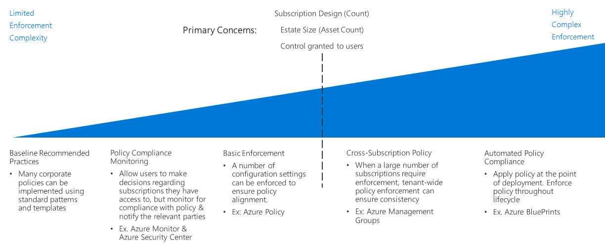

# Policy enforcement decision guide

Defining organizational policy is not effective unless it can be enforced across your organization. A key aspect of planning any cloud migration is determining how best to combine tools provided by the cloud platform with your existing IT processes to maximize policy compliance across your entire cloud estate.

Jump to: [Baseline recommended practices](#baseline-recommended-practices) | [Policy compliance monitoring](#policy-compliance-monitoring) | [Policy enforcement](#policy-enforcement) | [Cross-organization policy](#cross-organization-policy) | [Automated enforcement](#automated-enforcement)

As your cloud estate grows, you will be faced with a corresponding need to maintain and enforce policy across a larger array of resources, and subscriptions. As your estate gets larger and your organization's policy requirements increase, the scope of your policy enforcement processes needs to expand to ensure consistent policy adherence and fast violation detection.

Platform-provided policy enforcement mechanisms at the resource or subscription level are usually sufficient for smaller cloud estates. Larger deployments justify a larger enforcement scope and may need to take advantage of more sophisticated enforcement mechanisms involving deployment standards, resource grouping and organization, and integrating policy enforcement with your logging and reporting systems.

The primary factors in determining the scope of your policy enforcement processes is your organization's [cloud governance requirements](/azure/architecture/cloud-adoption/governance/overview), the size and nature of your cloud estate, and how your organization is reflected in your [subscription design](../subscriptions/index.md). An increase in size of your estate or a greater need to centrally manage policy enforcement can both justify an increase in enforcement scope.

## Baseline recommended practices

For single subscription and simple cloud deployments, many corporate policies can be enforced using features that are native to resources and subscriptions in Azure. The consistent use of the patterns discussed throughout the Cloud Adoption Framework [decision guides](../index.md) can help establish a baseline level of policy compliance without specific investment in policy enforcement. These features include:

- [Deployment templates](../resource-consistency/index.md) can provision resources with standardized structure and configuration.
- [Tagging and naming standards](../resource-tagging/index.md) can help organize operations and support accounting and business requirements.
- Traffic management and networking restrictions can be implemented through [Software Defined Networking](../software-defined-network/index.md).
- [Role-based access control](../identity/index.md) can secure and isolate your cloud resources.

Start your cloud policy enforcement planning by examining how the application of the standard patterns discussed throughout these guides can help meet your organizational requirements.

## Policy compliance monitoring

A first step beyond simply relying on the policy enforcement mechanisms provided by the Azure platform, is ensuring ability to verify cloud-based applications and services comply with organizational policy. This includes implementing notification capabilities for alerting responsible parties if a resource becomes noncompliant. Effectively [logging and reporting](../log-and-report/index.md) the compliance status of your cloud workloads is a critical part of a corporate policy enforcement strategy.

As your cloud estate grows, additional tools such as [Azure Security Center](/azure/security-center) can provide integrated security and threat detection, and help apply centralized policy management and alerting for both your on-premises and cloud assets.

## Policy enforcement

In Azure, you can apply configuration settings and resource creation rules at the management group, subscription, or resource group level to help ensure policy alignment.

[Azure Policy](/azure/governance/policy/overview) is an Azure service for creating, assigning, and managing policies. These policies enforce different rules and effects over your resources, so those resources stay compliant with your corporate standards and service level agreements. Azure Policy evaluates your resources for noncompliance with assigned policies. For example, you might want to limit the SKU size of virtual machines in your environment. Once a corresponding policy is implemented, new and existing resources would be evaluated for compliance. With the right policy, existing resources can be brought into compliance.

## Cross-organization policy

As your cloud estate grows to span many subscriptions that require enforcement, you will need to focus on a cloud estate-wide enforcement strategy to ensure policy consistency.

Your [subscription design](../subscriptions/index.md) will need to account for policy as it relates to your organizational structure. In addition to helping support complex organization within your subscription design, [Azure management groups](../../ready/considerations/scaling-subscriptions.md#managing-multiple-subscriptions) can be used to assign Azure Policy rules across multiple subscriptions.

## Automated enforcement

While standardized deployment templates are effective at a smaller scale, [Azure Blueprints](/azure/governance/blueprints/overview) allows large-scale standardized provisioning and deployment orchestration of Azure solutions. Workloads across multiple subscriptions can be deployed with consistent policy settings for any resources created.

For IT environments integrating cloud and on-premises resources, you may need use logging and reporting systems to provide hybrid monitoring capabilities. Your third-party or custom operational monitoring systems may offer additional policy enforcement capabilities. For larger or more mature cloud estates, consider how best to integrate these systems with your cloud assets.

## Next steps

Policy enforcement is just one of the core infrastructure components requiring architectural decisions during a cloud adoption process. Visit the [decision guides overview](../index.md) to learn about alternative patterns or models used when making design decisions for other types of infrastructure.

> [!div class="nextstepaction"]
> [Architectural decision guides](../index.md)
