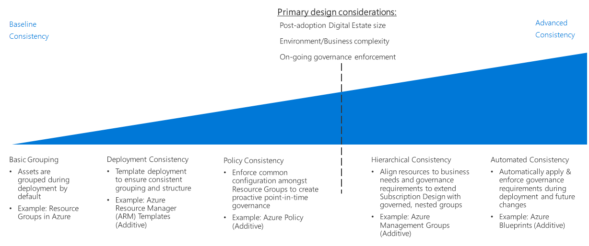

# Resource consistency decision guide

Azure [subscription design](../subscriptions/index.md) defines how you organize your cloud assets in relation to your organization's structure, accounting practices, and workload requirements. In addition to this level of structure, addressing your organizational governance policy requirements across your cloud estate requires the ability to consistently organize, deploy, and manage resources within a subscription.

Jump to: [Basic grouping](#basic-grouping) | [Deployment consistency](#deployment-consistency) | [Policy consistency](#policy-consistency) | [Hierarchical consistency](#hierarchical-consistency) | [Automated consistency](#automated-consistency)

Decisions regarding the level of your cloud estate's resource consistency requirements are primarily driven by these factors: post-migration digital estate size, business or environmental requirements that don't fit neatly within your existing subscription design approaches, or the need to enforce governance over time after resources have been deployed.

As these factors increase in importance, the benefits of ensuring consistent deployment, grouping, and management of cloud-based resources becomes more important. Achieving more advanced levels of resource consistency to meet increasing requirements requires more effort spent in automation, tooling, and consistency enforcement, and this results in additional time spent on change management and tracking.

## Basic grouping

In Azure, [resource groups](/azure/azure-resource-manager/resource-group-overview#resource-groups) are a core resource organization mechanism to logically group resources within a subscription.

Resource groups act as containers for resources with a common lifecycle or shared management constraints such as policy or role-based access control (RBAC) requirements. Resource groups can't be nested, and resources can only belong to one resource group. Some actions can act on all resources in a resource group. For example, deleting a resource group removes all resources within that group. Common patterns for creating resource groups are often divided into two categories:

- **Traditional IT workloads:** Most often grouped by items within the same lifecycle, such as an application. Grouping by application allows for individual application management.
- **Agile IT workloads:** Focus on external customer-facing cloud applications. These resource groups often reflect the functional layers of deployment (such as web tier or app tier) and management.

## Deployment consistency

Building on top of the base resource grouping mechanism, the Azure platform provides a system for using templates to deploy your resources to the cloud environment. You can use templates to create consistent organization and naming conventions when deploying workloads, enforcing those aspects of your resource deployment and management design.

[Azure Resource Manager templates](/azure/azure-resource-manager/resource-group-overview#template-deployment) allow you to repeatedly deploy your resources in a consistent state using a predetermined configuration and resource group structure. Resource Manager templates help you define a set of standards as a basis for your deployments.

For example, you can have a standard template for deploying a web server workload that contains two virtual machines as web servers combined with a load balancer to distribute traffic between the servers. You can then reuse this template to create structurally identical set of virtual machines and load balancer whenever this type of workload is needed, only changing the deployment name and IP addresses involved.

You can also programmatically deploy these templates and integrate them with your CI/CD systems.

## Policy consistency

To ensure that governance policies are applied when resources are created, part of resource grouping design involves using a common configuration when deploying resources.

By combining resource groups and standardized Resource Manager templates, you can enforce standards for what settings are required in a deployment and what [Azure Policy](/azure/governance/policy/overview) rules are applied to each resource group or resource.

For example, you may have a requirement that all virtual machines deployed within your subscription connect to a common subnet managed by your central IT team. You can create a standard template for deploying workload VMs to create a separate resource group for the workload and deploy the required VMs there. This resource group would have a policy rule to only allow network interfaces within the resource group to be joined to the shared subnet.

For a more in-depth discussion of enforcing your policy decisions within a cloud deployment, see [Policy enforcement](../policy-enforcement/index.md).

## Hierarchical consistency

Resource groups allow you to support additional levels of hierarchy within your organization within the subscription, applying Azure Policy rules and access controls at a resource group level. However, As the size of your cloud estate grows, you may need to support more complicated cross-subscription governance requirements than can be supported using the Azure Enterprise Agreement's Enterprise/Department/Account/Subscription hierarchy.

[Azure management groups](/azure/governance/management-groups) allow you to organize subscriptions into more sophisticated organizational structures by grouping subscriptions in a hierarchy distinct from your enterprise agreement's hierarchy. This alternate hierarchy allows you to apply access control and policy enforcement mechanisms across multiple subscriptions and the resources they contain. Management group hierarchies can be used to match your cloud estate's subscriptions with operations or business governance requirements. For more information, see the [subscription decision guide](../subscriptions/index.md).

## Automated consistency

For large cloud deployments, global governance becomes both more important and more complex. It is crucial to automatically apply and enforce governance requirements when deploying resources, as well as meet updated requirements for existing deployments.

[Azure Blueprints](/azure/governance/blueprints/overview) enable organizations to support global governance of large cloud estates in Azure. Blueprints move beyond the capabilities provided by standard Azure Resource Manager templates to create complete deployment orchestrations capable of deploying resources and applying policy rules. Blueprints support versioning, the ability to update all subscriptions where the blueprint was used, and the ability to lock down deployed subscriptions to avoid the unauthorized creation and modification of resources.

These deployment packages allow IT and development teams to rapidly deploy new workloads and networking assets that comply with changing organizational policy requirements. Blueprints can also be integrated into CI/CD pipelines to apply revised governance standards to deployments as they are updated.

## Next steps

Resource consistency is just one of the core infrastructure components requiring architectural decisions during a cloud adoption process. Visit the [decision guides overview](../index.md) to learn about alternative patterns or models used when making design decisions for other types of infrastructure.

> [!div class="nextstepaction"]
> [Architectural decision guides](../index.md)
