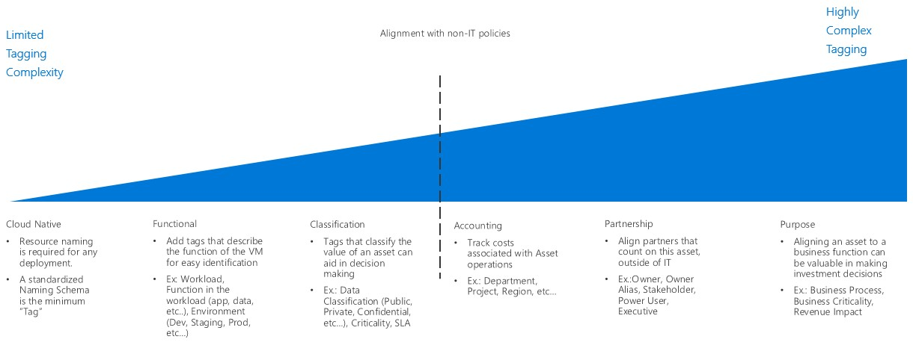

# Resource naming and tagging decision guide

Organizing cloud-based resources is one of the most important tasks for IT, unless you only have simple deployments. Organizing your resources serves three primary purposes:

- **Resource Management:** Your IT teams will need to quickly find resources associated with specific workloads, environments, ownership groups, or other important information. Organizing resources is critical to assigning organizational roles and access permissions for resource management.
- **Automation:** In addition to making resources easier for IT to manage, a proper organizational scheme allows you to take advantage of automation as part of resource creation, operational monitoring, and the creation of DevOps processes.
- **Accounting:** Making business groups aware of cloud resource consumption requires IT to understand what workloads and teams are using which resources. To support approaches such as chargeback and showback accounting, cloud resources need to be organized to reflect ownership and usage.

## Tagging decision guide

Jump to: [Baseline naming conventions](#baseline-naming-conventions) | [Resource tagging patterns](#resource-tagging-patterns) | [Learn more](#learn-more)

Your tagging approach can be simple or complex, with the emphasis ranging from supporting IT teams managing cloud workloads to integrating information relating to all aspects of the business.

An IT aligned tagging focus, such as tagging based on workload, function, or environment, will reduce the complexity of monitoring assets and make management decisions based on operational requirements much easier.

Tagging schemes that include a business aligned focus, such as accounting, business ownership, or business criticality may require a larger time investment to create tagging standards that reflect business interests and maintain those standards over time. However, the result of this process is a tagging system providing an improved ability to account for costs and value of IT assets to the overall business. This association of an asset's business value to its operational cost is one of the first steps in changing the cost center perception of IT within your wider organization.

## Baseline naming conventions

A standardized naming convention is the starting point for organizing your cloud-hosted resources. A properly structured naming system allows you to quickly identify resources for both management and accounting purposes. If you have existing IT naming conventions in other parts of your organization, consider whether your cloud naming conventions should align with them or if you should establish separate cloud-based standards.

Note also that different Azure resource types have different [naming requirements](../../../best-practices/naming-conventions.md#naming-rules-and-restrictions). Your naming conventions must be compatible with these naming requirements.

## Resource tagging patterns

For more sophisticated organization than a consistent naming convention only can provide, cloud platforms support the ability to tag resources.

*Tags* are metadata elements attached to resources. Tags consist of pairs of key/value strings. The values you include in these pairs is up to you, but the application of a consistent set of global tags, as part of a comprehensive naming and tagging policy, is a critical part of an overall governance policy.

As part of your planning process, use the following questions to help determine the kind of information your resource tags need to support:

- Does your naming and tagging policies need to integrate with existing naming and organizational policies within your company?
- Will you implement a chargeback or showback accounting system? Will you need to associate resources with accounting information for departments, business groups, and teams in more detail than a simple subscription-level breakdown allows?
- Does tagging need to represent details such regulatory compliance requirements for a resource? What about operational details such as uptime requirements, patching schedules, or security requirements?
- What tags will be required for all resources based on central IT policy? What tags will be optional? Are individual teams allowed to implement their own custom tagging schemes?

The common tagging patterns listed below provide examples of how tagging can be used to organize cloud assets. These patterns are not meant to be exclusive and can be used in parallel, providing multiple ways of organizing assets based on your company's needs.

<!-- markdownlint-disable MD033 -->

| Tag type | Examples | Description |
|-----|-----|-----|
| Functional            | app = catalogsearch1  tier = web  webserver = apache env = prod  env = staging  env = dev                 | Categorize resources in relation to their purpose within a workload, what environment they've been deployed to, or other functionality and operational details.                                 |
| Classification        | confidentiality=private sla = 24hours                                 | Classifies a resource by how it is used and what policies apply to it                               |
| Accounting            | department = finance  project = catalogsearch  region = northamerica | Allows resource to be associated with specific groups within an organization for billing purposes |
| Partnership           | owner = jsmith  contactalias = catsearchowners stakeholders = user1;user2;user3                        | Provides information about what people (outside of IT) are related or otherwise affected by the resource                      |
| Purpose               | businessprocess=support businessimpact=moderate revenueimpact=high   | Aligns resources to business functions to better support investment decisions  |

<!-- markdownlint-enable MD033 -->

## Learn more

For more information about naming and tagging in Azure, see:

- [Naming conventions for Azure resources](../../../best-practices/naming-conventions.md). Refer to this guidance for recommended naming conventions for Azure resources.
- [Use tags to organize your Azure resources](/azure/azure-resource-manager/resource-group-using-tags?toc=/azure/billing/TOC.json). You can apply tags in Azure at both the resource group and individual resource level, giving you flexibility in the granularity of any accounting reports based on applied tags.

## Next steps

Resource tagging is just one of the core infrastructure components requiring architectural decisions during a cloud adoption process. Visit the [decision guides overview](../index.md) to learn about alternative patterns or models used when making design decisions for other types of infrastructure.

> [!div class="nextstepaction"]
> [Architectural decision guides](../index.md)
