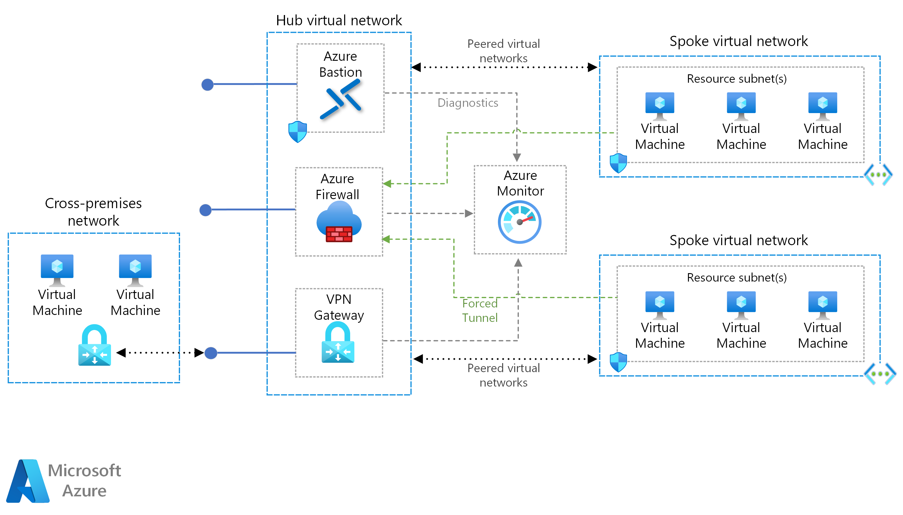

# Software Defined Networking: Hub and spoke

The hub and spoke networking model organizes your Azure-based cloud network infrastructure into multiple connected virtual networks. This model allows you to more efficiently manage common communication or security requirements and deal with potential subscription limitations.

In the hub and spoke model, the _hub_ is a virtual network that acts as a central location for managing external connectivity and hosting services used by multiple workloads. The _spokes_ are virtual networks that host workloads and connect to the central hub through [virtual network peering](/azure/virtual-network/virtual-network-peering-overview).

All traffic passing in or out of the workload spoke networks is routed through the hub network where it can be routed, inspected, or otherwise managed by centrally managed IT rules or processes.

This model aims to address each of the following concerns:

- **Cost savings and management efficiency.** Centralizing services that can be shared by multiple workloads, such as network virtual appliances (NVAs) and DNS servers, in a single location allows IT to minimize redundant resources and management effort across multiple workloads.
- **Overcoming subscriptions limits.** Large cloud-based workloads may require the use of more resources than are allowed within a single Azure subscription (see [subscription limits](/azure/azure-subscription-service-limits)). Peering workload virtual networks from different subscriptions to a central hub can overcome these limits.
- **Separation of concerns.** The ability to deploy individual workloads between central IT teams and workloads teams.

The following diagram shows an example hub and spoke architecture including centrally managed hybrid connectivity.

The hub and spoke architecture is often used alongside the hybrid networking architecture, providing a centrally managed connection to your on-premises environment shared between multiple workloads. In this scenario, all traffic traveling between the workloads and on-premises passes through the hub where it can be managed and secured.

## Hub and spoke assumptions

Implementing a hub and spoke virtual networking architecture assumes the following:

- Your cloud deployments will involve workloads hosted in separate working environments, such as development, test, and production, that all rely on a set of common services such as DNS or directory services.
- Your workloads do not need to communicate with each other but have common external communications and shared services requirements.
- Your workloads require more resources than are available within a single Azure subscription.
- You need to provide workload teams with delegated management rights over their own resources while maintaining central security control over external connectivity.

## Global hub and spoke

Hub and spoke architectures are commonly implemented with virtual networks deployed to the same Azure Region to minimize latency between networks. However, large organizations with global reach may need to deploy workloads across multiple regions for availability, disaster recovery, or regulatory requirements. The hub and spoke model can use of Azure [global virtual network peering](/azure/virtual-network/virtual-network-peering-overview) to extend centralized management and shared services across regions and support workloads distributed across the world.

## Learn more

For examples of how to implement hub and spoke networks on Azure, see the following examples on the Azure Reference Architectures site:

- [Implement a hub and spoke network topology in Azure](../../../reference-architectures/hybrid-networking/hub-spoke.md)
- [Implement a hub and spoke network topology with shared services in Azure](../../../reference-architectures/hybrid-networking/shared-services.md)
