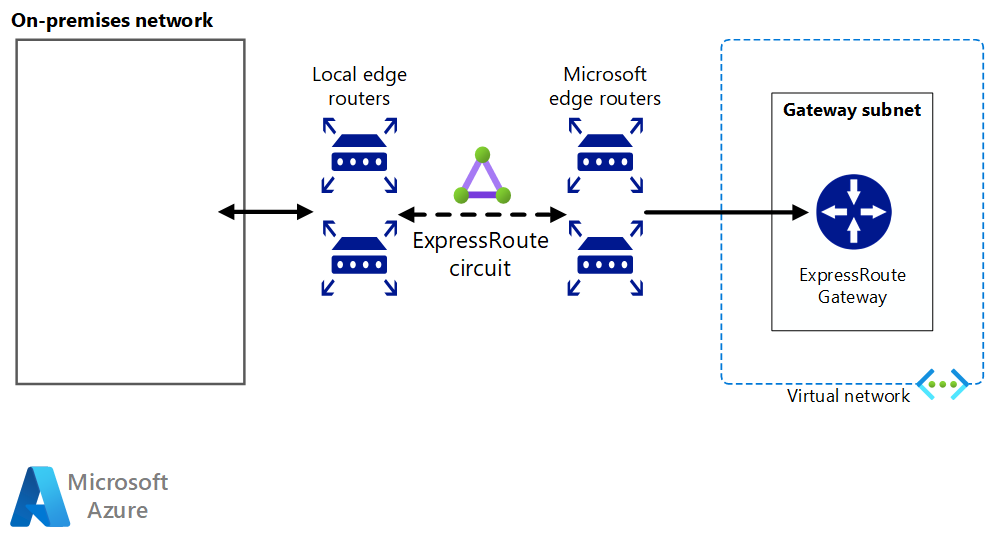

# Software Defined Networking: Hybrid network

The hybrid cloud network architecture allows virtual networks to access your on-premises resources and services and vice versa, using a Dedicated WAN connection such as ExpressRoute or other connection method to directly connect the networks.

Building on the cloud-native virtual network architecture, a hybrid virtual network is isolated when initially created. Adding connectivity to the on-premises environment grants access to and from the on-premises network, although all other inbound traffic targeting resources in the virtual network need to be explicitly allowed. You can secure the connection using virtual firewall devices and routing rules to limit access or you can specify exactly what services can be accessed between the two networks using cloud-native routing features or deploying network virtual appliances (NVAs) to manage traffic.

Although the hybrid networking architecture supports VPN connections, dedicated WAN connections like ExpressRoute are preferred due to higher performance and increased security.

## Hybrid assumptions

Deploying a hybrid virtual network includes the following assumptions:

- Your IT security teams have aligned on-premises and cloud-based network security policy to ensure cloud-based virtual networks can be trusted to communicated directly with on-premises systems.
- Your cloud-based workloads require access to storage, applications, and services hosted on your on-premises or third-party networks, or your users or applications in your on-premises need access to cloud-hosted resources.
- You need to migrate existing applications and services that depend on on-premises resources, but don't want to expend the resources on redevelopment to remove those dependencies.
- Connecting your on-premises networks to cloud resources over VPN or dedicated WAN is not prevented by corporate policy, data sovereignty requirements, or other regulatory compliance issues.
- Your workloads either do not require multiple subscriptions to bypass subscription resource limits, or your workloads involve multiple subscriptions but do not require central management of connectivity or shared services used by resources spread across multiple subscriptions.

Your cloud adoption teams should consider the following issues when looking at implementing a hybrid virtual networking architecture:

- Connecting on-premises networks with cloud networks increases the complexity of your security requirements. Both networks must be secured against external vulnerabilities and unauthorized access from both sides of the hybrid environment.
- Scaling the number and size of workloads within a hybrid cloud environment can add significant complexity to routing and traffic management.
- You will need to develop compatible management and access control policies to maintain consistent governance throughout your organization.

## Learn more

For more information about hybrid networking in Azure, see:

- [Hybrid network reference architecture](../../../reference-architectures/hybrid-networking/expressroute.md). Azure hybrid virtual networks use either an ExpressRoute circuit or Azure VPN to connect your virtual network with your organization's existing IT assets not hosted in Azure. This article discusses the options for creating a hybrid network in Azure.
