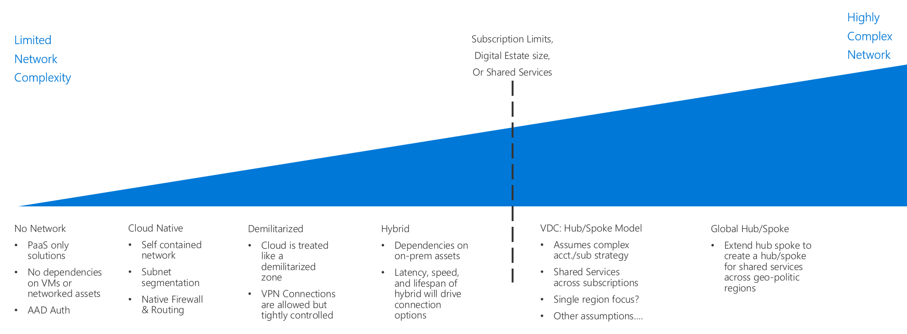

# Software Defined Networking decision guide

Software Defined Networking (SDN) is a network architecture designed to allow virtualized networking functionality that can be centrally managed, configured, and modified through software. SDN enables the creation of cloud-based networks using the virtualized equivalents to physical routers, firewalls, and other networking devices used in on-premises networks. SDN is critical to creating secure virtual networks on public cloud platforms such as Azure.

## Networking decision guide

Jump to: [PaaS Only](paas-only.md) | [Cloud-native](cloud-native.md) | [Cloud DMZ](cloud-dmz.md) [Hybrid](hybrid.md) | [Hub and spoke model](hub-spoke.md) | [Learn more](#learn-more)

SDN provides several options with varying degrees of pricing and complexity. The above discovery guide provides a reference to quickly personalize these options to best align with specific business and technology strategies.

The inflection point in this guide depends on several key decisions that your cloud strategy team has made before making decisions about networking architecture. Most important among these are decisions involving your [digital estate definition](../../digital-estate/index.md) and [subscription design](../subscriptions/index.md) (which may also require inputs from decisions made related to your cloud accounting and global markets strategies).

Small single-region deployments of fewer than 1,000 VMs are less likely to be significantly affected by this inflection point. Conversely, large adoption efforts with more than 1,000 VMs, multiple business units, or multiple geopolitical markets, could be substantially affected by your SDN decision and this key inflection point.

## Choosing the right virtual networking architectures

This section expands on the decision guide to help you choose the right virtual networking architectures.

There are many ways to implement SDN technologies to create cloud-based virtual networks. How you structure the virtual networks used in your migration and how those networks interact with your existing IT infrastructure will depend on a combination of the workload requirements and your governance requirements.

When planning which virtual networking architecture or combination of architectures to consider when planning your cloud migration, consider the following questions to help determine what's right for your organization:

| Question | PaaS-only | Cloud-native | Cloud DMZ | Hybrid | Hub and spoke |
|-----|-----|-----|-----|-----|-----|
| Will your workload only use PaaS services and not require networking capabilities beyond those provided by the services themselves? | Yes | No | No | No | No |
| Does your workload require integration with on-premises applications? | No | No | Yes | Yes | Yes |
| Have you established mature security policies and secure connectivity between your on-premises and cloud networks? | No | No | No | Yes | Yes |
| Does your workload require authentication services not supported through cloud identity services, or do you need direct access to on-premises domain controllers? | No | No | No | Yes | Yes |
| Will you need to deploy and manage a large number of VMs and workloads? | No | No | No | No | Yes |
| Will you need to provide centralized management and on-premises connectivity while delegating control over resources to individual workload teams? | No | No | No | No | Yes |

## Virtual networking architectures

Learn more about the primary software defined networking architectures:

- **[PaaS-only](paas-only.md):** Most platform as a service (PaaS) products support a limited set of built-in networking features and may not require an explicitly defined software defined network to support workload requirements.
- **[Cloud-native](cloud-native.md):** A cloud-native architecture supports cloud-based workloads using virtual networks built on the cloud platform's default software defined networking capabilities, without reliance on on-premises or other external resources.
- **[Cloud DMZ](cloud-dmz.md):** Supports limited connectivity between your on-premises and cloud networks, secured through the implementation of a demilitarized zone tightly controlling traffic between the two environments.
- **[Hybrid](hybrid.md):** The hybrid cloud network architecture allows virtual networks in trusted cloud environments to access your on-premises resources and vice versa.
- **[Hub and spoke](hub-spoke.md):** The hub and spoke architecture allows you to centrally manage external connectivity and shared services, isolate individual workloads, and overcome potential subscription limits.

## Learn more

For more information about Software Defined Networking in Azure, see:

- [Azure Virtual Network](/azure/virtual-network/virtual-networks-overview). On Azure, the core SDN capability is provided by Azure Virtual Network, which acts as a cloud analog to physical on-premises networks. Virtual networks also act as a default isolation boundary between resources on the platform.
- [Azure best practices for network security](/azure/security/azure-security-network-security-best-practices). Recommendations from the Azure Security team on how to configure your virtual networks to minimize security vulnerabilities.

## Next steps

Software defined networking is just one of the core infrastructure components requiring architectural decisions during a cloud adoption process. Visit the [decision guides overview](../index.md) to learn about alternative patterns or models used when making design decisions for other types of infrastructure.

> [!div class="nextstepaction"]
> [Architectural decision guides](../index.md)
