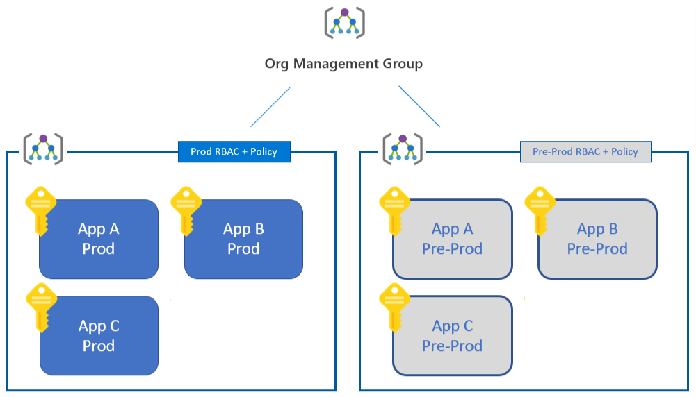
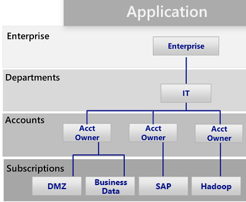
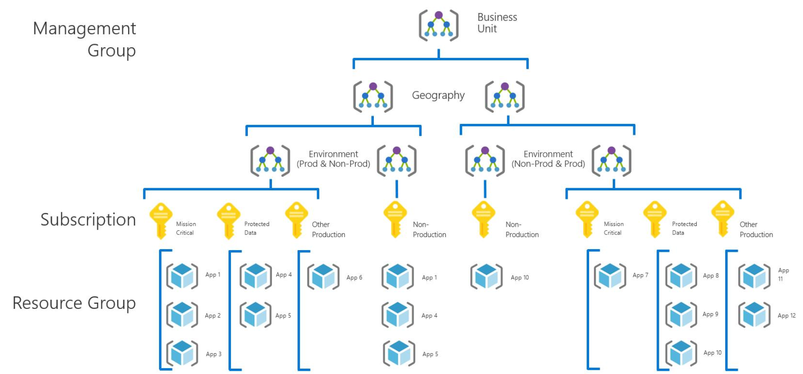

# Subscription decision guide

Effective subscription design helps organizations establish a structure for organize assets in Azure during a cloud adoption.

Each resource in Azure, such as a virtual machine or a database, is associated with a subscription. Adopting Azure begins by creating an Azure subscription, associating it with an account, and deploying resources to the subscription. For an overview of these concepts, see [Azure fundamental concepts](../../ready/considerations/fundamental-concepts.md).

As your digital estate in Azure grows, you will likely need to create additional subscriptions to meet your requirements. Azure allows you to define a hierarchy of management groups to organize your subscriptions and easily apply the right policy to the right resources. For more information, see [Scaling with multiple Azure subscriptions](../../ready/considerations/scaling-subscriptions.md).

Some basic examples of using management groups to separate different workloads include:

- **Production vs. nonproduction:** Some enterprises create management groups to separate their production and nonproduction subscriptions. Management groups allow these customers to more easily manage roles and policies. For example, a nonproduction subscription may allow developers **contributor** access, but in production, they have only **reader** access.
- **Internal services vs. external services:** Much like production versus nonproduction workloads, enterprises often have different requirements, policies, and roles for internal services versus external customer-facing services.

This decision guide helps you consider different approaches to organizing your management group hierarchy.

## Subscription design patterns

Because every organization is different, Azure management groups are designed to be flexible. Modeling your cloud estate to reflect your organization's hierarchy helps you define and apply policies at higher levels of the hierarchy, and rely on inheritance to ensure that those policies are automatically applied to management groups lower in the hierarchy. Although subscriptions can be moved between different management groups, it is helpful to design an initial management group hierarchy that reflects your anticipated organizational needs.

Before finalizing your subscription design, also consider how [resource consistency](../resource-consistency/index.md) considerations might influence your design choices.

> [!NOTE]
> Azure Enterprise Agreements (EAs) allows you to define another organizational hierarchy for billing purposes. This hierarchy is distinct from your management group hierarchy, which focuses on providing an inheritance model for easily applying suitable policies and access control to your resources.

The following subscription patterns reflect an initial increase in subscription design sophistication, followed by several more advanced hierarchies that may align well to your organization:

### Single subscription

A single subscription per account may suffice for organizations that need to deploy a small number of cloud-hosted assets. This is the first subscription pattern you'll implement when beginning your cloud adoption process, allowing small-scale experimental or proof-of-concept deployments to explore the capabilities of the cloud.

### Production-and-preproduction pattern

Once you're ready to deploy a workload to a production environment, you should add an additional subscription. This helps you keep your production data and other assets out of your dev/test environments. You can also easily apply two different sets of policies across the resources in the two subscriptions.

### Workload separation pattern

As an organization adds new workloads to the cloud, different ownership of subscriptions or basic separation of responsibility may result in multiple subscriptions in both the production and preproduction management groups. While this approach does provide basic workload separation, it doesn't take significant advantage of the inheritance model to automatically apply policies across a subset of your subscriptions.

### Application category pattern

As an organization's cloud footprint grows, additional subscriptions are typically created to support applications with fundamental differences in business criticality, compliance requirements, access controls, or data protection needs. Building from the production-and-preproduction subscription pattern, the subscriptions supporting these application categories are organized under either the production or preproduction management group as applicable. These subscriptions are typically owned and administered by central IT operations staff.

Each organization will categorize their applications differently, often separating subscriptions based on specific applications or services or along the lines of application archetypes. This categorization is often designed to support workloads that are likely to consume most of the resource limits of a subscription, or separate mission-critical workloads to ensure they aren't competing with other workloads under these limits. Some workloads that might justify a separate subscription under this pattern include:

- Mission-critical workloads.
- Applications with protected data.
- Experimental applications.
- Applications subject to regulatory requirements (such as HIPAA or FedRAMP).
- Batch workloads.
- Big data workloads such as Hadoop.
- Containerized workloads using deployment orchestrators such as Kubernetes.
- Analytics workloads.

### Functional pattern

The functional pattern organizes subscriptions and accounts along functional lines, such as finance, sales, or IT support, using a management group hierarchy.

### Business unit pattern

The business unit pattern groups subscriptions and accounts based on profit and loss category, business unit, division, profit center, or similar business structure using a management group hierarchy.

### Geographic pattern

For organizations with global operations, the geographic pattern groups subscriptions and accounts based on geographic regions using a management group hierarchy.

## Mixed patterns

Management group hierarchies can be up to six levels deep. This provides you with the flexibility to create a hierarchy that combines several of these patterns to meet your organizational needs. For example, the diagram below shows an organizational hierarchy that combines a business unit pattern with a geographic pattern.

## Related resources

- [Resource access management in Azure](../../getting-started/azure-resource-access.md)
- [Multiple layers of governance in large enterprises](/azure/architecture/cloud-adoption/governance/journeys/large-enterprise/multiple-layers-of-governance)
- [Multiple geographic regions](/azure/architecture/cloud-adoption/migrate/expanded-scope/multiple-regions)

## Next steps

Subscription design is just one of the core infrastructure components requiring architectural decisions during a cloud adoption process. Visit the [decision guides overview](../index.md) to learn about alternative patterns or models used when making design decisions for other types of infrastructure.

> [!div class="nextstepaction"]
> [Architectural decision guides](../index.md)
