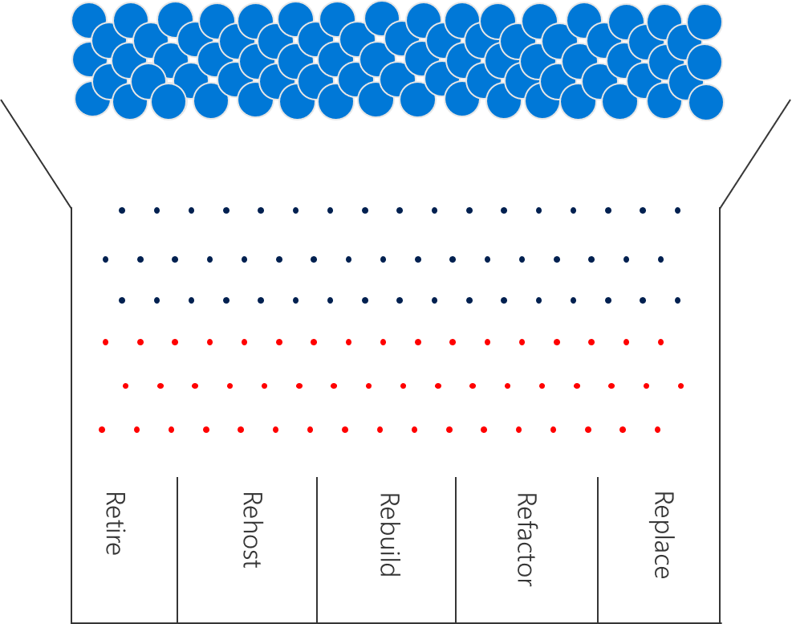
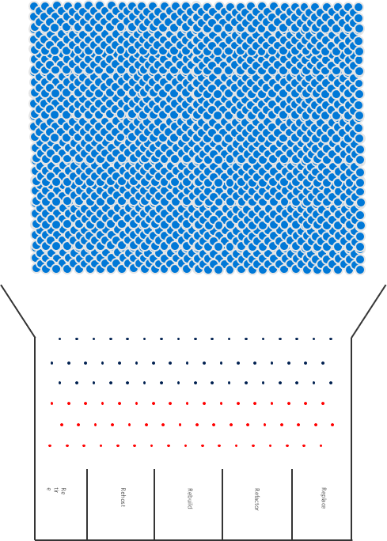

# Enterprise Cloud Adoption: How can a full inventory be rationalized to divide resources across the 5 Rs of rationalization?

Cloud Rationalization is the process of evaluating assets to determine the best approach to hosting the asset in the cloud.
Once an [approach](approach.md) has been determined and [inventory](inventory.md) has been aggregated, Cloud Rationalization can begin. The [5 Rs of rationalization] discusses the most common rationalization options.

## Rationalization Plinko

Visualize the traditional process of rationalization like a giant Plinko board. At the top are all of the assets in the digital estate. Those assets are feed through a process that results in one of five answers for each Plinko chip. For small estates like the one pictured, this works well. For larger estates, its not very efficient and can lead to significant delays. Lets examine the process to see why.

*Figure 1. Rationalization as a plinko board with black pegs for quantitative analysis and red pegs for qualitative analysis.*

**Inventory:** Very few organizations invest the time, energy, and expense to maintain an accurate inventory of the full digital estate. The return on investment (ROI) of maintaining the inventory, is extremely low. Most IT organizations have other more pressing issues to address that produce greater returns. Current scanning tools can delay decisions by weeks or months, to scan and catalog the full inventory.

**Quantitative analysis:** In the image above, each black peg represents a quantitative question: Is the asset used? If so, is it optimized and sized properly? What dependencies exist between assets? These questions are vital to classification of the inventory

**Qualitative analysis:** Each red peg is a question that requires human intelligence or qualitative analysis. Often times, these questions are unique to the solution and can only be answered by business stakeholders and power users. These pegs tend to jam up the process, slowing things down considerably. This analysis generally consumed 40-80 FTE hours per application.

**Rationalization Decision:** In the hands of an experienced rationalization team, the qualitative and quantitative data creates clear decisions. Unfortunately, experienced teams are expensive and/or take months to train.

## Rationalization Plinko at Enterprise Scale

If this effort is time consuming and daunting for a 50 VM digital estate, imagine the effort required to drive business transformation in an environment with 1,000 VMs and hundreds of applications. The human effort required can easily exceed 1,500 FTE hours and 9 months of planning.

*Figure 2. Rationalization as a plinko board with 1,000 assets to by rationalized*

While full rationalization is the end state and a great direction to move towards, it seldom produces a high ROI relative to the time and energy required.

When rationalization is essential to financial decisions, it is worth considering a professional services organization that specializes in cloud rationalization to accelerate the process. Even then, full rationalization can be an effort in futility.

See [Incremental Rationalization](rationalize-incremental.md) for an alternative approach…

## Next steps

The output of a rationalization effort is a prioritized backlog of all assets to be impacted by the chosen transformation.

This backlog is now ready to serve as the foundation for [costing models of cloud services](calculate.md).

> [!div class="nextstepaction"]
> [Price calculations for cloud services](calculate.md)