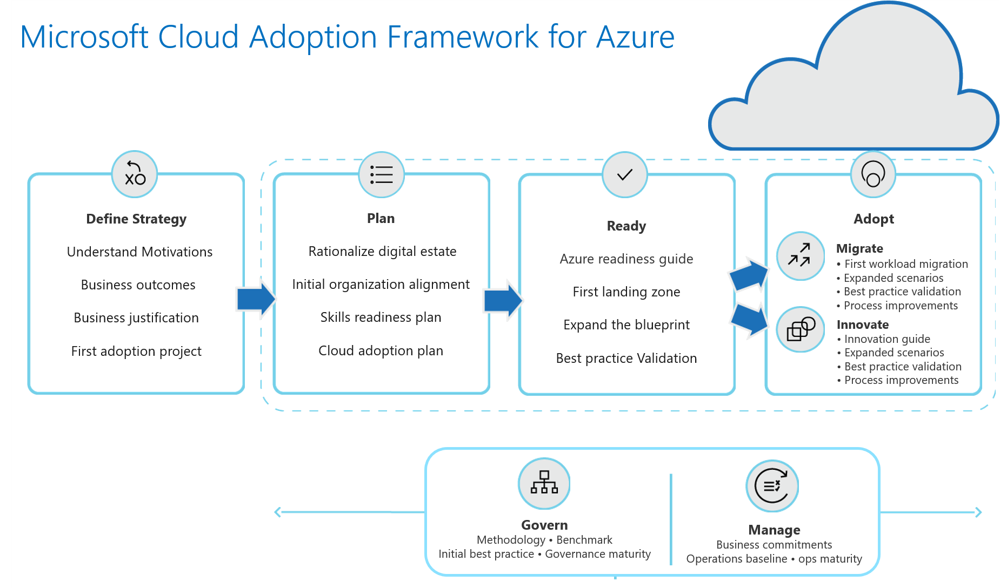

# Innovation through cloud adoption in the Cloud Adoption Framework

Innovation is closely linked to migration. When workloads create market differentiation opportunities, it is common for those workloads to be migrated to the cloud, then undergo modernization efforts. Once in the cloud modernization can be accelerated by modern cloud-based approaches, which also enable the development of new innovations.

> [!NOTE]
> This guidance is being developed for the Q3 2019 release of the Cloud Adoption Framework. The taxonomy and approach below is likely to change. The following information shows the general direction of innovation guidance.

## Motivations behind innovation

Innovation should not be the chosen adoption path for all workloads. This path to cloud adoption often requires a larger investment in custom code and data management. Innovation also takes inherently longer than migration, or even many forms of modernization. However, this path is suggested when customers are targeting the following types of business outcomes:

- Prepare for new technical capabilities
- Scale to meet market demands
- Scale to meet geographic demands
- Build new technical capabilities
- Improve customer experiences / engagements
- Transform products or services
- Disrupt the market with new products or services

## Innovation guidance

As the innovation content within the Cloud Adoption Framework is developed, it will provide guidance related to the following topics:

- Modernize existing assets
- Build new apps
- Follow practices that encourage a growth mindset
- Integrate DevOps strategies

## Common workload examples associated with a cloud innovation

- Custom-built applications.
- Technology-based experiences.
- IoT: Integration of physical products and technology.
- Ambient intelligence: Integration of nonintrusive technology into an environment.
- Cognitive Services: Big Data, AI, Machine Learning, and predictive solutions.
