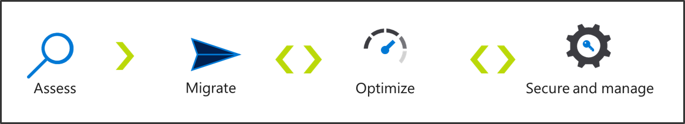

# Cloud migration executive summary

Microsoft has defined a cloud adoption framework, to help customers with a simplified cloud adoption journey. The Cloud Adoption Framework is designed to provide comprehensive guidance for transitioning legacy application workloads using modern, innovative, cloud-based technologies. This framework contains detailed information to cover an end-to-end cloud adoption journey, which starts with targeted business outcomes, aligning cloud readiness and assessments to clearly defined business objectives. Those outcomes are then realized through a defined path for cloud adoption. With migration-based adoption, that defined path focuses largely on the completion of a migration from on-premises to the cloud. Sometimes this journey includes modernization of workloads to increase returns from the migration effort.

This framework is designed to speak most directly to cloud architects and the Cloud Strategy team who lead cloud adoption efforts. However, many of the topics in this framework will be relevant to additional roles across the business and IT. It is assumed that cloud architects will serve as facilitators engaging each of the relevant roles. This executive summary is designed to prepare those various roles prior to those facilitated conversations.

> [!NOTE]
> This guidance is currently available as a public preview. Terminology, approaches, and guidance are being thoroughly tested with customers, partners, and Microsoft teams during this preview. As such, the TOC and guidance may change slightly over time.

## Motivations and methodology

The motivation or business outcome driving a cloud migration can heavily influence the best approach to migration. Cloud migrations can align to a number of business outcomes. Clear communication of business drivers and the measures of  success is an important first step in cloud migration efforts. The following are a few examples of common migration motivations, grouped by the methodology (or type of migration).

### Asset migration

During cloud migrations, assets such as virtual machines, data sources, and applications are migrated from an existing on-premises environment to the cloud. Asset migrations provide a streamlined approach to respond to a critical event or a need to move specific assets. Asset migrations are typically motivated by the following short-term critical business events.

- Datacenter exit
- Mergers, acquisition, or divestiture
- Reductions in capital expenses
- End of support for mission-critical technologies

**Summary of the asset migration methodology:** Asset migration is a technical process for migrating digital assets to the cloud using migration automation tooling. This approach can be successfully executed within the limited scope of the [Azure migration guide](../migrate/azure-migration-guide/index.md).

### Workload migration

More often, cloud migrations are part of a focused effort to streamline IT operations, costs, or complexity. Workload migration builds on asset migrations, but adds a focus on the migration of a workload, which adds deeper planning and testing requirements. Examples of workloads could include things like an HR payroll solution, a CRM solution, a document approval workflow in Finance, or a business intelligence solution. Workloads could also include shared technical resources like a data warehouse that supports several other solutions. The following are a few longer term motivations associated with a workload migration.

- Cost savings
- Reduction in vendor or technical complexity
- Optimize internal operations

**Summary of the workload migration methodology:** Successful workload migrations build on the [Azure migration guide](../migrate/azure-migration-guide/index.md) and [Azure Readiness Guide](../ready/azure-readiness-guide/index.md). However, to successfully complete a workload migration, additional considerations should be given to the [expanded scope checklist](../migrate/expanded-scope/index.md), which expands upon the scope of the Azure migration guide.

### Portfolio migration

C-level conversations regarding cloud migration tend to focus on the benefits associated with portfolio migrations. Portfolio in this case describes the entire collection of workloads owned and managed by IT. These migrations are more likely to produce tangible business outcomes like the following:

- Decrease business interruptions
- Increase business agility
- Prepare for new technical capabilities
- Scale to meet market demands
- Scale to meet geographic demands

**Summary of the portfolio migration methodology:** Portfolio migrations look across the entire IT portfolio to guide decisions regarding investments, impact on business processes, potential of innovation outcomes, and the future state of workload collections. This model requires a much deeper alignment between the business and IT. The technical implementation is a slight extension of the workload or asset migration methodologies. The methodology differs most when it comes to the rigor of business planning, richer readiness investments, improved change management, and a more disciplined approach to cloud governance. The following section outlines this methodology in more detail.

## Portfolio migration methodology

This methodology is based on an incremental approach to cloud adoption that aligns to Agile technology strategies, Growth Mindset based cultural growth, and Business Outcome-driven strategies. This methodology consists of the following high-level components that guide the implementation of each strategy.

As depicted in the image above, this framework aligns strategic decisions to a small number of contained processes, which operate within an iterative model:

- [Plan](../business-strategy/overview.md): When technical implementation is aligned with clear business objectives, it's much easier to measure and align success across multiple cloud adoption efforts.
- [Ready](../ready/overview.md): Preparing the business, culture, people, and environment for coming changes leads to success in each effort and accelerates implementation and change projects.
- Adopt: Ensure proper implementation of desired changes, across IT and business processes, to achieve business outcomes.
  - [Migrate](../migrate/overview.md): Iterative execution of the cloud migration adhering to the tested process of Assess, Migrate, Optimize, and Secure & Manage to create a repeatable process for migrating collections of IT assets.
  - [Operate](../operations/overview.md): Expand IT operations to ensure cloud-based solutions can be operated through secure, cost effective processes using modern, cloud-first operations tools
  - [Govern](../governance/overview.md): Align corporate policy to tangible risks, mitigated through policy, process, and cloud-based governance tooling.
  - Change management and oversight: Iterative approaches to implementation will be seen throughout this framework, which provides business and IT teams with a growth mindset approach to addressing ambiguity, learning, and succeeding in the fast paced environments demanded in today's marketplaces.

Throughout this migration experience this framework will be used to address ambiguity, manage change, and guide cross-functional teams through the realization of business outcomes.

## Common cultural changes associated with a portfolio migration

The effort to realize the desired business outcomes may trigger slight changes to the culture of IT, and to some degree the culture of the business. The following are a few common cultural changes seen in this process:

- The IT team is likely to adopt new skills to support workloads in the cloud
- Execution of a cloud migration encourages iterative or agile approaches
- Inclusion of cloud governance also tends to inspire DevOps approaches
- Creation of a Cloud Strategy team can lead to tighter integration between business and IT leaders
- Collectively, these changes tend to lead to business and IT agility

Cultural change is not a goal of cloud migration or the Cloud Adoption Framework, but it is a commonly experienced outcome.
Cultural changes are not directly guided, instead subtle changes to the culture are embedded in the suggested process improvements and approaches throughout the guidance.

## Common technical efforts associated with a portfolio migration

During a portfolio migration, the IT team will focus largely on the migration of existing digital assets to the cloud. During this effort, minimal code changes as expected, but can often be limited to configuration changes. In many cases, a strong business justification can be made for minor modernization as part of the technical execution.

## Common workload examples associated with a portfolio migration

Portfolio migrations often target a broad collection of workloads and applications. Within the portfolio, a number of common application or workload types are commonly migrated. The following are a few examples:

- Line of business applications
- Customer facing applications
- Third-party applications
- Data analytics platforms
- Globally distributed solutions
- Highly scalable solutions

## Common technologies migrated in this approach

The technologies migrated to the cloud constantly expand as cloud providers add new capabilities. The following are a few examples of the technologies commonly seen in a migration effort:

- Windows and SQL Server
- Linux and OSS DB
- SAP on Azure
- Analytics (Data Warehouse, Data Lake)

## Next steps: Lifecycle solution

The Cloud Adoption Framework is a lifecycle solution. It is intended to help readers who are just beginning their journey and those who are deep into their migration. As such, content is very context and audience specific. Next steps are best aligned to the high-level process the reader would like to improve next.

> [!div class="nextstepaction"]
> [Plan](../business-strategy/overview.md)
>
> [Ready](../ready/overview.md)
>
> [Migrate](../migrate/overview.md)
>
> [Operate](../operations/overview.md)
>
> [Govern](../governance/overview.md)
