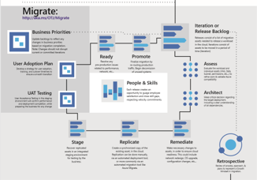

# Getting started with a cloud migration journey

Learn about using the Microsoft Cloud Adoption Framework for Azure to begin a cloud migration journey. This framework provides comprehensive guidance for transitioning legacy application workloads using innovative cloud-based technologies.

## Executive summary

The Cloud Adoption Framework helps customers undertake a simplified cloud adoption journey. This framework contains detailed information covering an end-to-end cloud adoption journey, starting with targeted business outcomes and aligning cloud readiness and assessments with clearly defined business objectives. Those outcomes are achieved through a defined path for cloud adoption. With migration-based adoption, the defined path focuses largely on completing a migration of on-premises workloads to the cloud. Sometimes this journey includes modernization of workloads to increase the return on investment from the migration effort.

This framework is designed primarily for cloud architects and the cloud strategy teams leading cloud adoption efforts. However, many topics in this framework are relevant to other roles across the business and IT. Cloud architects frequently serve as facilitators to engage each of the relevant roles. This executive summary is designed to prepare the various roles before facilitating conversations.

> [!NOTE]
> This guidance is currently a public preview. Terminology, approaches, and guidance are being thoroughly tested with customers, partners, and Microsoft teams during this preview. As such, the TOC and guidance may change slightly over time.

## Motivations

Cloud migrations can help companies deliver on their desired business outcomes. Clear communication of motivations, business drivers, and measurements of success are important foundations for making wise decisions throughout cloud migration efforts. The following table classifies motivations to facilitate this conversation. It is assumed that most companies will have motivations across each classification. The objective of this table is not to limit outcomes, but instead make it easier to prioritize overall objectives and motivations:

<!-- markdownlint-disable MD033 -->

|Critical Business Events | Migration Motivations | Innovation Motivations |
|---------|---------|---------|
| Datacenter exit  Mergers, acquisition, or divestiture  Reductions in capital expenses  End of support for mission-critical technologies  Response to regulatory compliance changes  Meet new data sovereignty requirements  Reduce disruptions and improve IT stability|Cost savings  Reduction in vendor or technical complexity  Optimization of internal operations  Increase business agility  Prepare for new technical capabilities  Scale to meet market demands  Scale to meet geographic demands|Prepare for new technical capabilities  Build new technical capabilities  Scale to meet market demands  Scale to meet geographic demands  Improve customer experiences / engagements  Transform products or services  Disrupt the market with new products or services|

<!-- markdownlint-enable MD033 -->

When a response to critical business events is the highest priority, it is important to engage in [cloud implementation](#cloud-implementation) early, often in parallel with strategy and planning efforts. Taking such an approach requires a growth mindset and a willingness to iteratively improve processes, based on direct lessons learned.

When migration motivations are a priority, [strategy and planning](#cloud-strategy-and-planning) will play a vital role early in the process. However, it is highly suggested that [implementation](#cloud-implementation) of the first workload is conducted in parallel with planning, to help the team understand and plan for any learning curves associated with the cloud.

When innovation motivations are the highest priority, strategy and planning will require additional investments early in the process to ensure balance in the portfolio and wise alignment of the investment made during cloud. For more information about realizing innovation motivations, see [Understand the innovation journey](./innovate.md).

Preparing all participants across the migration effort with an awareness of the motivations will ensure wiser decisions. The following migration methodology outlines how Microsoft suggests customers guide those decisions in a consistent methodology.

## Migration approach

The Cloud Adoption Framework establishes a high-level construct of Plan, Ready, Adopt to group the types of effort required across any cloud adoption. This executive summary builds on that high-level flow to establish iterative processes that can facilitate lift/shift/optimize efforts **and** modernization efforts in a single approach across all cloud migration activities.

This approach consists of two methodologies or areas of focus: Cloud Strategy & Planning and Cloud Implementation. The [motivation](#motivations) or desired business outcome for a cloud migration often determines how much a team should invest in [strategy and planning](#cloud-strategy-and-planning) and [implementation](#cloud-implementation). Those motivations can also influence decisions to execute each sequentially or in parallel.

## Cloud implementation

Cloud implementation is an iterative process for migrating and modernizing the digital estate in alignment with targeted business outcomes and change management controls. During each iteration, workloads are migrated or modernized in alignment with the strategy and plan. Decisions regarding IaaS, PaaS, or hybrid are made during the assess phase to optimized control and execution. Those decisions will drive the tools used during the Migrate phase. This model can be used with minimal strategy and planning. However, to ensure the greatest business returns, it is highly suggested that both IT and the business align on a clear strategy and plan to guide implementation activities.

The focus of this effort is the migration or modernization of workloads. A workload is a collection of infrastructure, applications, and data that collectively supports a common business goal, or the execution of a common business process. Examples of workloads could include things like a line-of-business application, an HR payroll solution, a CRM solution, a financial document approval workflow, or a business intelligence solution. Workloads may also include shared technical resources like a data warehouse that supports several other solutions. In some cases, a workload could be represented by a single asset like a self-contained server, application, or data platform.

Cloud migrations are often considered a single project within a broader program to streamline IT operations, costs, or complexity. The cloud implementation methodology helps align the technical efforts within a series of workload migrations to higher-level business values outlined in the cloud strategy and plan.

**Getting started:** To get started with a cloud implementation, the [Azure migration guide](../migrate/azure-migration-guide/index.md) and [Azure readiness guide](../ready/azure-readiness-guide/index.md) outline the tools and high-level processes needed to be successful in the execution of a cloud implementation. Migrating your first workload using those guides will help the team overcome initial learning curves early in the planning process. Afterwards, additional considerations should be given to the [expanded scope checklist](../migrate/expanded-scope/index.md), [migration best practices](../migrate/azure-best-practices/index.md) and [migration consideration](../migrate/migration-considerations/index.md), to align the baseline guidance with your effort's unique constraints, processes, team structures, and objectives.

## Cloud strategy and planning

Cloud strategy and planning is a methodology that focuses on aligning business outcomes, priorities, and constraints to establish a clear migration strategy and plan. The resultant plan (or migration backlog) outlines the approach to migration and modernization across the IT portfolio, which may span entire datacenters, multiple workloads, or miscellaneous collections of infrastructure, applications, and data. Proper management of the IT portfolio across cloud implementation efforts will help drive the desired business outcomes.

**Getting started:** The remainder of this article prepares the reader for the proper application of the Cloud Adoption Framework's Cloud strategy and planning methodology. It also outlines additional resources and links that can help the reader adopt this approach to guide cloud implementation efforts.

### Methodology explained

The Cloud Adoption Framework's Cloud strategy and planning methodology is based on an incremental approach to cloud implementation that aligns to agile technology strategies, cultural maturity based on growth mindset approaches, and strategies driven by business outcomes. This methodology consists of the following high-level components that guide the implementation of each strategy.

As depicted in the image above, this framework aligns strategic decisions to a small number of contained processes, which operate within an iterative model. While described in a linear document, each of the following processes is expected to mature in parallel with iterations of the cloud implementation. The links for each process will aid in defining the end state and the means of maturing toward the desired end state:

- **[Plan](../business-strategy/index.md):** When technical implementation is aligned with clear business objectives, it's much easier to measure and align success across multiple cloud implementation efforts, regardless of technical decisions.
- **[Ready](../ready/index.md):** Preparing the business, culture, people, and environment for coming changes leads to success in each effort and accelerates implementation and change projects.
- **Adopt:** Ensure proper implementation of desired changes, across IT and business processes, to achieve business outcomes.
  - **[Migrate](../migrate/index.md):** Iterative execution of the [cloud implementation methodology](#cloud-implementation) adhering to the tested process of Assess, Migrate, Optimize, and Secure & Manage to create a repeatable process for migrating workloads.
- **[Operate](../operating-model/index.md):** Define a manageable operating model to guide activities during and long after adoption.
  - **[Organize](../organization/index.md):** Align people and teams to deliver proper cloud operations and adoption.
  - **[Govern](../governance/index.md):** Align corporate policy to tangible risks, mitigated through policy, process, and cloud-based governance tooling.
  - **[Manage](../operations/index.md):** Expand IT operations to ensure cloud-based solutions can be operated through secure, cost effective processes using modern, cloud-first operations tools.

Throughout this migration experience this framework will be used to address ambiguity, manage change, and guide cross-functional teams through the realization of business outcomes.

### Common cultural changes resulting from adherence to this methodology

The effort to realize the desired business outcomes may trigger slight changes to the culture of IT, and to some degree the culture of the business. The following are a few common cultural changes seen in this process:

- The IT team is likely to adopt new skills to support workloads in the cloud.
- Execution of a cloud migration encourages iterative or agile approaches.
- Inclusion of cloud governance also tends to inspire DevOps approaches.
- Creation of a cloud strategy team can lead to tighter integration between business and IT leaders.
- Collectively, these changes tend to lead to business and IT agility.

Cultural change is not a goal of cloud migration or the Cloud Adoption Framework, but it is a commonly experienced outcome.
Cultural changes are not directly guided, instead subtle changes to the culture are embedded in the suggested process improvements and approaches throughout the guidance.

### Common technical efforts associated with this methodology

During implementation of the cloud strategy and plan the IT team will focus a large percentage of their time on the migration of existing digital assets to the cloud. During this effort, minimal code changes are expected, but can often be limited to configuration changes. In many cases, a strong business justification can be made for modernization as part of the cloud migration.

### Common workload examples

Cloud strategy and planning often target a broad collection of workloads and applications. Within the portfolio, common application or workload types are typically migrated. The following are a few examples:

- Line-of-business applications
- Customer-facing applications
- Third-party applications
- Data analytics platforms
- Globally distributed solutions
- Highly scalable solutions

### Common technologies migrated

The technologies migrated to the cloud constantly expand as cloud providers add new capabilities. The following are a few examples of the technologies commonly seen in a migration effort:

- Windows and SQL Server
- Linux and Open Source (OSS) databases
- Unstructure/NoSQL databases
- SAP on Azure
- Analytics (Data Warehouse, Data Lake)

## Next steps: Lifecycle solution

The Cloud Adoption Framework is a lifecycle solution. It is designed to help readers who are just beginning their journey and as well as readers who are deep into their migration. As such, content is very context and audience specific. Next steps are best aligned to the high-level process the reader would like to improve next.

> [!div class="nextstepaction"]
> [Plan](../plan/index.md)
>
> [Ready](../ready/index.md)
>
> [Migrate](../migrate/index.md)
>
> [Operate](../operations/index.md)
>
> [Govern](../governance/index.md)
