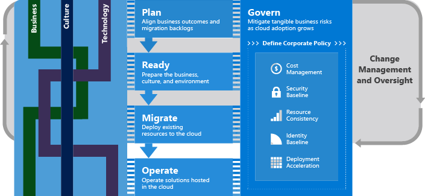

# Cloud migration executive summary

Microsoft has defined a cloud adoption framework, to help organizations with a simplified cloud adoption journey. The Cloud Adoption Framework is designed to provide comprehensive guidance for transitioning legacy application workloads using modern, innovative, cloud-based technologies. This framework contains detailed information to cover an end-to-end cloud adoption journey, which starts with targeted business outcomes, aligning cloud readiness and assessments to clearly defined business objectives. Those outcomes are then realized through a define path for cloud adoption. In the case of migration based adoption, that defined path focuses largely on the completion of a migration from on-premises to the cloud. At times this journey includes modernization of workloads to increase returns from the migration effort.

This framework is designed to speak most directly to Cloud Architects and the Cloud Strategy Team who lead cloud adoption efforts. However, many of the topics in this framework will be relevant to additional roles across the business and IT. It is assumed that Cloud Architects will serve as facilitators engaging each of the relevant roles. This executive summary is designed to prepare those various roles prior to those facilitated conversations.

> [!NOTE]
> This guidance is currently in a public preview state. Terms, approaches, and guidance are being thoroughly tested with customers, partners, and Microsoft teams during this preview. As such the TOC and guidance my change slightly.

## Framework for cloud migrations

This framework is based on an incremental approach to cloud adoption that aligns to Agile technology strategies, Growth Mindset based cultural growth, and Business Outcomes driven business strategies. This framework consists of the following high level components which guide the implementation of each strategy.

As depicted in the image above, this framework aligns strategic decisions to a small number of contained processes, which operate within an iterative model:

- Change management and oversight: Iterative approaches to implementation will be seen throughout this framework, which provides business and IT teams with a growth mindset approach to addressing ambiguity, learning, and succeeding in the fast paced environments demanded in today's marketplaces.
- [Plan](../business-strategy/overview.md): When technical implementation is aligned with clear business objectives, it's much easier to measure and align success across multiple cloud adoption efforts.
- [Ready](../ready/index.md): Preparing the business, culture, people, and environment for coming changes leads to success in each effort and accelerates implementation and change projects.
- [Migrate](../migrate/index.md): Iterative execution of the cloud migration adhering to the tested process of Assess, Migrate, Optimize, and Secure & Manage to create a repeatable process for migrating collections of IT assets.
- [Operate](../operations/overview.md): Expand IT operations to ensure cloud-based solutions can be operated through secure, cost effective processes using modern, cloud-first operations tools
- [Govern](../governance/overview.md): Align corporate policy to tangible risks, mitigated through policy, process, and cloud-based governance tooling.

Throughout this migration experience this framework will be used to address ambiguity, manage change, and guide cross-functional teams through the realization of business outcomes.

## Common business outcomes

Cloud migrations can align to a number of business outcomes. Most commonly migrations are related to stability, scale, or efficiency drivers. The following are few common business outcomes that would lead to a migration focused effort.

- Critical Business Event
    - Data center exit
    - Mergers, acquisition or divestiture
    - Reductions in capital expenses
    - End of support for mission critical technologies
- Cost Savings
- Reduction in vendor or technical complexity
- Optimize internal operations
- Increase business agility
- Prepare for new technical capabilities
- Scale to meet market demands
- Scale to meet geographic demands

Clearly communicating business drivers and the metrics used to measure success is an important first step in cloud migration efforts.

## Common cultural change

The effort to realize the desired business outcomes may trigger slight changes to the culture of IT, and to some degree the culture of the business. The following are a few common cultural changes seen in this process:

- The IT team is likely to adopt new skills to support workloads in the cloud
- Execution of a cloud migration encourages iterative or agile approaches
- Inclusion of cloud governance also tends to inspire DevOps approaches
- Creation of a Cloud Strategy Team can lead to tighter integration between business and IT leaders
- Collectively, these changes tend to lead to business and IT agility

Cultural change is not a goal of cloud migration or the Cloud Adoption Framework, but it is a commonly experienced outcome.
Cultural changes are not directly guided, instead subtle changes to the culture are embedded in the suggested process improvements and approaches throughout the guidance.

## Common technical efforts

During a cloud migration, the IT team will focus largely on the migration of existing digital assets to the cloud. During this effort, minimal code changes as expected, but can often be limited to configuration changes. In many cases, a strong business justification can be made for minor modernization as part of the technical execution.

## Common workload examples

Cloud migrations often target a broad portfolio of workloads and applications. Within those portfolios, a number of common application or workload types can be seen within the migrated assets. The following are a few examples:

- Line of business applications
- Customer facing applications
- 3rd party applications
- Data analytics platforms
- Globally distributed solutions
- Highly scalable solutions

## Common technologies migrated in this approach

The technologies migrated to the cloud constantly expand as cloud providers add new capabilities. The following are a few examples of the technologies commonly seen in a migration effort:

- Windows and SQL Server
- Linux and OSS DB
- SAP on Azure
- Analytics (Data Warehouse, Data Lake)

## Next steps: Lifecycle solution

The Cloud Adoption Framework is a lifecycle solution. It is intended to help readers who are just beginning their journey and those who are deep into their migration. As such, content is very context and audience specific. Next steps are best aligned to the high level process the reader would like to improve next.

> [!div class="nextstepaction"]
> [Plan](../business-strategy/overview.md)
>
> [Ready](../ready/index.md)
>
> [Migrate](../migrate/index.md)
>
> [Operate](../operations/overview.md)
>
> [Govern](../governance/overview.md)
