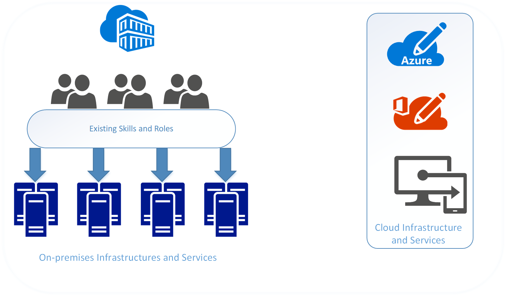
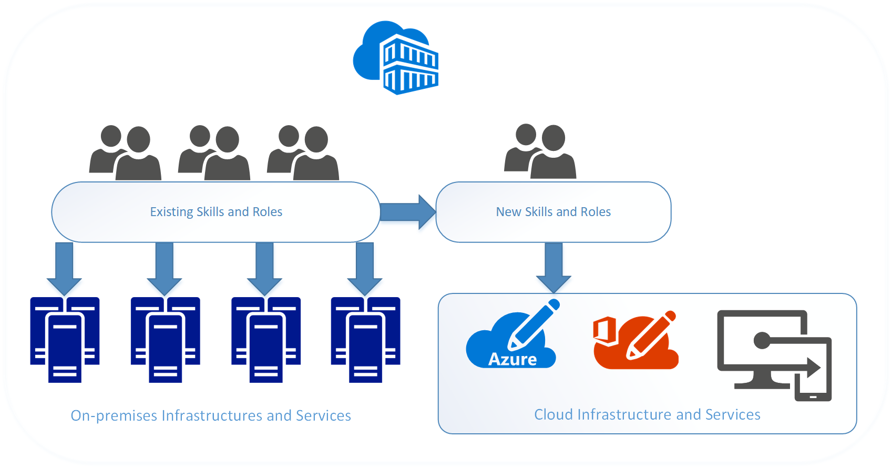

# Adopting Microsoft Azure: organizational readiness

For enterprises, the cloud represents an opportunity to digitally transform their business by integrating new technologies in to the business. There are technical challenges to cloud adoption, but there are also challenges to the existing organizational structure. 

People will have to learn new job skills while still performing their existing roles, and new processes will be implemented while old processes are in use.

To be successful in adopting the cloud, an enterprise must prepare their organization, people, and processes to be ready for this digital transformation. Every enterprise's organizational structure is different, so there is no one-size-fits-all approach to organizational readiness. This document outlines the high-level steps your enterprise can take to get ready. Your organization will have to spend time developing a detailed plan to accomplish each of the listed steps.

The high-level process is: 
1. Identify the stakeholders in your organization participating in the cloud adoption process. 
2. Conduct regular discussions with the stakeholders.
  * Capture stakeholder concerns. 
  * Identify the potential gaps in skills, roles, and processes from these concerns. 
  * Partner across teams on the overall goals of cloud adoption for the organization. 
3. Create a plan to address gaps and concerns. Execute the plan. 
4. Repeat this process until all gaps and concerns have been addressed.

## Identify the stakeholders

Adopting cloud technologies and digitally transforming your business involves not only your technical stakeholders, but your business stakeholders as well. Stakeholders are the individuals that have both the expertise and authority to participate in the decision-making process of your digital transformation. At a minimum, your stakeholders should be drawn from each of the areas listed below:

| Area | Expertise |
|-----|-----|
|Finance | Financial operation of the enterprise. |
|IT | Operation of the business infrastructure. | 
|Human resources| People management. |
|Compliance/Security | Protecting business assets on both the regulatory and security fronts.|
|Business unit leadership | Business strategy and management at the executive and business unit level. | 

Your enterprise may have additional roles and areas of expertise that require representation by key stakeholders.

> [!TIP]
> There is a tension between including too many people and not having a comprehensive representation of your organization. It is best to limit representation to members that have both expertise and authority within their respective areas. In practice, only one representative from each area is needed to participate in decision making.

## Conduct regular discussions during the transformation process

Once all stakeholders have been identified, set up a regular cadence for meetings to discuss the issues, determine possible solutions and outcomes, and arrive at a decision to move forward. Enumerating these issues for discussion is part of your digital transformation and will be unique to your enterprise. The [Azure Cloud Adoption guide](../index.md) provides a starting point and in-depth discussion to help with this.

### Capturing concerns

As your stakeholders work through these issues, each should determine any concerns as they relate to their area of expertise. For example, For example, your enterprise's IT workers may worry about the impact of the digital transformation on their day-to-day job duties. The finance stakeholder may identify a set of concerns around billing and chargeback for cloud resources. These concerns may take the form of a lack of process to alert the owner of workloads in the cloud that budgetary allowances have been exceeded.

When capturing concerns, identify the following: 
* The type of concern. For example, workers may be resistant to the changes in job duties that accompany the digital transformation.
* The impact of the concern if it is not addressed. For example, resistance to the digital transformation may be result in workers being slow to execute the changes necessary. 
* The area equipped to address the concern. For example, if workers in the IT department are reluctant to acquire new skills, the IT stakeholder's area is best equipped to address this concern. Identifying the area may be clear for some concerns, and in these cases you may need to escalate to executive leadership. 

### Identify gaps

Another aspect of working through the issues with your enterprise's digital transformation is identifying **gaps**. A gap is a role, skill, or process required for your digital transformation that does not currently exist in your enterprise. 

Begin by enumerating the new responsibilities that accompany the digital transformation, with an emphasis on new responsibilities and current responsibilities to be retired. Identify the area that is aligned with each responsibility. For new responsibilities, determine how closely aligned it is with the area. Some responsibilities may span several areas, and this represents an opportunity for better alignment that should be captured as a concern. In the case where no area is identified as being responsible, capture this as a gap.

Next, identify the skills necessary to support the responsibility. Determine if your enterprise has existing resources with these skills. If there are no existing resources, determine what training programs or talent acquisition is necessary. Determine the time frame by which the responsibility must be supported to keep your digital transformation on track.

Finally, identify the roles that will execute these skills. Some of your existing workforce will assume parts of the role, and in other cases an entirely new role may be necessary. 

### Partner across teams

The skills necessary to fill the gaps in your organization's digital transformation will typically not be confined to a single role, or even a single department. Skills will have relationships and dependencies that can span a single role or multiple roles, and those roles may exist in several departments. For example, a workload owner may require someone in an IT role to provision core resources such as subscriptions and resource groups.

These dependencies represent new processes that your organization implements to manage the workflow between roles. In the above example, there are several different types of process that can support the relationship between the workload owner and the IT role. For example, a workflow tool can be created to manage the process, or, a simple email template can be used.

Track these dependencies and make note of the processes that will support them, and whether or not the process currently exists. For process that require tooling, ensure that the timeline for deploying any tools aligns with the overall digital transformation schedule.

### Create a plan and execute

Many methodologies are useful and it is outside the scope of this paper to cover them all. However, we do recommend incorporating the following aspect: 
* Focus on the next 3-6 months (short term)
  * Prioritize work items associated with a gap or concern by the project phase in which they are to be completed. The process of becoming ready for your digital transformation is not helped by exhaustively listing all the tasks and the order of their completion. 
  * Be conservative when evaluating the tasks that can be completed. It is better to finish commitments early and return to the backlog. Overcommitment can lead to a diffusion of effort where nothing gets the requisite attention. 
* Assign a single owner for each gaps or concern. 
  * All tasks to resolve the gap or concern should have a single owner with responsibility for the task. Even tasks that cross practice areas should have a single owner.
  * Empower the owner so they have necessary authority or sponsorship to resolve the gap or concern. 
* Work iteratively.  
  * The team should meet on regularly. Two or three week iterations are generally the most effective. 
  * Identify the tasks that are struggling for completion, and identify what issues are blocking. Update the plan with solutions or workarounds for the blocking issues.
* Be transparent. 
  * Create and publish a matrix that communicates the commitments (gaps/concerns) and their status. Update this with each iteration. 
  * Promote a team culture in which a “red status” is a request for help and not a sign of failure. 

  ## Next steps

  Begin your digital transformation at the [foundational stage](overview.md) of the [Azure Enterprise Cloud Adoption Guide](../index.md).
