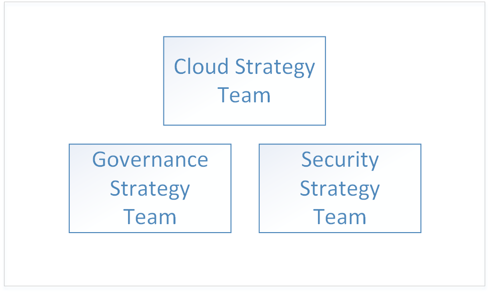
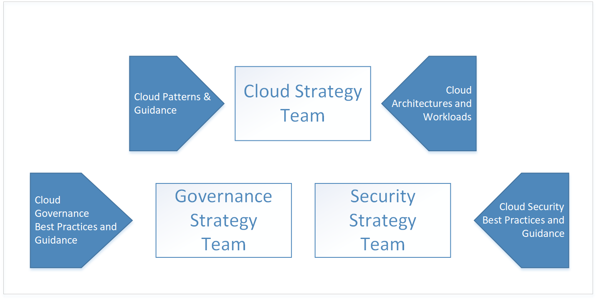
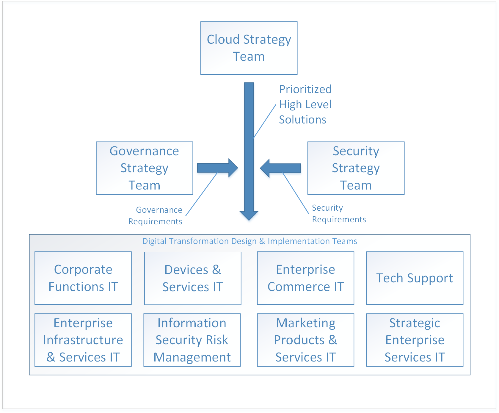

# Enterprise Cloud Adoption: Getting started 

The **digital transformation** to cloud computing represents a shift from operating on-premises to operating in the cloud. This shift includes new ways of doing business - for example, the digital transformation shifts from capital expenditures for software and datacenter hardware to operating expenditures for usage of cloud resources. 

## Digital transformation: process

To be successful in adopting the cloud, an enterprise must prepare its organization, people, and processes to be ready for this digital transformation. Every enterprise's organizational structure is different, so there is no one-size-fits-all approach to organizational readiness. This document outlines the high-level steps your enterprise can take to get ready. Your organization will have to spend time developing a detailed plan to accomplish each of the listed steps.

The high-level process for the digital transformation is:

1. Create a cloud strategy team. This team is responsible for leading the digital transformation. It's also important at this stage to form a governance team and a security team for the digital transformation.
2. Members of the cloud strategy team learn what's new and different about cloud technologies.  
3. The cloud strategy team prepares the enterprise by building the business case for digital transformation - enumerates all the current gaps in business strategy and determines the high-level solutions to eliminate them.
4. Align high-level solutions with business groups. Identify stakeholders in each business group to own the design and implementation for each solution.
5. Translate existing roles, skills and process to include cloud roles, skills, and process.  
<!--6. Develop processes for operating in the cloud to make solutions more robust in terms of availability, resiliency, and security. 
7. Optimize solutions for performance, scalability, and cost efficiency.-->

## Step 1: create a cloud strategy team

The first step in your enterprise's digital transformation is engaging business leaders from across the organization to create a cloud strategy team (CST). This team consists of business leaders from finance, IT infrastructure, and application groups. These teams can help with the cloud analysis and experimentation phase.

For instance, a Cloud Strategy Team could be driven by the CTO and consist of members of the enterprise architecture team, IT finance, senior technologists from various IT applications groups (HR, finance, and so on), and leaders from the infrastructure, security, and networking teams.  

It's also important to form two other high-level teams: a governance team, and a security team. These teams are responsible for designing, implementing, and the ongoing audit of the enterprise's governance and security policies. The governance team requires members that have worked with asset protection, cost management, group policy and related topics. The security team requires members that are well versed in current industry security standards as well as the enterprise's security requirements.

The governance team is responsible for designing and implementing the enterprise's governance model in the cloud, as well as deploying and maintaining the shared infrastructure assets that are part of the digital transformation. These assets include hardware, software, and cloud resources necessary to connect the on-premises network to virtual networking in the cloud.

The security team is responsible for designing and implementing the enterprise's security policy in the cloud, working closely with the governance team. The security team owns the extension of the security boundary of the on-premises network to include virtual networking in the cloud. This may take the form of owning and maintaining the inbound and outbound firewalls on the cloud virtual network as well as ensuring that tools and policy prevent the deployment of unauthorized resources.

## Step 2: learn what's new in the cloud
 
The next step in your enterprise's digital transformation is for the members of the cloud strategy team to learn about how cloud technology will change the way the enterprise does business. This is preparation and planning for the changes to your business, people, and technology. It's important for the members of the cloud strategy team to understand what's new and different in the cloud as compared to on-premises.

The starting point for understanding the cloud is learning [how Azure works](what-is-azure.md) at a high level. Next, learn about the basics of [governance in Azure](what-is-governance.md) in preparation for [understanding resource access management](azure-resource-access.md).

For advanced learning, the governance team should review the concepts and design guides in the governance section of the table of contents. The infrastructure and workloads sections are useful for learning about typical architectures and workloads in the cloud.

## Step 3: identify gaps in business strategy

The next step is for the cloud strategy team to enumerate the business problems that require a digital transformation solution. For example, an enterprise may have an existing on-premises data center with end-of-life hardware that requires replacement. In another example, an enterprise may be experiencing difficulty with time-to-market for new features and services and may be falling behind to competition. These gaps represent the *goals* of your enterprise's digital transformation.

Gaps in business strategy can be classified into the following categories:

|Category|Description|
|-----|-----|
|Cost management|Represents a gap in the way the Enterprise pays for technology.|
|Governance|Represents a gap in the processes used by the Enterprise to protect its assets from improper usage that might result in cost overruns, security issues, or compliance issues. | 
|Compliance|Represents a gap in the way the enterprise adheres to its own internal processes and policies as well as external laws, regulations, and standards. |
|Security|Represents a gap in the way the enterprise protects its technology and data assets from external threats. |
|Data governance|Represents a gap in the way an enterprise manages its data, especially customer data. For example, new General Data Protection Regulation (GDPR) in the European Union has strict requirements for the protection of customer data that may require new hardware and software.|    

Once your enterprise has classified all business strategy gaps into these categories, the next step is to determine a high-level solution for each problem.

The following table illustrates several examples:

|Business strategy gap|Category &nbsp; &nbsp; &nbsp; &nbsp; &nbsp;|Solution &nbsp;&nbsp;&nbsp;&nbsp;&nbsp;&nbsp;&nbsp;&nbsp;&nbsp;&nbsp;&nbsp;&nbsp;&nbsp;&nbsp;|
|-----|-----|-----|
| Services currently hosted on-premises experience issues with availability, resiliency, and scalability during time of peak demand, which is approximately ten percent of usage. Servers in on-premises datacenter are end-of-life. Enterprise IT recommends purchasing new on-premises hardware for datacenter with specifications to handle peak demand.| Cost management | Migrate affected existing on-premises workloads to scalable resources in the cloud, paying for usage only. |
| External data management laws and regulations require the enterprise to adhere to set of standard controls that require encryption of data at rest, requiring new hardware and software. | Data governance | Move data to Azure storage service encryption for data at rest. |
| Services hosted in on-premises datacenter been experiencing distributed denial of service (DDoS) attacks on public-facing services. The attacks are difficult to mitigate and require new hardware, software, and security personnel to deal with effectively. | Security | Migrate services to Azure, and take advantage of Azure DDoS protection.|

When all of the gaps in business strategy have been enumerated and high-level solutions have been determined, prioritize the list. The list can be prioritized by aligning the business strategy gaps with the enterprise's short and long-term goals in each category. For example, if the enterprise has a short-term goal to reduce IT spend in the next two fiscal quarters, the business gaps in the *cost management* category may be prioritized by the projected cost saving associated with each.

The output of this process is a stack-ranked list of high-level solutions aligned with business categories. 

## Step 4: align high-level solutions with business groups to design solutions 

Now that the goals of the digital transformation have been enumerated, prioritized, and high-level solutions proposed, the next step is for the cloud strategy team to align each of the high-level solutions with design and implementation teams in each of the business groups. 

The teams take the prioritized lists and work through each high-level solution to design each solution. The design process will involve the specification of new infrastructure and new workloads. There may also be changes to the roles of the people and the processes they follow. It's also extremely important at this stage for each of the design teams to include both the governance and security teams for review of each design. Each design must fall within with the policies and procedures defined by the governance and security teams, and these teams must be included in the final sign off of each design.

The design of each solution is a non-trivial task and as designs are created, must be considered in context with other solution designs from other teams. For example, if several of the designs result in a migration of existing on-premises applications and services to the cloud, it may be more efficient to group these together and design an overall migration strategy. In another example, it may not be possible to migrate some existing on-premises applications and services and the solution may be to replace them with either new development or third-party services. In this case, it may be more efficient to group these together and determine the overlap between them to determine if a third-party service can be used for more than one solution.

Once the design of the solution is complete, the team moves on to the implementation phase for each design. The implementation phase for each solution design can be run using standard project management processes.

## Step 5: translate existing roles, skills, and process for the cloud

At each evolutionary phase during the history of the IT industry, the most notable industry changes are often marked by changes in staff roles. During the transition from mainframes to the client/server model, the role of the computer operator largely disappeared, replaced by the system administrator. When the age of virtualization arrived, the requirement for individuals working with physical servers diminished, replaced with a need for virtualization specialists. Similarly, as institutions shift to cloud computing, roles will likely change again. For example, datacenter specialists might be replaced with cloud financial analysts. Even in cases where IT job titles have not changed, the daily work roles have evolved significantly. 

IT staff members may feel anxious about their roles and positions as they realize that a different set of skills is needed for the support of cloud solutions. But agile employees who explore and learn new cloud technologies don’t need to have that fear. They can lead the adoption of cloud services and help the organization understand and embrace the associated changes. 

### Capturing concerns

During the digital transformation, each team should capture any staff concerns as they arise. When capturing concerns, identify the following: 
* The type of concern. For example, workers may be resistant to the changes in job duties that accompany the digital transformation.
* The impact of the concern if it is not addressed. For example, resistance to the digital transformation may be result in workers being slow to execute the changes necessary. 
* The area equipped to address the concern. For example, if workers in the IT department are reluctant to acquire new skills, the IT stakeholder's area is best equipped to address this concern. Identifying the area may be clear for some concerns, and in these cases you may need to escalate to executive leadership. 

### Identify gaps

Another aspect of working through the issues with your enterprise's digital transformation is identifying **gaps**. A gap is a role, skill, or process required for your digital transformation that does not currently exist in your enterprise. 

Begin by enumerating the new responsibilities that accompany the digital transformation, with an emphasis on new responsibilities and current responsibilities to be retired. Identify the area that is aligned with each responsibility. For new responsibilities, determine how closely aligned it is with the area. Some responsibilities may span several areas, and this represents an opportunity for better alignment that should be captured as a concern. In the case where no area is identified as being responsible, capture this as a gap.

Next, identify the skills necessary to support the responsibility. Determine if your enterprise has existing resources with these skills. If there are no existing resources, determine what training programs or talent acquisition is necessary. Determine the time frame by which the responsibility must be supported to keep your digital transformation on track.

Finally, identify the roles that will execute these skills. Some of your existing workforce will assume parts of the role, and in other cases an entirely new role may be necessary. 

### Partner across teams

The skills necessary to fill the gaps in your organization's digital transformation will typically not be confined to a single role, or even a single department. Skills will have relationships and dependencies that can span a single role or multiple roles, and those roles may exist in several departments. For example, a workload owner may require someone in an IT role to provision core resources such as subscriptions and resource groups.

These dependencies represent new processes that your organization implements to manage the workflow between roles. In the above example, there are several different types of process that can support the relationship between the workload owner and the IT role. For example, a workflow tool can be created to manage the process, or, a simple email template can be used.

Track these dependencies and make note of the processes that will support them, and whether or not the process currently exists. For process that require tooling, ensure that the timeline for deploying any tools aligns with the overall digital transformation schedule.

## Next steps

The digital transformation is an iterative process, and with each iteration the teams involved will become more efficient. 

> [!div class="nextstepaction"]
> [Understand how Azure works](what-is-azure.md)