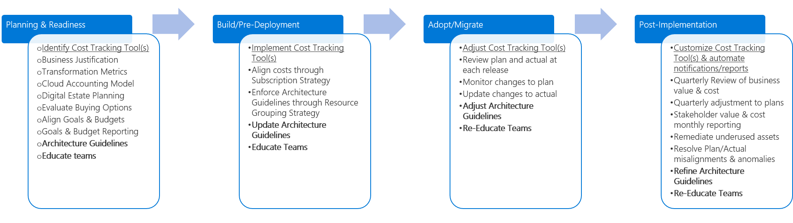

# Fusion: How can a company add Cost Management discipline to their Cloud Governance execution?

In the [Intro to Cloud Governance](../overview.md), Cost Management is one of the Five Disciplines to Cloud Governance. This discipline focuses on ways of establishing cloud spend plans, allocations of cloud budgets,  monitoring/enforcement of cloud budgets, detecting costly anomalies, and adjusting the plan when actual spending is misaligned.

This article outlines different phases of Cost Management evolution, as a company goes through increments of Planning, Building, Adopting, and Operating a cloud solution. It is impossible for any document collection to account for the various requirements of any business. As such, each section outlines a minimum suggested activity and a number of potential activities. The objective of each set of activities is to help build a [Policy MVP](../policy-compliance/overview.md), but establish a framework for [Incremental Policy](../policy-compliance/overview.md) evolution. The Cloud Governance Team should decide how much to invest in the potential activities to improve the Cost Management position.

> [!CAUTION]
> Neither the minimum suggested activities, nor the potential activities, outlined in this article are aligned to individual corporate policies or 3rd party compliance requirements. This guidance is designed to help facilitate the conversations that will lead to alignment of both requirements with a Cloud Governance Model.

*Figure 1. Evolution of Cost Management discipline across various phases of adoption

## Planning & Readiness

While not directly aligned, this phase of governance maturity most closely maps to the activities outlined in the [Plan process](../../transformation-journeys/operational-transformation/plan.md) for the [Operational Transformation Journey](../../transformation-journeys/operational-transformation/overview.md).

**Minimum Suggested Activities**

* Evaluate [Tool Chain](toolchain.md) options
* Develop and surface a draft of Architecture Guidelines
* Educate and involve the teams impacted in the development of Architecture Guidelines

**Potential Activities**

* Ensure budgetary decisions support the [Business Justification](../../business-strategy/cloud-migration-business-case.md)
* Validate [Transformation Metrics](../../business-strategy/transformation-metrics.md) used to report on the successful allocation of funding
* Understand the desired [Cloud Accounting Model](../../business-strategy/cloud-accounting.md)
* Become familiar with the [Digital Estate Plan](../../digital-estate/overview.md) & validate accurate costing expectations
* Evaluate buying options to determine if it's better to Pay As You Go or to make a pre-committment by purchasing an Enterprise Agreement.
* Align business goals with planned budgets
* Develop a goals and budget reporting mechanism to notify technical and business stakeholders at the end of each cost cycle

## Build / Pre-Deployment

While not directly aligned, this phase of governance maturity most closely maps to the activities outlined in the [Build process](../../transformation-journeys/operational-transformation/build.md) for the [Operational Transformation Journey](../../transformation-journeys/operational-transformation/overview.md).

**Minimum Suggested Activities**

* Implement [Tool Chain](toolchain.md)
* Update Architecture Guidelines
* Educate teams impacted in the Architecture Guidelines

**Potential Activities**

* Align budgetary plans with the [Subscription Strategy](../../infrastructure/subscriptions/overview.md)
* Leverage the [Resource Grouping Strategy](../../infrastructure/) to enforce architecture and cost guidelines

## Adopt / Migrate

While not directly aligned, this phase of governance maturity most closely maps to the activities outlined in the [Migrate process](../../transformation-journeys/operational-transformation/migrate.md) for the [Operational Transformation Journey](../../transformation-journeys/operational-transformation/overview.md).

**Minimum Suggested Activities**

* Adjust [Tool Chain](toolchain.md)
* Adjust Architecture Guidelines
* Educate teams impacted in the Architecture Guidelines

**Potential Activities**

* Review Plan and Actual spend during each release
* Monitor changes in plan
* Update changes to actual

## Operate / Post-Implementation

Once the transformation is complete, governance and operations must live on for the natural lifecycle of an  application or workload. This phase of governance maturity focuses on the activities that commonly come after the solution is implemented and the transformation cycle begins to stabilize.

**Minimum Suggested Activities**

* Customize [Tool Chain](toolchain.md)
* Automate [Tool Chain](toolchain.md) notifications and reports
* Refine Architecture Guidelines to guide future adoption processes
* Re-Educate impacted teams on a periodic basis to ensure on-going adherence to Architecture Guidelines

**Potential Activities**

* Execute a Quarterly Cloud Business Review to communicate value delivered to the business and associated costs
* Adjust plans quarterly to reflect changes to the actual spend
* Stakeholder value and cost reporting on a monthly basis
* Remediate underused assets
* Detect misalignments and anomalies between plan and actual
* Aid the Cloud Adoption Team and Cloud Strategy Team in understanding and resolving anomalies