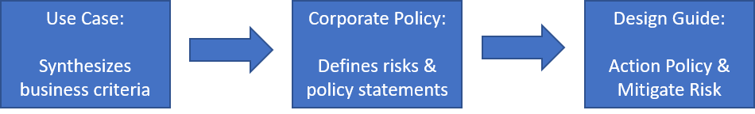

# Fusion: A Governance Design Guide for Enterprise MVP

Fusion provides a cloud agnostic approach to the creation of a cloud governance strategy. To learn more about the model that this design guide is based on, checkout the [overview section of Governance](../../overview.md). This article demonstrates implementation of a cloud governance strategy that aligns to the specific use case below: Enterprise MVP for Governance. The concept of MVP or Minimally Viable Product, focuses on delivering just enough governance to safely allow for a limited amount of cloud adoption. As cloud adoption plans evolve and grow, so would governance requirements. In this type of model, a plan for scaling governance is crucial to avoid future blockers.

## Use Case and Corporate Policy Summary

This design guide is an opinionated approach to implement the needs outlined in the use case and corporate policy summarized below.

* Use Case Summary: The company in this use case is not ready to invest in cloud governance. Current IT policy prevents any protected data or mission critical solutions from being deployed to the cloud. However, the future state defined by business and IT leadership calls for the retirement of 2 datacenters in the next 36 months.
* Corporate Policy Summary: Given the low tolerance for cloud governance investment, the risks, policy statements, and processes in this corporate policy are very limited. The focus of this company's cloud governance corporate policy is future looking. In this grass roots effort, the team will attempt to avoid vendor lock-in and ensure deployments can be folded into a rich cloud governance program in the future.

*This design guide is a specific solution based on a specific use case and corporate policy. This design guide is dependent upon the criteria set in each of those articles.*

> [!CAUTION]
> This article contains a highly opinionated design guide. The opinions in this guide DO NOT fit every situation. Caution should be exercised before implementing this guidance. Prior to implementation of this design guide, the reader should understand the [Use Case](./use-case.md) and [Corporate Policy](./corporate-policy.md) which influenced the guidance in this document.

## Checklist for the Enterprise Guardrails Design Guide

The following outlines the implementation choices included in this design guide.

### Implementation Checklist

This checklist provides a reference of the steps required to implement this design guide. Additional implementation details are provided in the following sections. At the end of this document, a section with alternative patterns is available to help refine these decisions.

1) Validate alignment with the [Use Case](./use-case.md) and [Corporate Policy](./corporate-policy.md) that determined the following decisions
2) Subscription model: The **Complex** pattern for subscription modeling has been suggested for this use case
3) Resource Grouping: The **Complex Grouping** pattern has been chosen for grouping resources
4) Resource Tagging: The **Accounting** pattern best aligns with defined corporate policy statements
5) Identity: The **Directory Replication w/Domain Service Extension** pattern is suggested for the proper level of hybrid identity
6) Software Defined Network: While not heavily leverage at this point, a **Demilitarized** pattern to networking has been chosen. In parallel, the networking team is implementing an Express Route connection to evolve this to a **Global Hub/Spoke** pattern
7) Encryption: A **Hybrid** pattern to encryption has been chosen, but is not yet required
8) Log & Reporting: A **Hybrid** pattern to logging has been chosen, but implementation is delayed pending the evolution of the network solution
9) Enforcement Automation: **On-going Enforcement** is the chosen pattern for policy enforcement

### Assumptions to validate

The above checklist assumes the following. Should these assumptions prove false, see the section on [Assumptions and Additional Considerations](#assumptions-and-additional-considerations) at the end of this article for more details on each.

[Todo: Summarize Assumptions]

The assumptions above can not generally be addressed by a Cloud Governance Team in isolation. Before implementing the design guide, review and prepare for each of these assumptions.

## Detailed Design Guidance supporting each point on the Implementation Checklist

Many of the [business risk, policy statements](./corporate-policy.md) and [objectives](./use-case.md) associated with this scenario can be mitigated through the adoption of standards and technical design. Mitigating these risks early in the process will future proof deployments, easing governance adoption down the road. Little actual governance is required to meet the business needs of this use case.

### Subscription Model

[Subscription Model Decision](../../../infrastructure/subscriptions/overview.md): The **Complex** pattern has been chosen for Azure subscriptions. Learn more about this pattern and alternatives considered in the [Decision Guide for Subscription Models](../../../infrastructure/subscriptions/overview.md)

* As new requests for azure resources are surfaced, a "Department" should be established for each major business unit in each operating geography. Within each of the Departments, "Subscriptions" should be created for each application archetype.
* An application archetype is a means of grouping applications with similar needs. Common examples would include: Applications with protected data, Governed Apps (HIPAA, FedRamp, etc...), Low risk applications, Applications with on-prem dependencies, SAP or other Mainframes in Azure, Applications that extend on-prem SAP or mainframes, etc... These are unique per organization based on data classifications and the types of applications that power the business. Dependency mapping of the digital estate can aid in defining the application archetypes in an organization.
* A common naming convention should be agreed upon as part of the subscription design, based on the above two bullets.

### Resource Grouping

[Resource Grouping Decision](../../../infrastructure/resource-grouping/overview.md): **Complex grouping** has been chosen for cloud deployments. Learn more about this pattern and alternatives considered in the [Decision Guide for Resource Grouping](../../../infrastructure/resource-grouping/overview.md)

* Deployed assets should be a member of a Resource Group within an Azure Management Group. Azure Policy should be applied to all Resource Groups.
* As part of the deployment process, an Azure Resource Management (ARM) template(s) for any asset or collection of assets should be stored in source control.
* Each resource group should align to a specific workload or application.
* The Azure Management Group should represent the hierarchy of billing responsibility and application ownership through nested groups.
* Extensive Azure Policy implementation could exceed the teams time commitments and may not provide a great deal of value at this time. However, a simple default policy should be created and applied to each resource group to enforce the small number of current cloud governance policy statements. This will serve as a mechanism for defining the implementation of specific governance requirements. Those implementations can then be applied across all deployed assets.

### Resource Tagging

[Resource Tagging Decision](../../../infrastructure/resource-tagging/overview.md): An **Accounting** pattern to tagging has been chosen for all cloud deployments. Learn more about this pattern and alternatives considered in the [Decision Guide for Resource Tagging](../../../infrastructure/resource-tagging/overview.md)

* Deployed assets should be tagged with the following values: Department/Billing Unit, Data Classification, Criticality, SLA, and Environment.
* These five values along with the Azure Management Group and Subscription associated with a deployed asset will drive governance, operations, and security decisions.

### Identity Solution

[Identity Solution Decision](../../../infrastructure/identity/overview.md): The team has chosen a **Directory Replication w/Domain Service Extension** pattern for hybrid identity. Learn more about this pattern and alternatives considered in the [Decision Guide for Identity Solutions](../../../infrastructure/identity/overview.md)

* RBAC will be provided by Azure AD, leveraging the directory synchronization or "Same Sign-On" that was implemented during the Office 365 implementation
    * See [Reference Architecture for Azure AD Integration](/azure/architecture/reference-architectures/identity/adfs) for implementation guidance.  
* When ticket-based authentication or 3rd party multi-factor authentication is required, a VM hosting a replicated instance of AD will be deployed to the subscription. AD will be extended from on-prem to the deployed instance via Domain Services over a secure network connection.
    * See [Reference Architecture on ADDS w/ Azure](/azure/architecture/reference-architectures/identity/adds-extend-domain) for implementation guidance). 
* When a global WAN is available, the chosen pattern will become a **Global Replication w/ Domain Service Extension** pattern to provide AD as a shared service across multiple subscriptions with ticket-based authentication or 3rd party multi-factor authentication requirements.

### Software Defined Network

[Software Defined Network Decision](../../../infrastructure/software-defined-networks/overview.md): At this point, a **Demilitarized** pattern to networking has been chosen. Learn more about this pattern and alternatives considered in the [Decision Guide for Software Defined Networks](../../../infrastructure/software-defined-networks/overview.md)

* Azure subscriptions may connect to an existing data center via VPN, but must follow all existing on-prem IT governance policies regarding connection of a demilitarized zone to protected resources.
    * See [VPN Reference Architecture](/azure/architecture/reference-architectures/hybrid-networking/vpn) for implementation guidance regarding VPN connectivity
    * Decisions regarding subnet, firewall, and routing are currently being deferred to each application/workload lead.
* Prior to adoption of protected data or mission critical workloads, IT will establish a **Hub/Spoke** or **Global Hub/Spoke** model with shared Express Route access to the WAN
    * See [Hub/Spoke with Shared Services Reference Architecture](/azure/architecture/reference-architectures/hybrid-networking/shared-services) for implementation guidance
    * When shared services are made available, additional networking requirements will be established for each subscription prior to connecting to shared services.
    * A support window will be establishing allowing existing deployments to meet the new requirements and obtain a connection to the shared services.

### Encryption

[Encryption Decision](../../../infrastructure/encryption/overview.md): At this point, a **Hybrid** pattern to encryption is suggested but not required. Learn more about this pattern and alternatives considered in the [Decision Guide for Encryption](../../../infrastructure/encryption/overview.md)

* No governance requirements have been set regarding the use of encryption, because mission critical and protected data are not permitted based in the use case.
* When encryption is required by an application, the encryption key will be generated and managed on-prem.
* Additional analysis will be required prior to the release of any protected data.

### Log & Reporting

[Log & Reporting Decision](../../../infrastructure/logs-and-reporting/overview.md): At this point, a **Hybrid** pattern to log and reporting has been selected, but implementation has been delayed. Learn more about this pattern and alternatives considered in the [Decision Guide for Resource Grouping](../../../infrastructure/logs-and-reporting/overview.md)

* No governance requirements have been set regarding the data to be collected for logging or reporting purposes.
* Additional analysis will be required prior to the release of any protected data or mission critical workloads.
* Prior to support for protected data or mission critical workloads, the logging tenant must be accessible by the existing on-prem operational monitoring solution. Applications will be required to meet security and logging requirements associated with the use of that tenant, if the application is to be supported with a defined SLA.

### Enforcement Automation

[Enforcement Automation Decision](../../monitoring-enforcement/overview.md): At this point, the **on-going Enforcement** pattern is required. Learn more about this pattern and alternatives considered in the [Decision Guide for Resource Grouping](../../monitoring-enforcement/overview.md)

* All subscriptions must have a published blueprint.
* Resource groups will be defined within the blueprint.
* Azure Policy(s) are to be applied to all Resource Groups within the subscription. However, the level of policies being enforced will be very limited.
* RBAC role assignments are to be specified in each blueprint.

## Assumptions and Additional Considerations

There are a number of assumptions and considerations embedded in this opinionated guidance. Each should be considered before. The following list outlines data points and tasks that generally don't fall into the domain of the Cloud Governance Team. While members of this team may have those skills, it is unlikely the team will be empowered to execute the following without additional team member support.

* Use Case Assumption: The use case in this design guide is built on the assumption that this implementation will eventually serve multiple business units (or billing units). The use case also assumes that the business unit serves customers in multiple geo-political region. These are not data points that the Cloud Governance Team is likely to be able to determine in isolation. There is likely a dependency on IT and business leadership. If these assumptions prove false, the team should consider the [Future Proof Governance Design Guide](../future-proof/design-guide.md) as a potential starting point for governance implementation. While the implementation differences between the two are subtle, they can have a big impact later in the process.
* Identity Assumption: It is assumed that the identity team has already configured an Identity integration with Azure AD that meets current IT governance policies. If that assumption is false, there is a dependency on system administrators with identity experience to configure that integration.
* Network Assumption: It is assumed that the networking team has implemented an Azure compatible VPN solution that confirms to existing IT governance policies. If that assumption is false, there is a dependency on system administrators and potential the Cloud Adoption Team(s).
* Encryption Assumption: It is assumed that the encryption key management solution is available and processes are defined for obtaining keys to be used in Azure.

## Conclusion

The 8 best practices above are one example of ways to design the base system, in order to reduce risk and promote readiness for the future integration of a robust governance strategy. This design guide is derived from a synthesized customer scenario for demonstration purposes. To learn more about the decisions that informed this design guide, see the articles that outline this scenarios [Use Case](./use-case.md) and [Corporate Policy](./corporate-policy.md).

## Next steps

More than likely, this guide will require customization. To aid in customizing this guide and making relevant decisions, the following links may be of value:

**[Defining Corporate Policy](../../policy-compliance/overview.md)**: Fusion Model to defining risk driven policies to govern the cloud.
**[Adjusting the 5 disciplines of cloud governance](../../governance-disciplines.md)**: Fusion model to implementing those policies across the five disciplines that automate governance.

> [!div class="nextstepaction"]
> [Adjusting the 5 disciplines of cloud governance](../../governance-disciplines.md)