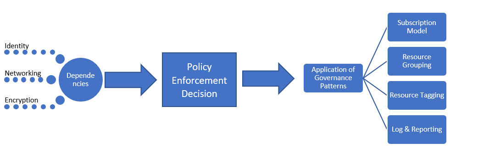

# Fusion: Large Enterprise – Additional technical Details regarding Governance MVP

This article outlines the implementation of the initial corporate policies for this governance journey. Those policies are described in the previous article, [Initial corporate policy behind the governance strategy](corporate-policy.md). Before implementation, it is advised that the reader review, modify, and integrate those artifacts into decision making processes.

The core of this governance minimum viable product (MVP) is the [Deployment Acceleration](../../configuration-management/overview.md) discipline. The tools and patterns applied at this stage will enable the incremental evolutions needed to expand governance in the future.

## Governance MVP (Cloud Adoption Foundation)

Rapid adoption of governance and corporate policy is achievable, thanks to a few simple principles and cloud-based governance tooling. These are the first of the three Cloud Governance Disciplines to approach in any governance process. Each will be expanded upon in this article.

To establish the starting point, this article will discuss the high-level strategies behind Identity Baseline, Security Baseline, and Deployment Acceleration that are required to create a Governance MVP, which will serve as the foundation for all adoption.

## Implementation process

The implementation of the governance MVP has dependencies on Identity, Security, and Networking. Once the dependencies are resolved, the Cloud Governance team will decide a few aspects of governance. The decisions from the Cloud Governance team and from supporting teams will be implemented through a single package of enforcement assets.

This implementation can also be described using a simple checklist:

1. Solicit decisions regarding core dependencies: Identity, Network, and Encryption.
2. Determine the pattern to be used during corporate policy enforcement.
3. Determine the appropriate governance patterns for the Resource Consistency, Resource Tagging, and Loging and Reporting disciplines.
4. Implement the governance tools aligned to the chosen policy enforcement pattern to apply the dependent decisions and governance decisions.

[!INCLUDE [implementation-process](../../../../../includes/cloud-adoption/governance/implementation-process.md)]

## Application of governance-defined patterns

The Cloud Governance team will be responsible for the following decisions and implementations. Many will require inputs from other teams, but the Cloud Governance team is likely to own both the decision and implementation. The following sections outline the decisions made for this use case and details of each decision.

### Subscription Model

The **Mixed** pattern has been chosen for Azure subscriptions.

- As new requests for Azure resources arise, a "Department" should be established for each major business unit in each operating geography. Within each of the Departments, "Subscriptions" should be created for each application archetype.
- An application archetype is a means of grouping applications with similar needs. Common examples include: Applications with protected data, governed applications (such as HIPAA or FedRAMP), low-risk applications, applications with on-premises dependencies, SAP or other mainframes in Azure, or applications that extend on-premises SAP or mainframes. Each organization has unique needs based on data classifications and the types of applications that support the business. Dependency mapping of the digital estate can help define the application archetypes in an organization.
- A common naming convention should be agreed upon as part of the subscription design, based on the above two bullets.

### Resource Consistency

**Hierarchical Consistency** has been chosen as a resource consistency pattern.

- Resource groups should be created for each application. Management groups should be created for each application archetype. Azure Policy should be applied to all subscriptions in the associated management group.
- As part of the deployment process, Resource Management templates for all assets should be stored in source control. 
- Each resource group should align to a specific workload or application.
- The Azure Management Group hierarchy defined should represent billing responsibility and application ownership using nested groups.
- Extensive implementation of Azure Policy could exceed the team’s time commitments and may not provide much value at this point. However, a simple default policy should be created and applied to each resource group to enforce the first few cloud governance policy statements. This serves to define the implementation of specific governance requirements. Those implementations can then be applied across all deployed assets.

### Resource Tagging

The **Accounting** pattern has been chosen for resource tagging.

- Deployed assets should be tagged with values for the following: Department/Billing Unit, Geography, Data Classification, Criticality, SLA, Environment, Application Archetype, Application, and Application Owner.
- These values along with the Azure Management Group and Subscription associated with a deployed asset will drive governance, operations, and security decisions.

### Logging and reporting

At this point, a **Hybrid** pattern for log and reporting is suggested but not required of any development team.

- No governance requirements are currently set regarding the specific data points to be collected for logging or reporting purposes. This is specific to this fictional narrative and should be considered an antipattern. Logging standards should be determined and enforced as soon as possible.
- Additional analysis is required prior to the release of any protected data or mission critical workloads.
- Prior to supporting protected data or mission-critical workloads, the existing on-premises operational monitoring solution must be granted access to the workspace used for logging. Applications are required to meet security and logging requirements associated with the use of that tenant, if the application is to be supported with a defined SLA.

## Evolution of governance processes

Some of the policy statements cannot or should not be controlled by automated tooling. Other policies will require periodic effort from IT Security and on-premises Identity Baseline teams. The Cloud Governance team will need to oversee the following processes to implement the last eight policy statements:

**Corporate Policy Changes**: The Cloud Governance team will make changes to the Governance MVP design to adopt the new policies. The value of the Governance MVP is that it will allow for the automatic enforcement of the new policies.

**Adoption Acceleration**: The Cloud Governance team has been reviewing deployment scripts across multiple teams. They've maintained a set of scripts that serve as deployment templates. Those templates can be used by the cloud adoption teams and DevOps teams to more quickly define deployments. Each script contains the requirements for enforcing governance policies, and additional effort from cloud adoption engineers is not needed. As the curators of these scripts, they can implement policy changes more quickly. Additionally, they are viewed as accelerators of adoption. This ensures consistent deployments without strictly enforcing adherence.

**Engineer Training**: The Cloud Governance team offers bi-monthly training sessions and has created two videos for engineers. Both resources help engineers get up to speed quickly on the governance culture and how deployments are performed. The team is adding training assets to demonstrate the difference between production and non-production deployments, which helps engineers understand how the new policies affect adoption. This ensures consistent deployments without strictly enforcing adherence.

**Deployment Planning**: Prior to deployment of any asset containing protected data, the Cloud Governance team will be responsible for reviewing deployment scripts to validate governance alignment. Existing teams with previously approved deployments will be audited using programmatic tooling.

**Monthly Audit and Reporting**: Each month, the Cloud Governance team runs an audit of all cloud deployments to validate continued alignment to policy. When deviations are discovered, they are documented and shared with the cloud adoption teams. When enforcement doesn't risk a business interruption or data leak, the policies are automatically enforced. At the end of the audit, the Cloud Governance team compiles a report for the Cloud Strategy team and each cloud adoption team to communicate overall adherence to policy. The report is also stored for auditing and legal purposes.

**Quarterly Policy Review**: Each quarter, the Cloud Governance team and Cloud Strategy team to review audit results and suggest changes to corporate policy. Many of those suggestions are the result of continuous improvements and the observation of usage patterns. Approved policy changes are integrated into governance tooling during subsequent audit cycles.

## Alternative patterns

If any of the patterns selected in this governance journey don't align with the reader's requirements, alternatives to each pattern are available:

- [Encryption patterns](../../../infrastructure/encryption/overview.md)
- [Identity patterns](../../../infrastructure/identity/overview.md)
- [Logging and Reporting patterns](../../../infrastructure/logs-and-reporting/overview.md)
- [Policy Enforcement patterns](../../../infrastructure/policy-enforcement/overview.md)
- [Resource Grouping patterns](../../../infrastructure/resource-grouping/overview.md)
- [Resource Tagging patterns](../../../infrastructure/resource-tagging/overview.md)
- [Software Defined Network patterns](../../../infrastructure/software-defined-networks/overview.md)
- [Subscription Design patterns](../../../infrastructure/subscriptions/overview.md)

## Next steps

Once this guide is implemented, the Cloud Adoption team can go forth with a sound governance foundation. The Cloud Governance team will work in parallel to continuously update the corporate policies and governance disciplines.

The two teams will use the tolerance indicators to identify the next evolution needed to continue supporting cloud adoption. For the fictitious company in this journey, the next step is evolving this governance baseline to support applications with legacy or third-party multifactor authentication (MFA) requirements.

> [!div class="nextstepaction"]
> [Identity baseline evolution](./identity-baseline.md)