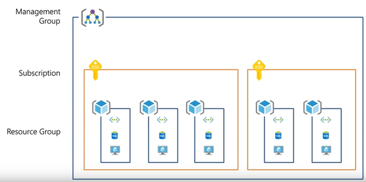
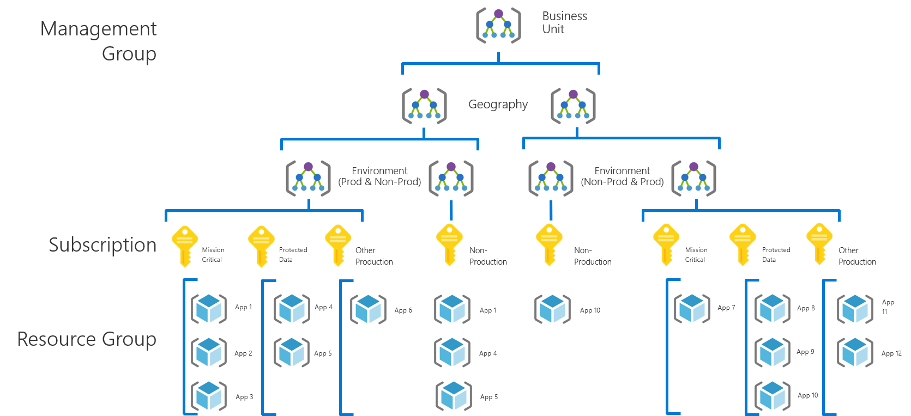
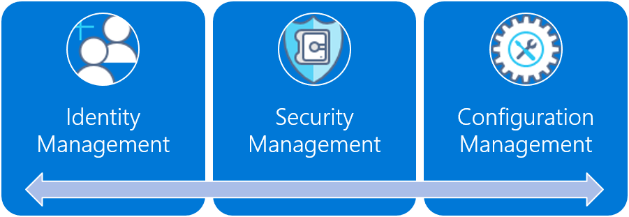
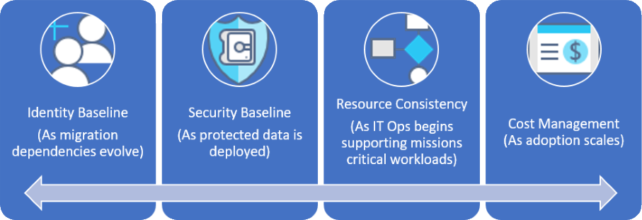

# Fusion: Large enterprise governance journey

## Best practice overview

This governance journey follows the experiences of a fictional company through various stages of governance maturity. It is based on real customer journeys. The suggested best practices are based on the constraints and needs of the fictional company.

As a quick starting point, this overview defines a governance minimum viable product (MVP) based on best practices. It also provides links to some governance evolutions that add further best practices as new business or technical risks emerge.

> [!WARNING]
> This MVP is a baseline starting point, based on a set of assumptions. Even this minimal set of best practices is based on corporate policies driven by unique business risks and risk tolerances. To see if these assumptions apply to you, read the [longer narrative](./use-case.md) that follows this article.

### Governance best practice

This best practice serves as a foundation that an organization can use to quickly and consistently add governance guardrails across multiple Azure subscriptions.

### Resource organization

The following diagram shows the Governance MVP hierarchy for organizing resources.

Every application should be deployed in the proper area of the Management Group, Subscription, and Resource Group hierarchy. During deployment planning, the Cloud Governance team will create the necessary nodes in the hierarchy to empower the Cloud Adoption team.

1. A management group for each business unit with a detailed hierarchy that reflects geography then environment type (Production, Non-Production).
2. A subscription for each unique combination of business unit, geography, environment, and "Application Categorization."
3. A separate resource group for each application.
4. Consistent nomenclature should be applied at each level of this grouping hierarchy.

These patterns provide room for growth without complicating the hierarchy unnecessarily.

[!INCLUDE [governance-of-resources](../../../../../includes/cloud-adoption/governance/governance-of-resources.md)]

## Governance evolutions

Once this MVP has been deployed, additional layers of governance can be quickly incorporated into the environment. Here are some ways to evolve the MVP to meet specific business needs:

- [Security baseline for protected data](./protected-data.md)
- [Resource configurations for mission critical applications](./mission-critical.md)
- [Controls for cost management](./cost-control.md)
- [Controls for multi-cloud evolution](./multi-cloud.md)

<!-- markdownlint-disable MD026 -->

## What does this best practice do?

In the MVP, practices and tools from the [Deployment Acceleration](../../configuration-management/overview.md) discipline are established to quickly apply corporate policy. In particular, the MVP makes use of Azure Blueprints, Azure Management Groups, and Azure Policy to apply a few basic corporate policies, as defined in the narrative for this fictional company. Those corporate policies are applied using Resource Manager templates and Azure policies to establish a very small baseline for identity and security.

## Evolving the best practice

Over time, this governance MVP will be used to evolve the governance practices. As adoption advances, business risk grows. Various disciplines within the Fusion Governance Model will evolve to mitigate those risks. Later articles in this series discuss the evolution of corporate policy affecting the fictional company. These evolutions happen across three disciplines: 

- Identity Baseline, as migration dependencies evolve in the narrative
- Cost Management, as adoption scales.
- Security Baseline, as protected data is deployed.
- Resource Consistency, as IT Ops begins supporting mission-critical workloads.

## Next steps

Now that you’re familiar with the governance MVP and have an idea of the governance evolutions to follow, read the supporting narrative for additional context.

> [!div class="nextstepaction"]
> [Read the supporting narrative](./use-case.md)

<!-- markdownlint-enable MD026 -->
