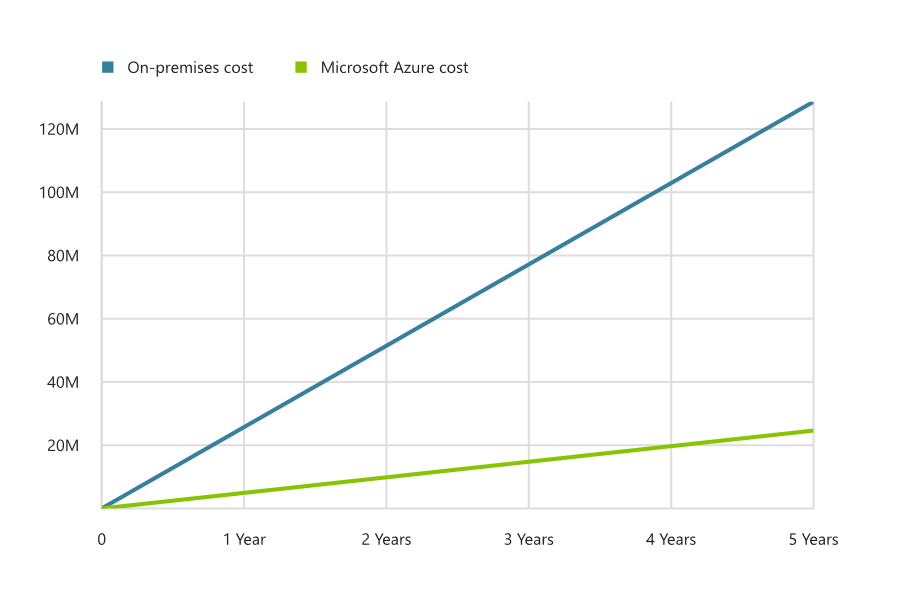

# Fusion: Large Enterprise - The narrative behind the governance strategy

The following narrative establishes a use case for a [large enterprise governance journey](./overview.md). Before implementing the journey, it's important to understand the assumptions and reasoning that are reflected in this narrative. Then you can better align the governance strategy to your own organization's journey.

## Back story

Customers are demanding a better experience when interacting with this company. The current experience caused market erosion and led to the board to hire a Chief Digital Officer (CDO). The CDO is working with marketing and sales to drive a digital transformation that will power improved experiences. Additionally, several business units recently hired data scientists to farm data and improve many of the manual experiences through learning and prediction. IT is supporting these efforts where it can. However, there are "shadow IT" activities occurring that fall outside of needed governance and security controls.

The IT organization is also facing its own challenges. Finance is planning continued reductions in the IT budget over the next five years, leading to some necessary spending cuts starting this year. Conversely, GDPR and other data sovereignty requirements are forcing IT to invest in assets in additional countries to localize data. Two of the existing datacenters are overdue for hardware refreshes, causing further problems with employee and customer satisfaction. Three more datacenters require hardware refreshes during the execution the five-year plan. The CFO is pushing the CIO to consider the cloud as an alternative for those datacenters, to free up capital expenses.

The CIO has innovative ideas that could help the company, but she and her teams are limited to fighting fires and controlling costs. At a luncheon with the CDO and one of the business unit leaders, the cloud migration conversation generated interest from the CIO's peers. The three leaders aim to support each other using the cloud to achieve their business objectives, and they have begun the exploration and planning phases of cloud adoption.

## Business characteristics

The company has the following business profile:

- Sales and operations span multiple geographic areas with global customers in multiple markets.
- The business grew through acquisition and operates across three business units based on the target customer base. Budgeting is a complex matrix across business units and functions.
- The business views most of IT as a capital drain or a cost center.

## Current state

Here is the current state of the company's IT and cloud operations:

- IT operates more than 20 privately owned datacenters around the globe.
- Each datacenter is connected by a series of regional leased lines, creating a loosely-coupled global WAN.
- IT entered the cloud by migrating all end-user email accounts to Office 365. This migration was completed more than six months ago. Since then, only a few IT assets have been deployed to the cloud.
- The CDO's primary development team is working in a dev/test capacity to learn about cloud native capabilities.
- One business unit is experimenting with big data in the cloud. The BI team inside of IT is participating in that effort.
- The existing IT governance policy states that customer personally identifiable information (PII) and financial data must be hosted on assets owned directly by the company. This policy blocks cloud adoption for any mission-critical apps or protected data.
- IT investments are controlled largely by capital expense (CapEx). Those investments are planned yearly and often include plans for ongoing maintenance, as well as established refresh cycles of three to five years depending on the datacenter.
- Most investments in technology that don't align to the annual plan are addressed by shadow IT efforts. Those efforts are usually managed by business units and funded through the business unit's operating expenses.

## Future state

The following changes are anticipated over the next several years:

- The CIO is leading an effort to modernize the policy on PII and financial data to support future goals. Two members of the IT Governance team have visibility into this effort.
- If the early experiments in App Dev and BI show leading indicators of success, they would each like to release small-scale production solutions to the cloud in the next 24 months.
- The CIO and CFO have assigned an architect and the Vice President of Infrastructure to create a cost analysis and feasibility study. These efforts will determine if the company can and should move 5,000 assets to the cloud over the next 36 months. A successful migration would allow the CIO to eliminate two datacenters, reducing costs by over $100M USD during the five-year plan. If three to four datacenters can experience similar results, the budget will be back in the black, giving the CIO budget to support more innovative initiatives.
    
- Along with this cost savings, the company plans to change the management of some IT investments by repositioning the committed CapEx as an operational expense (OpEx) within IT. This change will provide greater cost control, which IT can use to accelerate other planned efforts.

## Next steps

The company has developed a corporate policy to shape the governance implementation. The corporate policy drives many of the technical decisions.

> [!div class="nextstepaction"]
> [Review the initial corporate policy](./corporate-policy.md)
