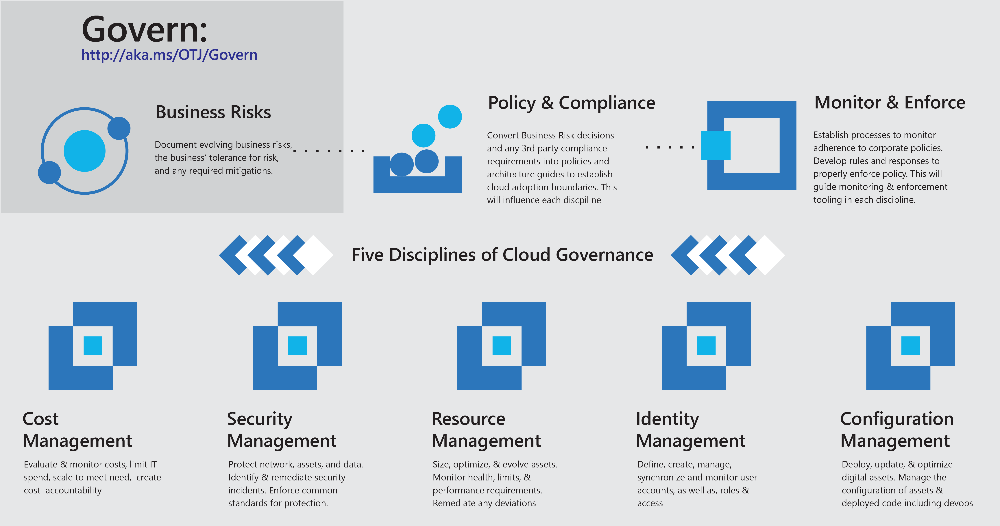
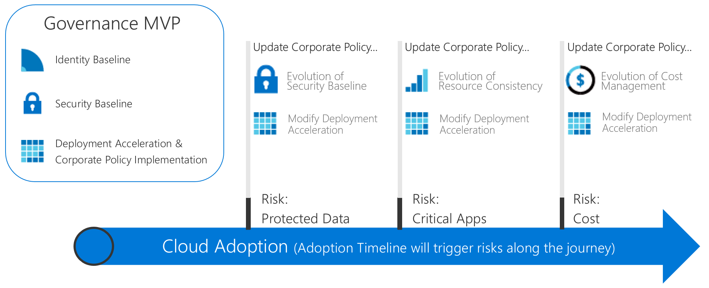

# Fusion: Actionable Governance Journeys

The governance journeys in this section illustrate the application of the Fusion Governance Model using an incremental governance approach. You can establish an agile governance platform that will evolve to meet the needs of any cloud governance scenario.

There are two journeys, each based on synthesized customer experiences:

- [Small-to-medium enterprise governance journey](./small-to-medium-enterprise/overview.md)
- [Large enterprise governance journey](./large-enterprise/overview.md)

Before using either guide, review the brief background on both models to understand the basic theories in this guide. For readers who are familiar with the model, you can jump ahead to the journey that best matches your organization.

## Fusion's incremental cloud governance model

Adopting the cloud is a journey, not a destination. Along the way, there are clear milestones and tangible business benefits. However, the final state of cloud adoption is usually unknown when a company begins the journey. Cloud governance creates guardrails that keep the company on a safe path throughout the journey.

These governance journeys describe the experiences of fictional companies, based on the journeys of real customers. Each journey follows the customer through the governance aspects of their cloud adoption.

### Establishing an end state

A journey without a target destination is just wandering. It’s important to establish a rough vision of the end state before taking the first step. The following infographic provides a frame of reference for the end state. It’s not your starting point, but it shows your potential destination.

The Fusion Governance Model identifies key areas of importance during the journey. Each area relates to different types of risks the company must address as it adopts more cloud services. Within this framework, the governance journey identifies required actions for the Cloud Governance team. Along the way, each tenet of the Fusion Governance Model is described further. Broadly, these include:

**Corporate policies**. Corporate policies drive cloud governance. The governance journey focuses on specific aspects of corporate policy:

- Business Risks: Identifying and understanding corporate risks.
- Policy and Compliance: Converting risks into policy statements that support any compliance requirements.
- Processes: Ensuring adherence to the stated policies.

**Five disciplines of cloud governance**. These disciplines support the corporate policies. Each discipline protects the company from potential pitfalls:

- Cost Management
- Security Baseline
- Resource Consistency
- Identity Baseline
- Deployment Acceleration

Essentially, corporate policies serve as the early warning system to detect potential problems. The disciplines help the company mitigate risks and create guardrails.

### Grow to the end state

Because governance requirements will evolve throughout the cloud adoption journey, a different approach to governance is required. Companies can no longer wait for a small team to build guardrails and roadmaps on every highway *before taking the first step*. Business results are expected more quickly and smoothly. IT governance must also move quickly and keep pace with business demands to stay relevant during cloud adoption and avoid "shadow IT."

An **incremental governance** approach empowers these traits. Incremental governance relies on a small set of corporate policies, processes, and tools to establish a foundation for adoption and governance. That foundation is called a **minimum viable product (MVP)**. An MVP allows the governance team to quickly incorporate governance into implementations throughout the adoption lifecycle. An MVP can be established at any point during the cloud adoption process. However, it’s a good practice to adopt an MVP as early as possible.

The ability to respond rapidly to changing risks empowers the Cloud Governance team to engage in new ways. The Cloud Governance team can join the Cloud Strategy team as scouts, moving ahead of the adoption teams, plotting routes, and quickly establishing guardrails to mitigate risks associated with the adoption plans. These just-in-time governance layers are known as **governance evolutions**. With this approach, governance strategy evolves one step ahead of the adoption team.

The following diagram shows a simple governance MVP and three governance evolutions. During the evolutions, additional corporate policies are defined to mitigate new risks. The Deployment Acceleration discipline then applies those changes across each deployment.

> [!NOTE]
> Governance is not a replacement for key functions such as security, networking, identity, finance, DevOps, or operations. Along the way, there will be interactions with and dependencies on members from each function. Those members should be included on the Cloud Governance Team to accelerate decisions and actions.

## Choosing a governance journey

The journeys demonstrate how to implement a governance MVP. From there, each journey shows how the governance team can work ahead of the adoption teams as a partner to accelerate adoption efforts. The Fusion Governance Model guides the application of governance from foundation through subsequent evolutions.

To begin a governance journey, choose one of the two options below. The options are based on synthesized customer experiences. The titles are based on the size of the enterprise for ease of navigation. However, the reader's decision may be more complex. The following tables outline the differences between the two options.

> [!NOTE]
> It’s unlikely that either journey aligns completely to your situation. Choose whichever journey is closest and use it as a starting point. Throughout the journey, additional information is provided to help you customize decisions to meet specific criteria.

### Business characteristics

|                                            | Small-to-medium enterprise                                                                              | Large enterprise                                                                                               |
|--------------------------------------------|---------------------------------------------------------------------------------------------------------|----------------------------------------------------------------------------------------------------------------|
| Geography (country or geopolitical region) | Customers or staff reside largely in one geography                                                      | Customers or staff reside in multiple geographies                                                              |
| Business units impacted                    | Single business unit                                                                                    | Multiple business units                                                                                        |
| IT budget                                  | Single IT budget                                                                                        | Budget allocated across business units                                                                         |
| IT investments                             | Capital expense (CapEx)-driven investments are planned yearly and usually cover only basic maintenance. | CapEx-driven investments are planned yearly and often include maintenance and a refresh cycle of 3 to 5 years. |

### Current state before adopting cloud governance

|                                             | Small-to-medium enterprise                                                                               | Large enterprise                                                                                                          |
|---------------------------------------------|----------------------------------------------------------------------------------------------------------|---------------------------------------------------------------------------------------------------------------------------|
| Datacenter or third-party hosting providers | Less than 5 datacenters                                                                                  | More than 5 datacenters                                                                                                   |
| Networking                                  | No WAN, or 1 &ndash; 2 WAN providers                                                                             | Complex network or global WAN                                                                                             |
| Identity                                    | Single forest, single domain. No requirement for claims-based authentication or third-party MFA devices. | Complex, multiple forests, multiple domains. Applications require claims-based authentication or third-party MFA devices. |

### Desired future state after evolving cloud governance

|                                              | Small-to-medium enterprise                                                                        | Large enterprise                                                                                        |
|----------------------------------------------|---------------------------------------------------------------------------------------------------|---------------------------------------------------------------------------------------------------------|
| Cost Management – cloud accounting           | Showback model. Billing is centralized through IT.                                                | Chargeback model. Billing could be distributed through IT procurement.                                  |
| Security Baseline – protected data           | Company financial data and IP. Limited customer data. No third-party compliance requirements.     | Multiple collections of customers’ financial and PII data. May need to consider third-party compliance. |
| Resource Consistency – mission critical apps | Outages are painful but not financially damaging. Existing IT Operations are relatively immature. | Outages have defined and monitored financial impacts. IT Operations are established and mature.         |

These two journeys represent two extremes of experience for customers who invest in cloud governance. Most companies reflect a combination of the two scenarios above. After reviewing the journey, use the Fusion Governance Model to start the governance conversation and modify the baseline journeys to more closely meet your needs.

## Next steps

Choose one of these journeys:

> [!div class="nextstepaction"]
> [Small-to-medium enterprise governance journey](./small-to-medium-enterprise/overview.md)
>
> [Large enterprise governance journey](./large-enterprise/overview.md)
