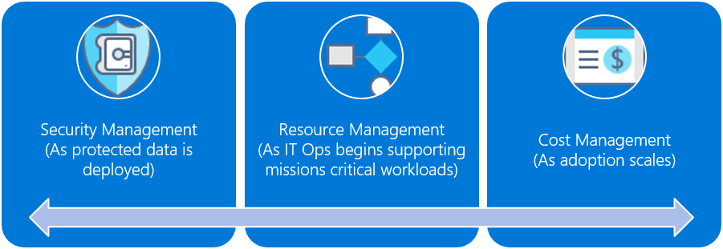

# Fusion: Small-to-medium enterprise governance journey

## Best practice overview

This governance journey follows the experiences of a fictional company through various stages of governance maturity. It is based on real customer journeys. The suggested best practices are based on the constraints and needs of the fictional company. 
As a quick starting point, this overview defines a best-practice governance MVP. It also provides links to a few governance evolutions that add further best practices as new business or technical risks emerge.

> [!WARNING]
> This MVP is a baseline starting point, based on a set of assumptions. Even this minimal set of best practices is based on corporate policies driven by unique business risks and risk tolerances. To see if these assumptions apply to you, read the [longer narrative](./use-case.md) that follows this article.

### Governance best practice

This best practice serves as a foundation that an organization can use to quickly and consistently add governance guardrails across multiple Azure subscriptions.

**Resource Organization**: The following represents the Governance MVP hierarchy for organizing resources. Every application should be deployed in the proper area of the Management Group, Subscription, and Resource Group hierarchy. During deployment planning, the Cloud Governance team will create the necessary nodes in the hierarchy to empower the Cloud Adoption team.  

1. A management group for each type of environment (such as Production, Development, and Test)
2. A subscription for each “Application Categorization” 
3. A separate resource group for each application.
4. Consistent nomenclature should be applied at each level of this grouping hierarchy. 

These patterns provide room for growth without complicating the hierarchy unnecessarily.

**Governance of Resources**: Enforcing governance across subscriptions will come from Azure Blueprints and the associated assets within the blueprint.

1. Create an Azure Blueprint named “Governance MVP”.
    1. Enforce the use of standard Azure roles.
    2. Enforce that users can only authenticate against existing an RBAC implementation.
    3. Apply this blueprint to all subscriptions within the management group.
2. Create an Azure Policy to apply or enforce the following:
    1. Resource tagging should require values for Business Function, Data Classification, Criticality, SLA, Environment, and  Application.
    2. The value of the Application tag should match the name of the resource group.
    3. Validate role assignments for each resource group and resource.
3. Publish and apply the “Governance MVP” Azure Blueprint to each management group.

These patterns enable resources to be discovered and tracked, and enforce basic role management.

**Demilitarized Zone (DMZ)**: It’s common for specific subscriptions to require some level of access to on-premises resources. This may be the case for migration scenarios or development scenarios, when some dependent resources are still in the on-premises datacenter. In this case, the governance MVP adds the following best practices:

1. Establish a Cloud DMZ. 
    1. The [Cloud DMZ Reference Architecture](http://docs.microsoft.com/en-us/azure/architecture/reference-architectures/dmz/secure-vnet-hybrid) establishes a pattern and deployment model for creating a VPN Gateway in Azure.
    2. Validate that proper DMZ connectivity and security requirements are in place for a local edge device in the on-premises datacenter.
    3. Validate that the local edge device is compatible with Azure VPN Gateway requirements.
    4. Once connection to the on-premise VPN has been verified, capture the ARM template created by that reference architecture.
2. Create a second Azure Blueprint named “DMZ”. 
    1. Add the Resource Manager template for the VPN Gateway to the Azure Blueprint.
3. Apply the DMZ Azure Blueprint to any subscriptions requiring on-premises connectivity. This Azure Blueprint should be applied in addition to the Governance MVP blueprint.

One of the biggest concerns raised by IT security and traditional governance teams, is the risk of early stage cloud adoption compromising existing assets. The above approach allows cloud adoption teams to build and migrate hybrid solutions, with reduced risk to on-premises assets. In later evolution, this temporary solution would be removed.

> [!NOTE]
> The above is a starting point to quickly create a baseline governance MVP. This is only the beginning of the governance journey. Further evolution will be needed as the company continues to adopt the cloud and takes on more risk in the following areas:
>
> - Mission-critical workloads
> - Protected data
> - Cost management
> - Multi-cloud scenarios
>
>Moreover, the specific details of this MVP are based on the example journey of a fictitious company, described in the articles that follow. We highly recommend becoming familiar with the other articles in this series before implementing this best practice.

### Governance evolutions

Once this MVP has been deployed, additional layers of governance can be quickly incorporated into the environment. Here are some ways to evolve the MVP to meet specific business needs.

- [Security baseline for protected data](./protected-data.md)
- [Resource configurations for mission critical applications](./mission-critical.md)
- [Controls for cost management](./cost-control.md)
- [Controls for multi-cloud evolution](./multi-cloud.md)

### What does this best practice do?

In the MVP, practices and tools from the Deployment Acceleration discipline are established to quickly apply corporate policy. In particular, the MVP makes use of Azure Blueprints, Azure Management Groups, and Azure Policy to apply a few basic corporate policies, as defined in the narrative for this fictional company. Those corporate policies are applied using Resource Manager templates and Azure policies to establish a very small baseline for identity and security.

### Evolving the best practice

Over time, this governance MVP will be used to evolve the governance practices. As adoption advances, business risk grows. Various disciplines within the Fusion Governance Model will evolve to mitigate those risks. Later articles in this series discuss the evolution of corporate policy affecting the fictional company. These evolutions happen across three disciplines: 

- Cost Management, as adoption scales.
- Security Baseline, as protected data is deployed.
- Resource Consistency, as IT Ops begins supporting mission-critical workloads.

## Next steps

Now that you’re familiar with the governance MVP and have an idea of the governance evolutions to follow, read the [supporting narrative](./use-case.md) for additional context.

> [!div class="nextstepaction"]
> [Review the supporting narrative](./use-case.md)