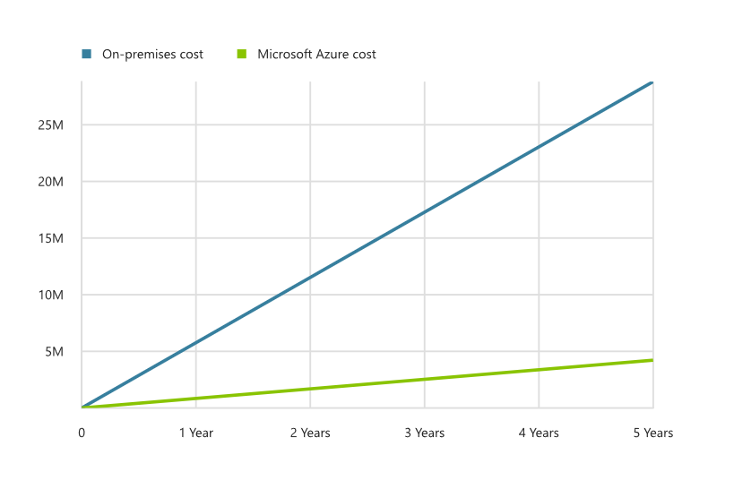

# Fusion: Small to Medium Enterprise - The narrative behind the governance strategy

The following narrative describes the use case for the [small-to-medium enterprise governance journey](./overview.md). Before implementing the journey, it’s important to understand the assumptions and reasoning that are reflected in this narrative. Then you can better align the governance strategy to your own organization’s journey.

## Back story

The board of directors started the year with plans to energize the business in several ways. They are pushing leadership to improve customer experiences to gain market share. They are also pushing for new products and services that will position the company as a thought leader in the industry. They also initiated a parallel effort to reduce waste and cut unnecessary costs. Though intimidating, the actions of the board and leadership show that this effort is focusing as much capital as possible on future growth.

In the past, the company’s CIO has been excluded from these strategic conversations. However, because the future vision is intrinsically linked to technical growth, IT has a seat at the table to help guide these big plans. IT is now expected to deliver in new ways. The team isn’t really prepared for these changes and is likely to struggle with the learning curve.

## Business characteristics

The company has the following business profile:

- All sales and operations reside in a single country, with a low percentage of global customers.
- The business operates as a single business unit, with budget aligned to functions, including Sales, Marketing, Operations, and IT.
- The business views most of IT as a capital drain or a cost center.

## Current state

Here is the current state of the company’s IT and cloud operations:

- IT operates two hosted infrastructure environments. One environment contains production assets. The second environment contains disaster recovery and some dev/test assets. These environments are hosted by two different providers. IT refers to these environments as their two datacenters, named Prod and DR respectively.
- IT entered the cloud by migrating all end-user email accounts to Office 365. This migration was completed six months ago. Few other IT assets have been deployed to the cloud.
- The application development teams are working in a dev/test capacity to learn about cloud native capabilities.
- The business intelligence (BI) team is experimenting with big data in the cloud and curation of data on new platforms.
- The company has a loosely defined policy stating that customer personally identifiable information (PII) and financial data cannot be hosted in the cloud, which limits mission-critical applications in the current deployments.
- IT investments are controlled largely by capital expense (CapEx). Those investments are planned yearly. In the past several years, investments have included little more than basic maintenance requirements.

## Future state

The following changes are anticipated over the next several years:

- The CIO is reviewing the policy on PII and financial data to allow for the future state goals.
- The application development and BI teams want to release cloud-based solutions to production over the next 24 months based on the vision for customer engagement and new products.
- This year, the IT team will finish retiring the disaster recovery workloads of the DR datacenter by migrating 2,000 VMs to the cloud. This is expected to produce an estimated $25M USD cost savings over the next five years.
    
- The company plans to change how it makes IT investments by repositioning the committed CapEx as an operational expense (OpEx) within IT. This change will provide greater cost control and enable IT to accelerate other planned efforts.

## Next steps

The company has developed a corporate policy to shape the governance implementation. The corporate policy drives many of the technical decisions.

> [!div class="nextstepaction"]
> [Review the initial corporate policy](./corporate-policy.md)
