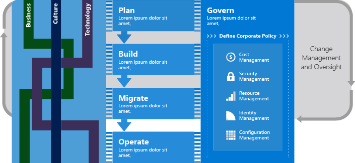
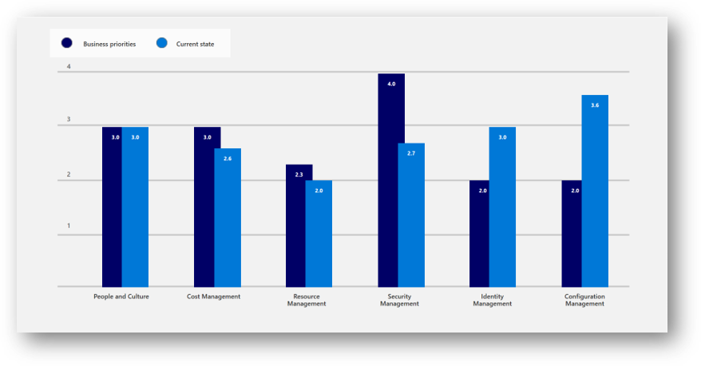

# Fusion: Incremental Cloud Governance

The cloud creates new paradigms regarding the technologies that support the business. These new paradigms also cause shifts in how those technologies are adopted, managed, and governed. When entire datacenters can be destroyed and recreated with one line of code executed from an unattended process, we have to rethink traditional approaches. This is equally true when it comes to governance.

For organizations with existing policies governing on-premises IT environments, cloud governance should complement those policies. However, the level of policy integration between on-premises and the cloud will vary depending on cloud governance maturity and digital estate in the cloud. As the cloud estate evolves over time, so will cloud governance processes and policies.

## Incremental Cloud Governance model

Early in a cloud transformation journey, adoption will be low and easily controlled. As such, risk to the business will be equally low. As adoption expands and accelerates, so will the business risks. To illustrate this point: A disconnected cloud environment hosting ten VMs and no protected data, represents little risk and needs less governance. When that same environment grows to include SAP, data warehouses, and mission critical applications with hooks into existing data centers, the risk is notably much higher.

The Incremental Cloud Governance model is a corner stone of Fusion. This model assumes that governance is an equal partner in all adoption. The Cloud Governance Team has a role from early stage planning, through adoption, and into long-term operations. As illustrated in the executive level view of one cloud adoption journey below, the incremental cloud governance model (referred to as Govern) focuses on the continuous development of [Corporate Policy (Risk, Policy, & Process)](./policy-compliance/overview.md) and implementation of those decisions across the [Five Disciplines of Cloud Governance](./governance-disciplines.md).

### Long Term View

Over time, Cloud Governance grows to implement a defined degree of maturity across each of the [Five Disciplines of Cloud Governance](./governance-disciplines.md). The end maturity of each is a reflection of actual risks and the business's tolerance for risk. Different companies and different industries are expected to have different levels of discipline adoption based on the nature of business operations, third party compliance requirements, and plans for cloud adoption. Even in the long term view, there is no "One size fits all" approach to governance. The following image is designed to be a frame of reference for activities. It is not intended to be an end state view of the world.

### Start Small - MVP starting point

For all cloud adoption journeys, the above model provides a frame of reference. The degree of adoption of each is very specific to the companies unique needs. This is even more true in the early stages of cloud adoption. As described in the [Redefining Policies section](#redefining-policies), the initial cloud governance policies should address **tangible** business risks.

The first step in an emerging partnership between your cloud governance and adoption teams is an agreement regarding the policy MVP. Your MVP for cloud governance should acknowledge that business risks are small in the beginning, but will likely grow as your organization adopts more cloud services over time.

For example: For a business that deploys 5 VMs that don't contain any High Business Impact (HBI) data, the business risk is small. And several increments later, when the number reaches 1,000 VMs and the business is starting to move HBI data, the business risk grows.

Policy MVP is an attempt to define a required foundation for policies required to deploy the first "x" VMs or the first x number of applications. Where x is a small yet impactful quantity of the units being adopted. This policy set requires few constraints, but would contain the foundational aspects needed to quickly grow from one increment of work to the next. Through incremental policy development, this governance strategy would grow over time. Through slow subtle shifts, the policy MVP would grow into feature parity with the outputs of the policy review exercise.

### Evolving Governance - Process

Incremental policy growth is the key mechanism to growing policy and cloud governance in partnership with cloud adoption. It is also the key requirement to adopting an incremental model to governance. For this model to work well, the governance team must be committed to an ongoing allocation of time at each sprint, in order to evaluate and implement changing governance disciplines.

**Sprint time requirements:** At the beginning of each iteration, the cloud adoption team creates a list of assets to be migrated or adopted in the current increment. The cloud governance team is expected to allow sufficient time to review the list, validate data classifications for assets, evaluate any new risks associated with each asset, update architecture guidelines, and educate the team on the changes. These commitments commonly require 10-30 hours per sprint. It's also expected for this level of involvement to require at least one dedicated employee to manage governance in a large cloud adoption effort.

**Release Time Requirements:** At the beginning of each release, the Cloud Adoption Team and Cloud Strategy team should have a prioritized list of applications or workloads to be migrated in the current iteration, along with any business change activities. Those data points allow the Cloud Governance Team to understand new business risks early. That allows time to align with the business and gauge the business's tolerance for risk.

### Evolving Governance - Tooling

Fusion includes a Governance Assessment to aid in evaluating a proper starting point. This tool collects data regarding current state governance capabilities. It also asks questions about the desired future state governance objectives and organizational readiness. Combined, these data points create a gap analysis to identify which of the [Five Disciplines of Cloud Governance](./governance-disciplines.md) will require the greatest focus.

As seen in the gap analysis above, the company completing the assessment has a series of future state needs. The outputs of this assessment suggest that the Security Management discipline would need to mature the most. The Security Management discipline also has the greatest gap between current & future state. Conversely, Identity and Configuration Management have lower future state requirements and excessive current state capabilities, those disciplines would likely require much less additional effort.

The visual above also does a great job of demonstrating that business risks are not likely to be evenly divided across the [Five Disciplines of Cloud Governance](./governance-disciplines.md). Business risks will vary depending on adoption. As will the implementation of each discipline.

## Building the Governance Partnership

It is important to understand that this model requires some redefinition in the partnership between Cloud Governance Teams and Cloud Adoption Teams. The following are a few high level points regarding changes that should be considered in this partnership.

### Redefining the Role

The traditional role of governance is often viewed as a barrier to adoption by engineers and the business as a whole. In some cases, this can be accurate and necessary. However, this perception and mindset prevents partnership. It also causes others to minimize the important role of governance. The Incremental Cloud Governance model is a means of repositioning this relationship. The Incremental Governance Model assumes that it is unacceptable to exceed the [business' tolerance for risk](./policy-compliance/risk-tolerance.md). However, it also assumes that the role of governance is to accelerate business change, encourage robust discussions about real [business risks](./policy-compliance/understanding-business-risk.md), and regularly communicate risk / risk mitigation.

In this new model, one of the most important roles filled by the Cloud Governance Team, is the role of Cloud Adoption pioneers or collectively a Cloud Center of Excellence. The Cloud Governance Team is best positioned to learn about business risk and adoption acceleration by monitoring the adoption plans of multiple Cloud Adoption Teams. Those observations can be used to educate engineers and the business about the cloud.

### Redefining Policies

Properly constructed policy statements which address **tangible** risk metrics, are crucial to capturing and sharing observations about cloud adoption and risk. Those policy statements will help engineers understand how they can better adhere to governance requirements. In healthy IT governance organizations, this may not feel very different from the ways governance operations today. However, it is a crucial starting point even for the most mature organizations. Where this model differs most, is in the term **tangible**. In the incremental model, governance doesn't seek to mitigate every potential risk that could ever be encountered. Instead the team seeks to understand the business risks that have been introduced by cloud adoption thus far. On an ongoing basis, the team seeks to understand new business risks that will be created by the planned releases within a Cloud Adoption Plan. Only those tangle and identified risks are addressed by policy, with a few caveats preventing adoption of things that haven't been discussed. For instance, if there are no plans for the adoption of protected data, it's not unreasonable to state that protected data can't be release in a production cloud environment without further analysis.

### Accelerating Adoption through Governance

Tangle risks establish a foundation for the governance partnership. However, the relationship is fueled by the technologies provided in the cloud. As mentioned before, the cloud allows engineers to create entire environments with relatively little code. Likewise, it allows Cloud Governance specialists to implement policies with small amounts of code. When policies are fair AND automated, governance is no longer a blocker. Going a step further, the Cloud Governance Team is well positioned to the be curators of good code. By building on each deployment to continuously create packages of code that include implementation and governance, the Cloud Governance Team moves from a blocker to an accelerator of adoption.

## Next steps

Learn how to implement start building the Governance Partnership in the [Governance: Start Small Guide](./start-small.md)
> [!div class="nextstepaction"]
> [Governance: Start Small Guide](./start-small.md)