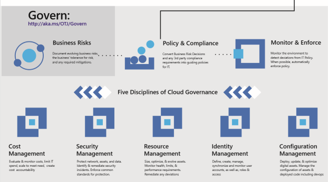

# Fusion: What is Cloud Governance?

Governance is a broadly used term. Throughout the Fusion framework, the topic of governance focuses on actionable governance practices, which include policies, enforcement, and the five disciplines of cloud governance. Each of these facets of governance is vital to ensure Cloud Adoption is safely governed.

*Figure 1. Corporate Governance and Governance Disciplines*

**Governance Strategy** The cloud offers many options for implementing management tools. Those tools are meant to automate and action defined policies. Healthy governance strategy starts with an [Understanding of Business Risks](policy-compliance/understanding-business-risk.md). [Policy](policy-compliance/overview.md) then creates guardrails to help mitigate that risk. Once policy is established, [Monitoring & Enforcement](monitoring-enforcement/overview.md) provides additional guidelines defining how a policy is enforced & what happens when deviation occur.

In some industry verticals, [regulatory compliance](policy-compliance/what-is-regulatory-compliance.md) will supercede corporate policy and require a set of more stringent guidelines. Enforceable yet flexible policies are the root of any mature governance strategy. When policies accurately reflect tangible risks and the business' tolerance for risk, as opposed to technical dogma, the policies and resultant strategy can be molded to align with the Cloud, or any other form of technical deployment.

**Governance Execution** This framework focuses on five disciplines of cloud governance, each implements a different aspect of corporate policies to support safe Cloud Adoption. Those disciplines include [Cost Management](cost-management/overview.md), [Security Management](security-management/overview.md), [Identity Management](identity-management/overview.md), [Resource Management](resource-management/overview.md), and [Configuration Management](configuration-management/overview.md). When policy focuses on risk & tolerance, management disciplines can extend those policies by applying proper risk mitigation to the chosen [deployment model](../getting-started/cloud-deployment-models.md).

## Next steps

The first step to taking action in any governance strategy, is a [policy review](policy-compliance/what-is-a-cloud-policy-review.md). [Policy and Compliance](policy-compliance/overview.md) could be a useful guide during your policy review. As a CISO, you can prepare for a policy review by reviewing the [guide to cloud readiness for CISOs](how-can-a-ciso-prepare-for-the-cloud.md).

> [!div class="nextstepaction"]
> [Prepare for a policy review](policy-compliance/what-is-a-cloud-policy-review.md)