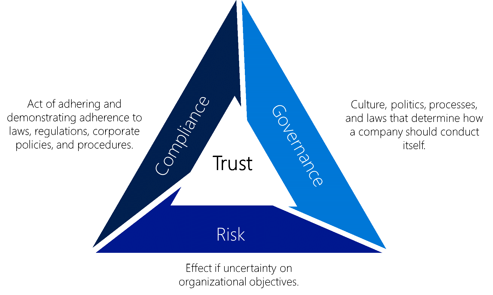

# Enterprise Cloud Adoption: Governance overview

This section of Azure enterprise cloud adoption covers the topic of *governance*. If you are new to the topic of goverance in Azure, you can begin with [what is cloud resource governance?](../getting-started/what-is-governance.md) and [resource access management in Azure](../getting-started/azure-resource-access.md) in the [getting started](../getting-started/overview.md) section.

## Governance in relation to corporate GRC Functions

Governance, risk management, and compliance (GRC) are three facets that help to ensure an organization meets the following corporate objectives:

* Governance is a set of rules or processes which regulate how a business is operated.
* Risk management is the process of predicting, understanding, and managing risks that could otherwise hinder or prevent the organizations success
* Compliance refers to detecting and preventing violations of policies and procedures established by the company, or third party laws and regulations

*Figure 1. Governance, Risk, and Compliance (GRC) Triangle.*

GRC is a discipline that aims to synchronize information and activity across governance, risk management, and compliance to operate more efficiently, facilitate effective information sharing, more effectively report activities, and avoid wasteful overlap.
The goals, therefore, of any GRC program within an IT organization would include the following:

* Clear communication of rules and processes
* Requirements for systems and services uptime
* Classifications and rules governing the protection of customer data and other sensitive corporate data
* Documented consensus regarding corporate risk tolerance and risk profile
* Processes to keep technical risk within acceptable levels
* Logs which record adherence to and violations of relevant laws and regulation
* Plans to execute proper processes when any violations are encountered

In general, GRC is not normally a “net-new” function for the cloud. It extends existing activities and requires slight updates to many organizations' GRC policies. GRC professionals should therefore fully understand the implications that the cloud has for their areas and extend existing practices. The links in the next section can aid in understanding the design considerations needed to govern cloud deployed workloads.

## Governance in this section of the Enterprise Cloud Adoption Framework

Currently, the scope of this framework limits the conversation to initial governance design when preparing to deploy a workload. Over time, this scope will expand.

If you are familiar with the concept of governance, this section covers [governance design for a simple workload](governance-single-team.md) and [governance design for multiple teams and multiple workloads](governance-multiple-teams.md). Both of these documents include an implementation guide.

## Next steps

Once you have learned how to design and implement a governance model in Azure, you can move on to learn how to deploy an [infrastructure](../infrastructure/basic-workload.md) to Azure.

> [!div class="nextstepaction"]
> [Learn about resource access for a single team](governance-single-team.md)