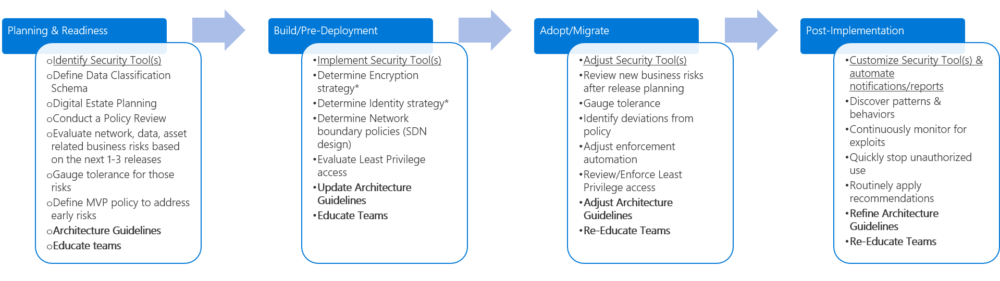

# Fusion: How can a company add Security Management discipline to their Cloud Governance execution?

In the [Intro to Cloud Governance](../overview.md), Security Management is one of the Five Disciplines to Cloud Governance. This discipline focuses on ways of establishing policies that protect the network, assets, and most importantly the data that will reside on a Cloud Provider's solution. Within the Five Disciplines of Cloud Governance, Security management includes classification of the digital estate and data. It also includes documentation of risks, business tolerance, and mitigation strategies associated with the security of the data, assets, and network. From a technical perspective, this also includes involvement in decisions regarding [encryption](../../infrastructure/encryption/overview.md), [network requirements](../../infrastructure/software-defined-networks/overview.md), [hybrid identity strategies](../../infrastructure/identity/overview.md), and tools to [automate enforcement](../../infrastructure/policy-enforcement/overview.md) of security policies across [resource groups](../../infrastructure/resource-grouping/overview.md).

This article outlines different phases of Security Management evolution, as a company goes through increments of Planning, Building, Adopting, and Operating a cloud solution. It is impossible for any document collection to account for the various requirements of any business. As such, each section outlines a minimum suggested activity and a number of potential activities. The objective of each set of activities is to help build a [Policy MVP](../policy-compliance/overview.md), but establish a framework for [Incremental Policy](../policy-compliance/overview.md) evolution. The Cloud Governance Team should decide how much to invest in the potential activities to improve the Security Management position.

> [!CAUTION]
> Neither the minimum suggested activities, nor the potential activities, outlined in this article are aligned to individual corporate policies or 3rd party compliance requirements. This guidance is designed to help facilitate the conversations that will lead to alignment of both requirements with a Cloud Governance Model.

*Figure 1. Evolution of Configuration Management discipline across various phases of adoption

## Planning & Readiness

While not directly aligned, this phase of governance maturity most closely maps to the activities outlined in the [Plan process](../../transformation-journeys/operational-transformation/plan.md) for the [Operational Transformation Journey](../../transformation-journeys/operational-transformation/overview.md).

**Minimum Suggested Activities**

* Evaluate your [Security Management Tool Chain](toolchain.md) options.
* Develop a draft Architecture Guidelines document and distribute to key stakeholders.
* Educate and involve the people and teams impacted by the development of Architecture Guidelines.

**Potential Activities**
* Determine whether your security management policy includes a [Cloud Native](cloud-native-policy.md) policy.
* Review secuirity guidelines in the [Microsoft Service Trust Platform](https://www.microsoft.com/en-us/trustcenter/stp/default.aspx).
* Determine whether your security management policy includes a [Security Development Lifecycle](https://www.microsoft.com/en-us/securityengineering/sdl/). 
* Review Microsoft's [top trends in cybersecurity](https://www.microsoft.com/en-us/security/operations/security-intelligence-report) report.

* Consider developing a [Security DevOps](https://www.microsoft.com/en-us/securityengineering/devsecops)role in your organization.

## Build / Pre-Deployment

While not directly aligned, this phase of governance maturity most closely maps to the activities outlined in the [Build process](../../transformation-journeys/operational-transformation/build.md) for the [Operational Transformation Journey](../../transformation-journeys/operational-transformation/overview.md).

**Minimum Suggested Activities**

* Implement your [Security Management Tool Chain](toolchain.md) by rolling out in a pre-deployment phase.
* Update the Architecture Guidelines document and distribute to key stakeholders.
* Develop educational materials and documentation, awareness communications, incentives and other programs to help drive user adoption.

**Potential activities**
* Determine whether you need [Data Protection Resources](https://servicetrust.microsoft.com/ViewPage/TrustDocuments) to protect and manage cloud data security and compliance for your organization.
* Consider developing a security roadmap for closing the gaps between your current plan and best practices as described by the [Microsoft Service Trust Platform](https://www.microsoft.com/en-us/trustcenter/stp/default.aspx). 
* Review your security management policy and determine if you need to modify your plans according to best practices outlined in the [Security Development Lifecycle](https://www.microsoft.com/en-us/securityengineering/sdl/).

## Adopt / Migrate

While not directly aligned, this phase of governance maturity most closely maps to the activities outlined in the [Migrate process](../../transformation-journeys/operational-transformation/migrate.md) for the [Operational Transformation Journey](../../transformation-journeys/operational-transformation/overview.md).

**Minimum Suggested Activities**

* Migrate your [Security Management Tool Chain](toolchain.md) from pre-deployment to production.
* Update the Architecture Guidelines document and distribute to key stakeholders.
* Develop educational materials and documentation, awareness communications, incentives and other programs to help drive user adoption

**Potential Activities**
* Validate that the best practices defined during the Build / Pre-deployment phases are properly executed. 
* Review security management and advanced threat protection information at the [Microsoft Azure Security Center](security management and advanced threat protection across hybrid cloud workloads).
* Test your Security Management Tool Chain with your cloud apps and utilize Microsoft's [Cloud App Security Framework](https://docs.microsoft.com/en-us/cloud-app-security/what-is-cloud-app-security) as necessary.

## Operate / Post-Implementation

Once the transformation is complete, governance and operations must live on for the natural lifecycle of an  application or workload. This phase of governance maturity focuses on the activities that commonly come after the solution is implemented and the transformation cycle begins to stabilize.

**Minimum Suggested Activities**

* Validate and/or refine your [Security Management Tool Chain](toolchain.md).
* Refine the Architecture Guidelines to guide future adoption processes.
* Automate notifications and reports to alert you of potential security issues.
* Communicate and continually re-educate the impacted people and teams on a periodic basis to ensure on-going adherence to Architecture Guidelines.

**Potential Activities**

* Consider adding security mechanisms to aid in the management and monitoring of [Azure cloud services and virtual machines (VMs)](https://docs.microsoft.com/en-us/azure/security/security-management-and-monitoring-overview).
* Report any security vulnerabilities to Microsoft products and services to the [Microsoft Security Response Center](https://www.microsoft.com/en-us/msrc).
* Review security best practices oulined in the [Azure Security Center](https://docs.microsoft.com/en-us/azure/security-center/security-center-intro?toc=/azure/security/toc.json&bc=/azure/security/breadcrumb/toc.json):
  * Centralized policy management – Ensure compliance with company or regulatory security requirements by centrally managing security policies across all your hybrid cloud workloads.
  * Continuous security assessment – Monitor the security posture of machines, networks, storage and data services, and applications to discover potential security issues.
  * Actionable recommendations – Remediate security vulnerabilities before they can be exploited by attackers with prioritized and actionable security recommendations.
  * Prioritized alerts and incidents - Focus on the most critical threats first with prioritized security alerts and incidents.
  * Advanced cloud defenses – Reduce threats with just in time access to management ports and adaptive application controls running on your VMs.
  * Integrated security solutions - Collect, search, and analyze security data from a variety of sources, including connected partner solutions.
  

