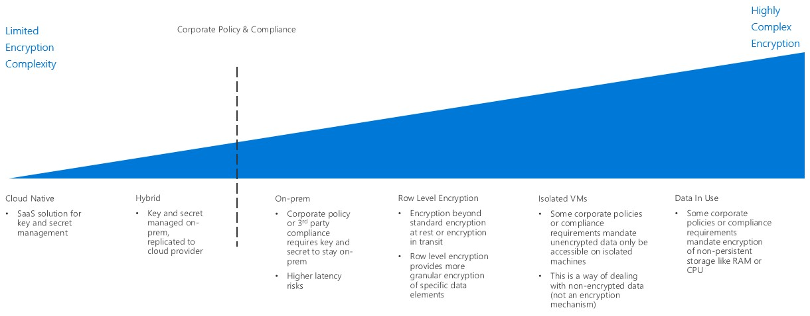

# Fusion: Encryption

Encrypting data, either in the cloud or on-premises, protects it against
unauthorized access. In the cloud, properly implemented encryption policy can
provide additional layers of security to your workloads, and safeguard against
attackers and other unauthorized users from both inside or outside your
organization and networks.

While encrypting resources is generally desirable, encryption does have costs
which can impact latency and overall resource usage. For demanding workloads
striking the correct balance between encryption and performance is key.

## Encryption decision guide

Jump to: [Key management](#key-management) | [Data encryption](#data-encryption)

The inflection point when deciding on a cloud encryption strategy focuses on corporate policy and compliance mandates.

There are a number of ways to deliver encryption within a cloud environment, with varying degrees of cost and complexity. Corporate policy and third-party compliance are the biggest drivers when planning an encryption strategy. Most cloud-based solutions provide standard mechanisms for encrypting data at rest and in transit. However, when policies and compliance requirements demand tighter controls such as standardized secrets and key management, encryption in-use, or data specific encryption, the solution becomes more complex.

## Key management

A key management system is critical to your organizations ability to create and
store cryptographic keys, important passwords, connection strings, and other IT
secrets. Modern key management systems should offer support for storing
keys using hardware security modules (HSMs) for increased protection.

When planning a cloud migration understanding what kind of key management system
will be used is critical:

| Question                                                                                                                              | Cloud Native | Hybrid | On-premises |
|---------------------------------------------------------------------------------------------------------------------------------------|--------------|--------|-------------|
| Does your organization lack centralized key and secret management?                                                                    | Yes          | No     | No          |
| Will you need to limit the creation of keys and secrets to devices to your on-premises hardware, while using these keys in the cloud? | No           | Yes    | No          |
| Does your organization have rules or policies in place that would prevent keys and secrets from being stored off-site?                | No           | No     | Yes         |

### Cloud Native

With cloud native key management, all keys and secrets are generated, managed,
and stored in a cloud-based vault. This approach can simplify many of the IT
tasks related to key management.

**Cloud Native Key Management Assumptions:** Using a cloud native key management system assumes the following:

- You trust the cloud key management solution with the creation, management, and hosting of your organization's secrets and keys. 
- Any on-premises applications or services that rely on accessing encryption services or secrets can access the cloud key management system.  

### Hybrid (bring your own key)

With a bring your own key approach, you can generate keys on dedicated HSM
hardware within your on-premises environment, and then transfer them to a secure
cloud key management system for use with cloud resources.

**Hybrid Key Management Assumptions:** Using a hybrid key management system assumes the following:

- You trust the underlying security and access control infrastructure of the cloud platform for hosting and using your keys and secrets.
- You are required by regulation or organizational policy to keep the creation, and management of your organization's secrets and keys on-premises.

### On-premises (hold your own key)

In certain scenarios there may be regulatory, policy, or technical reasons why
you can't store keys on a key management system provided by a public cloud
service. In these cases, you would maintain keys using on-premises hardware, and
provision a mechanism to allow cloud-based resource to access these keys for
encryptions purposes. Note that a hold your own key approach may not be
compatible with all cloud services.

**On-premises Key Management Assumptions:** Using an On-premises key management system assumes the following:

- You are required by regulation or organizational policy to keep the creation, management, *and hosting* of your organization's secrets and keys on-premises.
- Any cloud-based applications or services that rely on accessing encryption services or secrets can access the on-premises key management system.  

## Data encryption

There are several different states of data with different encryption needs to consider when planning your encryption policy:

| Data state      | Data                                                                                               |
|-----------------|-----------------------------------------------------------------------------------------------------|
| Data in transit | Internal network traffic, Internet connections, connections between DataCenters or virtual networks |
| Data at rest    | Databases, files, virtual drives, PaaS storage                                                      |
| Data in use     | Data loaded in RAM or in CPU caches                                          |

### Data in transit

Data in transit is data moving between resources on the internal, between
DataCenters or external networks, or over the internet.

Encrypting data in transit is usually done through enforcing the use of SSL/TLS protocols to traffic. Traffic transiting between  your cloud hosted resources to external network or the public internet should always be encrypted. PaaS resources will generally also enforce SSL/TLS encryption to traffic by default. Whether you enforce encryption for traffic between IaaS resources hosted inside your virtual networks is a decision for you Cloud Adoption Team and workload owner, but is generally recommended.

 **Encrypting Data in Transit Assumptions:** Implementing proper encryption policy for data in transit assumes the following:

- All publicly accessible endpoints in your cloud environment will communicate with the public internet using SSL/TLS protocols.
- When connecting cloud networks with on-premises or other external network over the public internet, use encrypted VPN protocols.
- When connecting cloud networks with on-premises or other external network using a dedicated WAN connection such as ExpressRoute, use firewalls on both end of the connection. 
- If you  are dealing with sensitive data that shouldn't be included in traffic logs or other diagnostics reports visible to IT staff, you will encrypt all traffic between resources in your virtual network.

### Data at rest

Data at rest represents any data not being actively moved or processed, including files, databases, virtual machine drives, PaaS storage accounts or similar assets. Encrypting stored data protects virtual devices or files against unauthorized access either from an external network penetration, rogue internal user, or accidental release.

PaaS storage and database resources will generally enforce encryption by default. IaaS virtual resources can be secured through  virtual disk encryption using cryptographic keys stored in your key management system.

Encryption for data at rest also encompasses more advanced database encryption techniques, such as column-level and row level encryption, which provides much more control over exactly what data is being secured. 

Your overall policy and compliance requirements, the sensitivity of the data being stored, and the performance requirements of your workloads should determine which assets require encryption.

**Encrypting Data at Rest Assumptions:** Encrypting data at rest assumes the following:

- You are storing data that is not meant for public consumption.
- Your workloads can accept the added latency cost of disk encryption.

### Data in use

Encryption for data in use involves securing data in non-persistent storage,
such as RAM or CPU caches. Use of technologies such as full memory encryption,
enclave technologies like Intel's Secure Guard Extensions (SGX), and
cryptographic techniques like homomorphic encryption can be used to create
secure, trusted execution environments.

**Encrypting Data at Rest Assumptions:** Encrypting data in use assumes the following:

- You are required to maintain data ownership separate from the underlying cloud platform at all times, even at the RAM and CPU level.

## Encryption in Azure

For a detailed description of how Azure makes use of encryption to secure both
data at rest and data in transit, see the [Azure encryption
overview](https://docs.microsoft.com/en-us/azure/security/security-azure-encryption-overview).

[Azure's confidential
computing](https://azure.microsoft.com/en-us/solutions/confidential-compute/)
initiative provides tools and technology to create trusted execution
environments (TEEs) or other encryption mechanisms to secure data in use.

## Azure Key Vault

[Azure Key Vault](https://azure.microsoft.com/en-us/services/key-vault/) is the
primary key management system for storing and managing cryptographic keys,
secrets, and certificates within Azure.

All cryptographic keys, connection strings, certificates, and other secrets used
by applications or resources in your Azure deployment can be stored and managed
as well. Key Vault supports a FIPS 140-2 Level 2-validated hardware security
model (HSM), and allows you to [generate keys using your on-premises HSM and
securely transfer them to Key
Vault](https://docs.microsoft.com/en-us/azure/key-vault/key-vault-hsm-protected-keys).

Keys stored in Key Vault can be used to encrypt storage assets, and to secure
PaaS services or individual applications (for example, storing a database
connection string in key vault instead of an application's configuration files
or environment variables). Authorized applications and services within Azure
deployments can use, but not modify, keys stored in Key Vault. Only authorized key owners
can make changes through Key Vault.

## Next steps

Learn how [logs, monitoring, and reporting](../logs-and-reporting/overview.md) are used by operations teams to manage the health and policy compliance of cloud workloads.

> [!div class="nextstepaction"]
> [Logs and Reporting](../logs-and-reporting/overview.md)