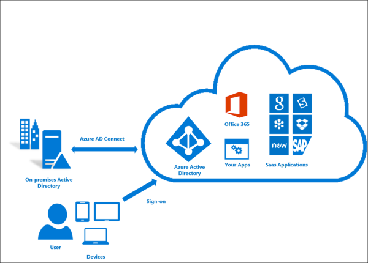

# Fusion: Identity

IT staff are responsible for maintaining and securing resources in cloud environments, as they do in on-premises environments. In any environment, whether on-premises, hybrid, or cloud-only, IT needs to control which administrators, users, and groups have access to resources. Identity and access management (IAM) services enable you to manage access control.

## Identity decision guide

Jump to: [Determine Identity Integration Requirements](#determine-identity-integration-requirements) | [Cloud native](#cloud-native) | [Federation (VDC)](#federation-vdc) | [Directory migration with federation](#directory-migration-with-federation) | [Azure Active Directory](#azure-active-directory)

There are several ways you can deliver hybrid identity within a cloud environment, with varying degrees of cost and complexity. The future state design provides clarity on the three SaaS enabled solutions.

The inflection point (between a SaaS enabled solution and a solution that requires both IaaS and SaaS components) is less about future state design and more driven by current state constraints. When migrating legacy applications that are not compatible with claims-based authentication, a replication of the current identity directory may be required. Also, complex forest or customized organizational units (OUs) could require replication of Azure Directory (AD) as well. (See AD DS comparison for details). If directory replication is required for a global solution, complexities rise significantly.

## Determine identity integration requirements

\*Reviewers note: This table is a working list of questions to help readers pick the right architecture for their migration. Eventually this is intended to be more of a decision list diagram or something similar.\*

| Question                                                                      | Cloud Native | Federation | Directory Migration |
|-------------------------------------------------------------------------------|--------------|------------|---------------------|
| Do you currently lack an on-premises directory service?                       | Yes          | No         | No                  |
| Do your workloads need to authenticate against on-premises identity services? | No           | Yes        | No                  |
| Are your workload requirements incompatible with hybrid authentication?       | No           | No         | Yes                 |
| Is integration between cloud and on-premises identity services impossible?    | No           | No         | Yes                 |

As part of planning a migration to Azure, you will need to determine how to best integrate your existing identity management and cloud identity services. The following are common integration scenarios:

### Cloud native

Public cloud platforms provide a native IAM system capable of granting users and groups access to management features. If your organization currently lacks a significant on-premises identity solution, and you plan on migrating workloads to be compatible with cloud-based authentication mechanisms, it makes sense to build your identity infrastructure using a cloud native identity service.

**Cloud native assumptions:** Using a cloud native identity provider assumes the following:

- Your cloud-based resources will not have dependencies on on-premises directory services or Active Directory servers.
- Your cloud-based identity management will not depend on an on-premises directory service, or you can migrate on-premises identity services to the cloud identity service.
- Your migrating workload applications and services support authentication mechanisms compatible with cloud identity providers OR can be easily modified to support them. Cloud native identity providers rely on internet-ready authentication mechanisms such as SAML and oAuth/OpenID connect. Existing workloads that depend on claims-based authentication methods using protocols like Kerberos or NTLM may need to be refactored before migrating to the cloud.

> [!TIP]
> Most cloud native identity services are not full replacements for traditional on-premises directories. Directory features such as computer management or group policy may not be available without using additional tools or services.
>
> Completely migrating your identity services to a cloud-based provider removes the need to maintain your own identity infrastructure, significantly simplifying your IT management load.

### Federation (VDC)

For organizations with an existing identity infrastructure, federation is often the best solution for preserving existing user and access management while providing the required IAM capabilities for managing cloud resources. Federation syncs directory information between the cloud and on-premises environments, allowing single sign-on (SSO) for users and a consistent role and permission system across your entire organization.

In addition to allowing shared identity services between cloud and on-premises, federation supports more complicated scenarios, potentially combining authentication and access control capabilities across multiple groups and domains, both inside and outside of your organization.

Replication using [Azure Active Directory](#identity-and-the-azure-management-plane) is one of the primary building blocks that allows the [Azure Virtual Datacenter model to apply](vdc-identity.md) centrally managed access control policies across multiple Azure subscriptions.  

**Federated identity assumptions:** Using a federated identity solution assumes the following:

- You need to maintain a common set of user accounts and group across your cloud and on-premises IT infrastructure.
- Your on-premises identity services support replication with your cloud identity provider.
- You require SSO mechanisms for users accessing cloud and on-premises identity providers.

> [!TIP]
> Any cloud-based workloads that depend on non-cloud authentication mechanisms will still require either connectivity to on-premises identity services or virtual servers in the cloud environment providing these services. Using on-premises identity services also introduces dependencies on connectivity between the cloud and on-premises networks.

### Directory migration with federation

If you have workloads that depend on claims-based authentication using protocols such as Kerberos or NTLM that cannot be refactored to accept cloud-compatible token based authentication mechanisms, you may need to perform a directory migration as part of your cloud deployment.

This type of migration involves deploying VMs running Active Directory or another identity provider with your cloud-based virtual networks. With directory services running in the cloud network, any existing applications and services migrating to your cloud network should be able to make use of these directory servers with a minimum of modification.

Federation is also recommended in this scenario. You likely want a federated identity solution to provide a common set of users and roles in both the virtual directory servers. This is so workloads will depend on it, as well as the cloud identity service responsible for access control in the cloud management plane. Federation also allows you to keep your on-premises directories in sync with cloud hosted directories.  

**Domain Services assumptions:** Performing a directory migration assumes the following:

- Your workloads depend on claims-based authentication using protocols like Kerberos or NT LAN Manager (NTLM).
- The identity services your workloads depend on support Replication with your cloud identity provider.

> [!TIP]
> While a directory migration coupled with federated identity provides great flexibility when migrating existing workloads, hosting VMs within your cloud virtual network to provide these services does increase the complexity of you IT management tasks. As your cloud migration experience matures, examine the long-term maintenance requirements of hosting these servers, and consider if refactoring existing workloads for compatibility with cloud identity providers can reduce the need for cloud hosted directory server VMs.  

## Evolving identity integration

Along with other aspects of the Fusion model, integration can be an iterative process. It may make sense to start off using a cloud native solution with a small set of users and corresponding roles for an initial deployment. As your migration matures, you may want to consider adopting a federated model or performing a full directory migration of your on-premises identity services to the cloud. It's important to revisit your identity strategy in every iteration of your migration process.

## Azure Active Directory

Azure uses [Azure Active Directory](https://azure.microsoft.com/services/active-directory/?&OCID=AID719825_SEM_w1MNAVjn&lnkd=Google_Azure_Brand&gclid=EAIaIQobChMIgvD6itOi3gIVj8JkCh1AbQApEAAYASAAEgJ28PD_BwE)
(Azure AD) by default for identity services. With Azure AD, you can manage access to your Azure resources, controlling identity management, device registration, user provisioning, application access control and data protection.

The [Azure AD Connect](/azure/active-directory/hybrid/whatis-hybrid-identity) tool allows you to connect Azure AD instances with your existing identity management solutions. Azure AD Federation supports integration with existing
on-premises deployments of Active Directory or other supported third-party identity services.

*Figure 1. Azure AD Connect can be used to provide synchronized authentication between Azure AD and on-premises directory services.*

## Identity and the Azure management plane

The Azure management plane includes Azure Resource Manager and the related operations, monitoring, and management capabilities used by your IT staff to deploy and configure resources and services in Azure. These features are
accessible through the Azure Portal, APIs, PowerShell, and CLI tools, which all rely on Azure AD for identity and access management.

As with on-premises resources, you will need to organize staff into groups to take on assorted responsibilities or roles, and provide these roles with access to the required Azure resources. While Azure removes the need for
some traditional on-premises roles, such as facilities management and physical security, many other responsibilities such as network security and operations can work much like they do in a physical datacenter.

For efficiently and securely managing access to resources in the management plane, Azure supports role-based access control (RBAC) through Azure AD. Using RBAC, jobs and responsibilities are organized into Azure AD roles, to which users are assigned.

By defining organizational roles during your migration, you can specify the access rights for specific Azure resources and give subscription management rights to users and groups assigned to a role. The scope of a role can encompass an Azure subscription, resource group, or single resource. RBAC also supports the inheritance of permissions, so a role assigned at a parent level also grants access to any child resources.

You can also implement Azure AD Privileged Identity Management (PIM) to lower the exposure time of privileges and increase your visibility into their use through reports and alerts. PIM does this by limiting users to only taking on their privileges "just in time" (JIT), or by assigning privileges for a shortened duration after which privileges are revoked automatically.

Azure AD, PIM and RBAC give you a way to assign different teams to various management tasks within the Azure environment. For large deployments, this distribution of access and permissions can be critical in giving your central IT teams control over core access and security features, while safely delegating significant control over workload resources to the development and operations teams best suited to manage them.

## Identity and authentication for workloads

While Azure AD is the only supported IAM mechanism for the Azure management plane and most Azure-hosted PaaS services, IaaS workloads are free to use whatever identity solutions are supported by the OS and applications running on the workload's VMs.

Azure AD offers a [variety of mechanisms](/azure/active-directory/develop/app-types) for authentication, but it's possible technologies used by applications and services you plan to migrate are not supported. For instance, you can't perform Kerberos authentication against Azure AD. In scenarios like this you will need to provision a compatible authentication service either within your Azure deployment (such as a Windows Server VM running Active Directory) or connect your Azure networks to on-premises environment where your workloads could access existing authentication mechanisms such as an Active Directory server.

Federation using Azure AD Connect allows these more sophisticated hybrid authentication mechanisms, letting workloads authenticate against an Azure AD provider or on-premises hosted services, maximizing compatibility with existing workloads and processes.

To choose the best Azure AD authentication mechanism for your organization, see [choosing the right authentication method for your Azure Active Directory hybrid identity solution](/azure/security/azure-ad-choose-authn).

## Next steps

Learn how to implement [policy enforcement](../policy-enforcement/overview.md) in the cloud.

> [!div class="nextstepaction"]
> [Policy Enforcement](../policy-enforcement/overview.md)
