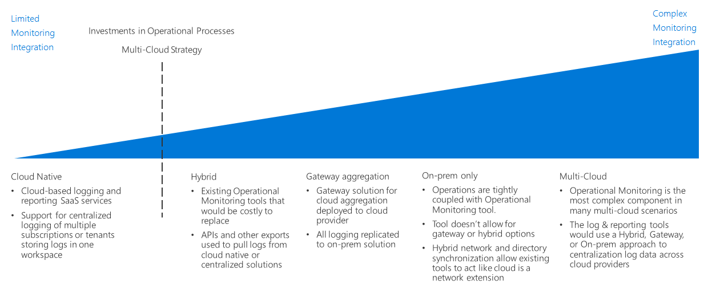

# Fusion: Logs, Reporting, and Monitoring

All organizations need mechanisms notifying IT teams of performance, uptime, and security
issues before they become serious problems. A successful monitoring strategy
allows you to understand how the individual components that make up your
workloads and networking infrastructure are performing. Within the context of a
public cloud migration, integrating logging and reporting with any of your
existing monitoring systems, while surfacing important events and metrics to the
appropriate IT staff, is critical in ensuring your organization is meeting
uptime, security, and policy compliance goals.

## Identity Decision Guide

Jump to: [Planning your monitoring infrastructure](#planning-your-monitoring-infrastructure) | [Cloud native](#cloud-native) | [Hybrid cloud monitoring](#hybrid-cloud-monitoring) | [On-premises monitoring](#on-premises-monitoring) | [Reporting and monitoring in Azure](#reporting-and-monitoring-in-azure)

There are a number of ways to log & report on activities in the cloud. Cloud Native and Centralized logging are two common SaaS options that are driven by the subscription design and number of subscriptions. (Article on Service Provider or Central Logs discusses a similar decision point, assume Service Provider and Cloud Native are the same for that article.)

The inflection point is based on existing investments in Operational Processes (and to some degree the need for a multi-cloud strategy).

## Planning your monitoring infrastructure

When planning your deployment, you will need to consider where logging data is
stored and how you integrate cloud-based reporting and monitoring services with
your existing processes and tools.

| Question                                                                               | Cloud native | Hybrid cloud | On-premises |
|----------------------------------------------------------------------------------------|--------------|--------------|-------------|
| Do you have existing on-premise monitoring infrastructure?                             | No           | Yes          | Yes         |
| Do you have requirements preventing storage of log data on external storage locations? | No           | No           | Yes         |
| Do you need to integrate cloud monitoring with on-premises systems?                    | No           | Yes          | No          |

### Cloud native

If your organization currently lacks established monitoring and reporting
systems, or if your planned cloud deployment does not need to be integrated with
existing on-premises or other external monitoring systems, a cloud native
solution is likely the simplest choice.

In this scenario log data is recorded and stored in the same cloud environment
as your workload, while the monitoring and reporting tools that process and
surface information to IT staff are offered as part of the could platform.

**Cloud Native Assumptions:** Using a cloud native monitoring and reporting system assumes the following:

- You do not need to integrate the log data from you cloud workloads into existing on-premises systems.
- You will not be using your cloud based reporting systems to monitor on-premises systems.

### Hybrid cloud monitoring

You'll need to use a hybrid cloud monitoring system if you plan to integrate log
data from your on-premises environment into your cloud based monitoring and reporting tools.

In a hybrid cloud system, cloud based resources are monitored in the same manner as a cloud native system. However, in the hybrid scenario the cloud based monitoring systems are also used to track telemetry data from on-premises resources. Either the on-premises servers and applications send telemetry data directly to the cloud monitoring system, or this data is compiled and ingested into the system at regular intervals.

With data from both on-premises and cloud resources, this approach offers a consistent analysis and reporting system across your entire IT estate.

**Hybrid Assumptions:** Using a hybrid monitoring and reporting system assumes the following:

- You will use cloud based reporting systems to monitor both cloud and on-premises systems.
- Your cloud based monitoring and reporting systems will be able to ingest log data from both on-premises and cloud based systems.

> [!TIP]
> As part of the iterative nature of cloud migration, transitioning from distinct cloud native and on-premises monitoring to some kind of partial hybrid is likely. Make sure to keep changes to your monitoring architecture in line with your overall IT and operational processes.

### On-premises monitoring

If you have an existing investment in on-premises monitoring and reporting systems, or you have regulatory or policy requirements against long-term storage of log data in third-party systems, you may need to integrate the telemetry from your cloud workloads into preexisting on-premises monitoring solutions.

In this scenario, on-premises telemetry data continues to use the existing on-premises monitoring system. Mirroring the hybrid cloud approach, cloud based telemetry data is either sent to the cloud monitoring system directly, or the data is stored on the cloud alongside your workloads and then compiled and ingested into the on-premises system at regular intervals. If required cloud-based data can be deleted after it's been ingested into your on-premises systems.

On-premises monitoring and reporting systems are another approach to create a consistent analysis and reporting system across your entire IT estate.

**On-premises Assumptions:** Using an on-premises monitoring and reporting system assumes the following:

- You need to use existing on-premises reporting systems to monitor cloud workloads.
- You need to maintain ownership of log data on-premises.
- Your on-premises monitoring and reporting systems is able to ingest log data from cloud based systems.

## Reporting and monitoring in Azure

[Azure Monitor](https://docs.microsoft.com/en-us/azure/azure-monitor/overview)
is the default reporting and monitoring service on Azure. It consists of several
tools capable of logging, visualizing, analyzing, and reporting on telemetry
data generated by Azure resources. It's capable of providing insights into
virtual machines, guest operating systems, virtual network, and workload
application events. It also provides import and export mechanisms for
integrating with on-premises or third-party systems.

### Log Analytics

[Azure Log
Analytics](https://docs.microsoft.com/en-us/azure/log-analytics/log-analytics-queries)
is the component of Azure Monitor used to collect telemetry information from
virtual machines and guest operating systems hosted in the Azure cloud. The tool
also provides the mechanisms to analyze this data or created alerts. [In hybrid
scenarios](https://docs.microsoft.com/en-us/azure/log-analytics/log-analytics-concept-hybrid),
on-premises or other externally hosted physical servers and virtual machines can
be configured to send telemetry to your azure-based Log Analytics instance for
integrated analysis and reporting.

### Application Insights

[Application
Insights](https://docs.microsoft.com/en-us/azure/application-insights/app-insights-overview?toc=/azure/azure-monitor/toc.json)
is the Azure Monitor component designed to capture telemetry data from
applications and workloads. Applications can include the Application Insights
SDK or the hosting web server can be configured to send telemetry without
requiring modification to application code.

### Azure Monitor Integration

Azure Monitor provides a [REST
API](https://docs.microsoft.com/en-us/azure/monitoring-and-diagnostics/monitoring-rest-api-walkthrough)
for integration with external services and automation of monitoring and alerting
services.

In addition, Azure Monitor offers [integration with may popular 3rd party
vendors](https://docs.microsoft.com/en-us/azure/monitoring-and-diagnostics/monitoring-partners).

## Next steps

See [guidance and examples](../overview.md#azure-examples-and-guidance) of how to use core infrastructure components in the Azure cloud.

> [!div class="nextstepaction"]
> [Azure Examples and Guidance](../overview.md#azure-examples-and-guidance)