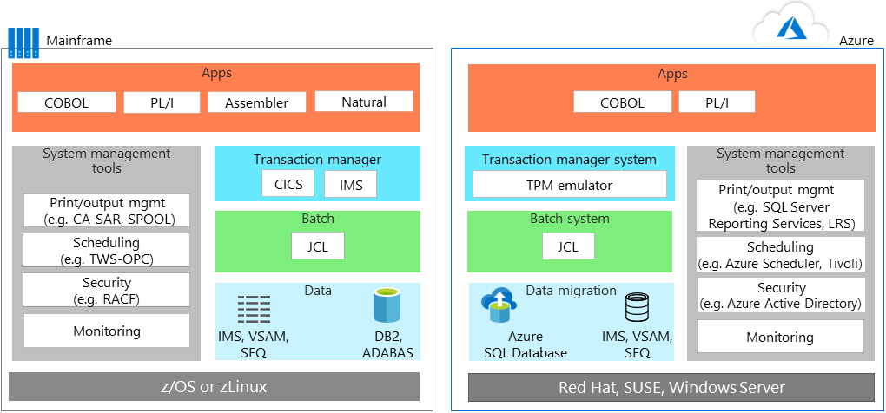
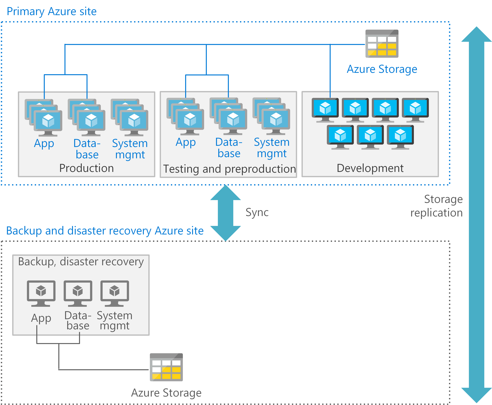

# Mainframe application migration

When migrating applications from mainframe environments to Azure, most teams follow a pragmatic approach: reuse wherever and whenever possible, and then start a phased deployment where applications are rewritten or replaced.

Application migration typically involves one or more of the following strategies:

- **Rehost:** You can move existing code, programs, and applications from the mainframe, and then recompile the code to run in a mainframe emulator hosted in a cloud instance. This approach typically starts with moving applications to a cloud-based emulator, and then migrating the database to a cloud-based database. Some engineering and refactoring are required along with data and file conversions.

    Alternatively, you can rehost using a traditional hosting provider. One of the principal benefits of the cloud is outsourcing infrastructure management. You can find a datacenter provider that will host your mainframe workloads for you. This model may buy time, reduce vendor lock in, and produce interim cost savings.

- **Retire:** All applications that are no longer needed should be retired before migration.

- **Rebuild:** Some organizations choose to completely rewrite programs using modern techniques. Given the added cost and complexity of this approach, it’s not as common as a "lift and shift" approach. Often after this type of migration, it makes sense to begin replacing modules and code using code transformation engines.

- **Replace:** This approach replaces mainframe functionality with equivalent features in the cloud. Software as a service (SaaS) is one option, which is using a solution created specifically for an enterprise concern, such as finance, human resources, manufacturing, or enterprise resource planning. In addition, many industry-specific apps are now available to solve problems that custom mainframe solutions used to previously solve.

You should consider starting by planning those workloads that you want to initially migrate, and then determine those requirements for moving associated applications, legacy codebases, and databases.

## Mainframe emulation in Azure

Azure cloud services can emulate traditional mainframe environments, enabling you to reuse existing mainframe code and applications. Common server components that you can emulate include online transaction processing (OLTP), batch, and data ingestion systems.

### OLTP systems

Many mainframes have OLTP systems that process thousands or millions of updates for huge numbers of users. These applications often use transaction processing and screen-form handling software, such as customer information control system (CICS), information management systems (IMS), and terminal interface processor (TIP).

When moving OLTP applications to Azure, emulators for mainframe transaction processing (TP) monitors are available to run as infrastructure as a service (IaaS) using virtual machines (VMs) on Azure. The screen handling and form functionality can also be implemented by web servers. This approach can be combined with database APIs, such as ActiveX data objects (ADO), open database connectivity (ODBC), and Java database connectivity (JDBC) for data access and transactions.

### Time-constrained batch updates

Many mainframe systems perform monthly or annual updates of millions of account records, such as those used in banking, insurance, and government. Mainframes handle these types of workloads by offering high-throughput data handling systems. Mainframes batch jobs are typically serial in nature and depend on the input/output operations per second (IOPS) provided by the mainframe backbone for performance.

Cloud-based batch environments use parallel compute and high-speed networks for performance. If you need to optimize batch performance, Azure provides various compute, storage, and networking options.

### Data ingestion systems

Mainframes ingest large batches of data from retail, financial services, manufacturing, and other solutions for processing. With Azure, you can use simple command-line utilities such as [AzCopy](/azure/storage/common/storage-use-azcopy) for copying data to and from storage location. You can also use the [Azure Data Factory](/azure/data-factory/introduction) service, enabling you to ingest data from disparate data stores to create and schedule data-driven workflows.

In addition to emulation environments, Azure provides platform as a service (PaaS) and analytics services that can enhance existing mainframe environments.

## Migrate OLTP workloads to Azure

The "lift and shift" approach is the no-code option for quickly migrating existing applications to Azure. Each application is migrated as is, which provides the benefits of the cloud without the risks or costs of making code changes. Using an emulator for mainframe transaction processing (TP) monitors on Azure supports this approach.

TP monitors are available from various vendors and run on virtual machines, an infrastructure as a service (IaaS) option on Azure. The following before and after diagrams show a migration of an online application backed by IBM DB2, a relational database management system (DBMS), on an IBM z/OS mainframe. DB2 for z/OS uses virtual storage access method (VSAM) files to store the data and Indexed Sequential Access Method (ISAM) for flat files. This architecture also uses CICS for transaction monitoring.

On Azure, emulation environments are used to run the TP manager and the batch jobs that use JCL. In the data tier, DB2 is replaced by [Azure SQL Database](/azure/sql-database/sql-database-technical-overview), although Microsoft SQL Server, DB2 LUW, or Oracle Database can also be used. An emulator supports IMS, VSAM, and SEQ. The mainframe’s system management tools are replaced by Azure services, and software from other vendors, that run in VMs.

The screen handling and form entry functionality is commonly implemented using web servers, which can be combined with database APIs, such as ADO, ODBC, and JDBC for data access and transactions. The exact line-up of Azure IaaS components to use depends on the operating system you prefer. For example:

- Windows–based VMs: Internet Information Server (IIS) along with ASP.NET for the screen handling and business logic. Use ADO.NET for data access and transactions.

- Linux–based VMs: The Java-based application servers that are available, such as Apache Tomcat for screen handling and Java-based business functionality. Use JDBC for data access and transactions.

## Migrate batch workloads to Azure

Batch operations in Azure differ from the typical batch environment on mainframes. Mainframe batch jobs are typically serial in nature and depend on the IOPS provided by the mainframe backbone for performance. Cloud-based batch environments use parallel computing and high-speed networks for performance.

To optimize batch performance using Azure, consider the [compute](/azure/virtual-machines/windows/overview), [storage](/azure/storage/blobs/storage-blobs-introduction), [networking](https://azure.microsoft.com/blog/maximize-your-vm-s-performance-with-accelerated-networking-now-generally-available-for-both-windows-and-linux), and [monitoring](/azure/azure-monitor/overview) options as follows.

### Compute

Use:

- VMs with the highest clock speed. Mainframe applications are often single-threaded and mainframe CPUs have a very high clock speed.

- VMs with large memory capacity to allow caching of data and application work areas.

- VMs with higher density vCPUs to take advantage of multithreaded processing if the application supports multiple threads.

- Parallel processing, as Azure easily scales out for parallel processing, delivering more compute power for a batch run.

### Storage

Use:

- [Azure premium SSD](/azure/virtual-machines/windows/premium-storage) or [Azure ultra SSD](/azure/virtual-machines/windows/disks-ultra-ssd) for maximum available IOPS.

- Striping with multiple disks for more IOPS per storage size.

- Partitioning for storage to spread IO over multiple Azure storage devices.

### Networking

- Use [Azure Accelerated Networking](/azure/virtual-network/create-vm-accelerated-networking-powershell) to minimize latency.

### Monitoring

- Use monitoring tools, [Azure Monitor](/azure/azure-monitor/overview), [Azure Application Insights](/azure/application-insights/app-insights-overview), and even the Azure logs enable administrators to monitor any over performance of batch runs and help eliminate bottlenecks.

## Migrate development environments

The cloud’s distributed architectures rely on a different set of development tools that provide the advantage of modern practices and programming languages. To ease this transition, you can use a development environment with other tools that are designed to emulate IBM z/OS environments. The following list shows options from Microsoft and other vendors:

| Component        | Azure Options                                                                                                                                  |
|------------------|---------------------------------------------------------------------------------------------------------------------------------------------------|
| z/OS             | Windows, Linux, or UNIX                                                                                                                      |
| CICS             | Azure services offered by Micro Focus, Oracle, GT Software (Fujitsu), TmaxSoft, Raincode, and NTT Data, or rewrite using Kubernetes |
| IMS              | Azure services offered by Micro Focus and Oracle                                                                                  |
| Assembler        | Azure services from Raincode and TmaxSoft; or COBOL, C, or Java, or map to operating system functions               |
| JCL              | JCL, PowerShell, or other scripting tools                                                                                                   |
| COBOL            | COBOL, C, or Java                                                                                                                            |
| Natural          | Natural, COBOL, C, or Java                                                                                                                  |
| FORTRAN and PL/I | FORTRAN, PL/I, COBOL, C, or Java                                                                                                           |
| REXX and PL/I    | REXX, PowerShell, or other scripting tools                                                                                                  |

## Migrate databases and data

Application migration usually involves rehosting the data tier. You can migrate SQL Server, open-source, and other relational databases to fully managed solutions on Azure, such as [Azure SQL Database Managed Instance](/azure/sql-database/sql-database-managed-instance), [Azure Database Service for PostgreSQL](/azure/postgresql/overview), and [Azure Database for MySQL](/azure/mysql/overview) with [Azure Database Migration Service](/azure/dms/dms-overview).

For example, you can migrate if the mainframe data tier uses:

- IBM DB2 or an IMS database, use Azure SQL database, SQL Server, DB2 LUW, or Oracle Database on Azure.

- VSAM and other flat files, use Indexed Sequential Access Method (ISAM) flat files for Azure SQL, SQL Server, DB2 LUW, or Oracle.

- Generation Date Groups (GDGs), migrate to files on Azure that use a naming convention and filename extensions that provide similar functionality to GDGs.

The IBM data tier includes several key components that you must also migrate. For example, when you migrate a database, you also migrate a collection of data contained in pools, each containing dbextents, which are z/OS VSAM data sets. Your migration must include the directory that identifies data locations in the storage pools. Also, your migration plan must consider the database log, which contains a record of operations performed on the database. A database can have one, two (dual or alternate), or four (dual and alternate) logs.

Database migration also includes these components:

- **Database manager:** Provides access to data in the database. The database manager runs in its own partition in a z/OS environment.
- **Application requester:** Accepts requests from applications before passing them to an application server.
- **Online resource adapter:** Includes application requester components for use in CICS transactions.
- **Batch resource adapter:** Implements application requester components for z/OS batch applications.
- **Interactive SQL (ISQL):** Runs as a CICS application and interface enabling users to enter SQL statements or operator commands.
- **CICS application:** Runs under the control of CICS, using available resources and data sources in CICS.
- **Batch application:** Runs process logic without interactive communication with users to, for example, produce bulk data updates or generate reports from a database.

## Optimize scale and throughput for Azure

Generally speaking, mainframes scale up, while the cloud scales out. To optimize scale and throughput of mainframe-style applications running on Azure, it is important that you understand at how mainframes can separate and isolate applications. A z/OS mainframe uses a feature called Logical Partitions (LPARS) to isolate and manage the resources for a specific application on a single instance.

For example, a mainframe might use one logical partition (LPAR) for a CICS region with associated COBOL programs, and a separate LPAR for DB2. Additional LPARs are often used for the development, testing, and staging environments.

On Azure, it’s more common to use separate VMs to serve this purpose. Azure architectures typically deploy VMs for the application tier, a separate set of VMs for the data tier, another set for development, and so on. Each tier of processing can be optimized using the most suitable type of VMs and features for that environment.

In addition, each tier can also provide appropriate disaster recovery services. For example, production and database VMs might require a hot or warm recovery, while the development and testing VMs support a cold recovery.

The following figure shows a possible Azure deployment using a primary and a secondary site. In the primary site, the production, preproduction, and testing VMs are deployed with high availability. The secondary site is for backup and disaster recovery.

## Perform a staged mainframe to Azure

Moving solutions from a mainframe to Azure may involve a *staged* migration, whereby some applications are moved first, and others remain on the mainframe temporarily or permanently. This approach typically requires systems that allow applications and databases to interoperate between the mainframe and Azure.

A common scenario is to move an application to Azure while keeping the data used by the application on the mainframe. Specific software is used to enable the applications on Azure to access data from the mainframe. Fortunately, a wide range of solutions provide integration between Azure and existing mainframe environments, support for hybrid scenarios, and migration over time. Microsoft partners, independent software vendors, and system integrators can help you on your journey.

One option is [Microsoft Host Integration Server](/host-integration-server), a solution that provides the distributed relational database architecture (DRDA) required for applications in Azure to access data in DB2 that remains on the mainframe. Other options for mainframe-to-Azure integration include solutions from IBM, Attunity, Codit, other vendors, and open source options.

## Partner solutions

If you are considering a mainframe migration, the partner ecosystem is available to assist you.

Azure provides a proven, highly available, and scalable infrastructure for systems that currently run on mainframes. Some workloads can be migrated with relative ease. Other workloads that depend on legacy system software, such as CICS and IMS, can be rehosted using partner solutions and migrated to Azure over time. Regardless of the choice you make, Microsoft and our partners are available to assist you in optimizing for Azure while maintaining mainframe system software functionality.

## Learn more

For more information, see the following resources:

- [Get started with Azure](/azure)

- [Deploy IBM DB2 pureScale on Azure](https://azure.microsoft.com/resources/deploy-ibm-db2-purescale-on-azure)

- [Host Integration Server documentation](/host-integration-server)
