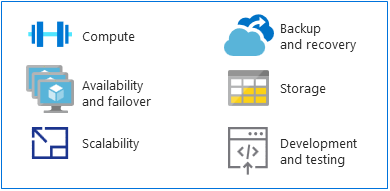

# Fusion: Make the switch from mainframes to Azure

As an alternative platform for running traditional mainframe applications, Azure offers hyperscale compute and storage in a high availability environment. You get the value and agility of a modern, cloud-based platform without the costs associated with a mainframe environment.

This section provides technical guidance for making the switch from a mainframe platform to Azure.

## MIPS vs. vCPUs

No universal mapping formula exists for determining the virtual central processing units (vCPUs) needed to run mainframe workloads. However, the metric of a million instructions per second (MIPS) is often mapped to vCPUs on Azure. MIPS measures the overall compute power of a mainframe by providing a constant value of the number of cycles per second for a given machine.

A small organization, for example, might require less than 500 MIPS, while a large organization typically would use more than 5,000 MIPS. At \$1,000 per single MIPS, a large organization spends \$5 million annually to deploy a 5,000-MIPS infrastructure. The annual cost estimate on Azure for a typical deployment of this scale is approximately one-tenth the cost. (For details, see Table 4 in the [Demystifying Mainframe-to-Azure
Migration](https://azure.microsoft.com/en-us/resources/demystifying-mainframe-to-azure-migration/en-us/)
white paper.)

An accurate calculation of MIPS to vCPUs on Azure depends on two factors—the type of vCPU and the exact workload being run. However, benchmark studies provide a good basis for estimating the number and type of vCPUs you need. A recent [HPE zREF
benchmark](https://h20195.www2.hpe.com/v2/getpdf.aspx/4aa4-2452enw.pdf) provided the following estimates:

-   288 MIPS per Intel-based core running on HP Proliant servers for online (CICS) jobs.

-   170 MIPS per Intel core for COBOL batch jobs.

This guide estimates 200 MIPS per vCPU for online processing and 100 MIPS per vCPU for batch processing.

> [!NOTE]
> These estimates are subject to change as new virtual machine (VM) series become available in Azure.

## High availability and failover

Mainframe systems often offer five 9s availability (99.999 percent) when mainframe coupling and Parallel Sysplex are used. Yet system operators still need to schedule downtime for maintenance and IPLs. The actual availability approaches two or three 9s, on par with high-end, Intel-based servers.

By comparison, Azure offers commitment-based service-level agreements (SLAs), where multiple 9s availability is the default, optimized with local or geo-based replication of services.

Azure provides additional availability by replicating data from multiple storage devices, either locally or in other geographic regions. In the event of an Azure-based failure, compute resources can access the replicated data on either the local or regional level.

When you use Azure platform-as-a-service (PaaS) resources, such as [Azure SQL Database](https://docs.microsoft.com/azure/sql-database/sql-database-technical-overview) and [Azure Cosmos DB](https://docs.microsoft.com/azure/cosmos-db/introduction), the platform handles failovers automatically. When you use Azure infrastructure as a service IaaS), failover relies on specific system functionality, such as SQL Server AlwaysOn features, failover clustering instances, and availability groups.

## Scalability

Mainframes typically scale up, while cloud environment scale out. Mainframes can scale out with the use of a Coupling Facility (CF), but the high cost of hardware and storage makes mainframes very expensive to scale out.

In addition, a CF offers tightly coupled compute, whereas the scale-out features of Azure are loosely coupled. The cloud can scale up or down to match exact user specifications. Compute power, storage, and services scale on demand under a usage-based billing model.

## Backup and recovery

Mainframe customers typically maintain disaster recovery sites or make use or an independent mainframe provider for disaster contingencies. Synchronization with a disaster recovery site is usually done through offline copies of data. Both options incur high costs.

Automated geo-redundancy is also available through the mainframe coupling facility, albeit at great expense, and is usually  reserved for mission-critical systems.

In contrast, Azure, as an enterprise cloud provider, has easy-to-implement and cost-effective options for [backup](https://docs.microsoft.com/azure/backup/backup-introduction-to-azure-backup), [recovery](https://docs.microsoft.com/azure/site-recovery/site-recovery-overview), and [redundancy](https://docs.microsoft.com/azure/storage/common/storage-redundancy) at local or regional levels, or via geo-redundancy.

## Storage

Part of demystifying mainframes involves decoding various overlapping terms. For example, central storage, real memory, real storage, and main storage generally all refer to storage attached directly to the mainframe processor.

Mainframe hardware includes processors and many other devices, such as direct access storage devices (DASDs), magnetic tape drives, and several types of user consoles. Tapes and DASDs are used for system functions and by user programs.

Types of physical storage include:

-   **Central storage.** Located directly on the mainframe processor, this type is also known as processor or real storage.

-   **Auxiliary storage.** Located separately from the mainframe, this type includes storage on DASDs and is also known as paging storage.

In the cloud, you have a range of flexible, scalable options, and you pay only for what you need. [Azure Storage](https://docs.microsoft.com/azure/storage/common/storage-introduction) offers a massively scalable object store for data objects, a file system service
for the cloud, a reliable messaging store, and a NoSQL store. For VMs, managed and unmanaged disks provide persistent, secure disk storage.

## Mainframe development and testing

A major driver in mainframe migration projects is the changing face of application development. Organizations want their development environment to be more agile and responsive to business needs.

Mainframes typically have separate logical partitions (LPARs) for development and testing, such as QA and staging LPARs. Mainframe development solutions include compilers (COBOL, PL/I, Assembler) and editors. The most common is the Interactive System Productivity Facility (ISPF) for the z/OS operating system that runs on IBM mainframes. Others include ROSCOE Programming Facility (RPF) and Computer Associates tools, such as CA Librarian and CA-Panvalet.

Emulation environments and compilers are available on x86 platforms, so development and testing are typically among the first workloads to migrate from a mainframe to Azure. The availability and widespread use of [DevOps tools in Azure](https://azure.microsoft.com/solutions/devops/) is accelerating the migration of development and testing environments.

When solutions are developed and tested on Azure and are ready for deployment to the mainframe, the source code is compiled on the mainframe.

## Next steps

> [!div class="nextstepaction"]
> [Mainframe application migration](application-strategies.md)

