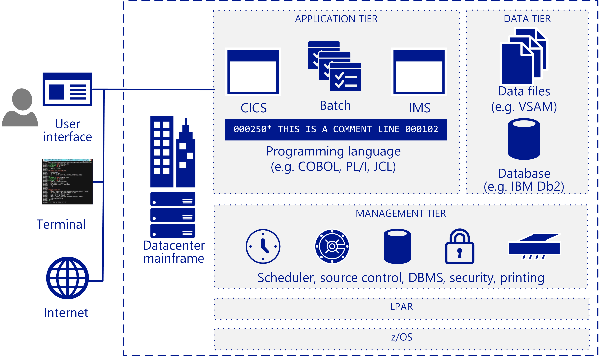

# Mainframe migration overview

Many companies and organizations benefit from moving some or all their mainframe workloads, applications, and databases to the cloud. Azure provides mainframe-like features at cloud scale without many of the drawbacks associated with mainframes.

The term mainframe generally refers to a large computer system, but the vast majority currently of mainframes deployed are IBM System Z servers or IBM plug-compatible systems running MVS, DOS, VSE, OS/390, or z/OS. Mainframe systems continue to be used in many industries to run vital information systems, and they have a place in highly specific scenarios, such as large, high-volume, transaction-intensive IT environments.

Migrating to the cloud enables companies to modernize their infrastructure. With cloud services you can make mainframe applications, and the value that they provide, available as a workload whenever your organization needs it. Many workloads can be transferred to Azure with only minor code changes, such as updating the names of databases. You can migrate more complex workloads using a phased approach.

Most Fortune 500 companies are already running Azure for their critical workloads. Azure's significant bottom-line incentives motivate many migration projects. Companies typically move development and test workloads to Azure first, followed by DevOps, email, and disaster recovery as a service.

## Intended audience

If you’re considering a migration or the addition of cloud services as an option for your IT environment, this guide is for you.

This guidance helps IT organizations start the migration conversation. You may be more familiar with Azure and cloud-based infrastructures than you are with mainframes, so this guide starts with an overview of how mainframes work, and continues with various strategies for determining what and how to migrate.

## Mainframe architecture

In the late 1950s, mainframes were designed as scale-up servers to run high-volume online transactions and batch processing. Because of this, mainframes have software for online transaction forms (sometimes called green screens) and high-performance I/O systems for processing batch runs.

Mainframes have a reputation for high reliability and availability, and are known for their ability to run huge online transactions and batch jobs. A transaction results from a piece of processing initiated by a single request, typically from a user at a terminal. Transactions can also come from multiple other sources, including web pages, remote workstations, and applications from other information systems. A transaction can also be triggered automatically at a predefined time as the following figure shows.

A typical IBM mainframe architecture includes these common components:

- **Front-end systems:** Users can initiate transactions from terminals, web pages, or remote workstations. Mainframe applications often have custom user interfaces that can be preserved after migration to Azure. Terminal emulators are still used to access mainframe applications, and are also called green-screen terminals.

- **Application tier:** Mainframes typically include a customer information control system (CICS), a leading transaction management suite for the IBM z/OS mainframe that is often used with IBM Information Management System (IMS), a message-based transaction manager. Batch systems handle high-throughput data updates for large volumes of account records.

- **Code:** Programming languages used by mainframes include COBOL, Fortran, PL/I, and Natural. Job control language (JCL) is used to work with z/OS.

- **Database tier:** A common relational database management system (DBMS) for z/OS is IBM DD2. It manages data structures called *dbspaces* that contain one or more tables and are assigned to storage pools of physical data sets called *dbextents*. Two important database components are the directory that identifies data locations in the storage pools, and the log that contains a record of operations performed on the database. Various flat-file data formats are supported. DB2 for z/OS typically uses virtual storage access method (VSAM) datasets to store the data.

- **Management tier:** IBM mainframes include scheduling software such as TWS-OPC, tools for print and output management such as CA-SAR and SPOOL, and a source control system for code. Secure access control for z/OS is handled by resource access control facility (RACF). A database manager provides access to data in the database and runs in its own partition in a z/OS environment.

- **LPAR:** Logical partitions, or LPARs, are used to divide compute resources. A physical mainframe is partitioned into multiple LPARs.

- **z/OS:** A 64-bit operating system that is most commonly used for IBM mainframes.

IBM systems use a transaction monitor such as CICS to track and manage all aspects of a business transaction. CICS manages the sharing of resources, the integrity of data, and prioritization of execution. CICS authorizes users, allocates resources, and passes database requests by the application to a database manager, such as IBM DB2.

For more precise tuning, CICS is commonly used with IMS/TM (formerly IMS/Data Communications or IMS/DC). IMS was designed to reduce data redundancy by maintaining a single copy of the data. It complements CICS as a transaction monitor by maintaining state throughout the process and recording business functions in a data store.

## Mainframe operations

The following are typical mainframe operations:

- **Online:** Workloads include transaction processing, database management, and connections. They are often implemented using IBM DB2, CICS, and z/OS connectors.

- **Batch:** Jobs run without user interaction, typically on a regular schedule such as every weekday morning. Batch jobs can be run on systems based on Windows or Linux by using a JCL emulator such as Micro Focus Enterprise Server or BMC Control-M software.

- **Job control language (JCL):** Specify resources needed to process batch jobs. JCL conveys this information to z/OS through a set of job control statements. Basic JCL contains six types of statements: JOB, ASSGN, DLBL, EXTENT, LIBDEF, and EXEC. A job can contain several EXEC statements (steps), and each step could have several LIBDEF, ASSGN, DLBL, and EXTENT statements.

- **Initial program load (IPL):**  Refers to loading a copy of the operating system from disk into a processor’s real storage and running it. IPLs are used to recover from downtime. An IPL is like booting the operating system on Windows or Linux VMs.

## Next steps

> [!div class="nextstepaction"]
> [Myths and facts](myths-and-facts.md)
