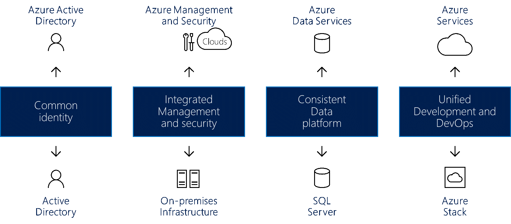

# Create hybrid cloud consistency

This article guides you through the high-level approaches for creating hybrid cloud consistency.

Hybrid deployment models during migration can reduce risk and contribute to a smooth infrastructure transition. Cloud platforms offer the greatest level of flexibility when it comes to business processes. Many organizations are hesitant to make the move to the cloud. Instead, they prefer to keep full control over their most sensitive data. Unfortunately, on-premises servers don’t allow for the same rate of innovation as the cloud. A hybrid cloud solution offers the speed of cloud innovation and the control of on-premises management.

## Integrate hybrid cloud consistency

Using a hybrid cloud solution allows organizations to scale computing resources. It also eliminates the need to make massive capital expenditures to handle short-term spikes in demand. Changes to your business can drive the need to free up local resources for more sensitive data or applications. It's easier, faster, and less expensive to deprovision cloud resources. You pay only for those resources your organization temporarily uses, instead of having to purchase and maintain additional resources. This approach reduces the amount of equipment that might remain idle over long periods of time. Hybrid cloud computing delivers all the benefits of cloud computing flexibility, scalability, and cost efficiencies with the lowest possible risk of data exposure.

*Figure 1 - Creating hybrid cloud consistency across identity, management, security, data, development, and DevOps.*

A true hybrid cloud solution must provide four components, each of which brings significant benefits:

- **Common identity for on-premises and cloud applications:** This component improves user productivity by giving users single sign-on (SSO) to all their applications. It also ensures consistency as applications and users cross network or cloud boundaries.
- **Integrated management and security across your hybrid cloud:** This component provides you with a cohesive way to monitor, manage, and secure the environment, which enables increased visibility and control.
- **A consistent data platform for the datacenter and the cloud:** This component creates data portability, combined with seamless access to on-premises and cloud data services for deep insight into all data sources.
- **Unified development and DevOps across the cloud and on-premises datacenters:** This component allows you to move applications between the two environments as needed. Developer productivity improves because both locations now have the same development environment.

Here are some examples of these components from an Azure perspective:

- Azure Active Directory (Azure AD) works with on-premises Active Directory to provide common identity for all users. SSO across on-premises and via the cloud makes it simple for users to safely access the applications and assets they need. Admins can manage security and governance controls and also have the flexibility to adjust permissions without affecting the user experience.
- Azure provides integrated management and security services for both cloud and on-premises infrastructure. These services include an integrated set of tools that are used to monitor, configure, and protect hybrid clouds. This end-to-end approach to management specifically addresses real-world challenges that face organizations considering a hybrid cloud solution.
- Azure hybrid cloud provides common tools that ensure secure access to all data, seamlessly and efficiently. Azure data services combine with Microsoft SQL Server to create a consistent data platform. A consistent hybrid cloud model allows users to work with both operational and analytical data. The same services are provided on-premises and in the cloud for data warehousing, data analysis, and data visualization.
- Azure cloud services, combined with Azure Stack on-premises, provide unified development and DevOps. Consistency across the cloud and on-premises means that your DevOps team can build applications that run in either environment and can easily deploy to the right location. You also can reuse templates across the hybrid solution, which can further simplify DevOps processes.

## Azure Stack in a hybrid cloud environment

Azure Stack is a hybrid cloud solution that allows organizations to run Azure-consistent services in their datacenter. It provides a simplified development, management, and security experience that's consistent with Azure public cloud services. Azure Stack is an extension of Azure. You can use it to run Azure services from your on-premises environments and then move to the Azure cloud if and when required.

With Azure Stack, you can deploy and operate both IaaS and PaaS by using the same tools and offering the same experience as the Azure public cloud. Management of Azure Stack, whether through the web UI portal or through PowerShell, has a consistent look and feel for IT administrators and end users with Azure.

Azure and Azure Stack open up new hybrid use cases for both customer-facing and internal line-of-business applications:

- **Edge and disconnected solutions.** To address latency and connectivity requirements, customers can process data locally in Azure Stack and then aggregate it in Azure for further analytics. They can use common application logic across both. Many customers are interested in this edge scenario across different contexts, like factory floors, cruise ships, and mine shafts.
- **Cloud applications that meet various regulations.** Customers can develop and deploy applications in Azure, with full flexibility to deploy on-premises on Azure Stack to meet regulatory or policy requirements. No code changes are needed. Application examples include global audit, financial reporting, foreign exchange trading, online gaming, and expense reporting. Customers sometimes look to deploy different instances of the same application to Azure or Azure Stack, based on business and technical requirements. While Azure meets most requirements, Azure Stack complements the deployment approach where needed.
- **Cloud application model on-premises.** Customers can use Azure web services, containers, serverless, and microservice architectures to update and extend existing applications or build new ones. You can use consistent DevOps processes across Azure in the cloud and Azure Stack on-premises. There's a growing interest in application modernization, even for core mission-critical applications.

Azure Stack is offered via two deployment options:

- **Azure Stack integrated systems:** Azure Stack integrated systems are offered through Microsoft and hardware partners to create a solution that provides cloud-paced innovation balanced with simple management. Because Azure Stack is offered as an integrated system of hardware and software, you get flexibility and control while still adopting innovation from the cloud. Azure Stack integrated systems range in size from 4 to 12 nodes. They're jointly supported by the hardware partner and Microsoft. Use Azure Stack integrated systems to enable new scenarios for your production workloads.
- **Azure Stack Development Kit:** The Microsoft Azure Stack Development Kit is a single-node deployment of Azure Stack. You can use it to evaluate and learn about Azure Stack. You can also use the kit as a developer environment, where you can develop by using APIs and tooling that are consistent with Azure. The Azure Stack Development Kit isn't intended for use as a production environment.

## Azure Stack one-cloud ecosystem

You can speed up Azure Stack initiatives by using the complete Azure ecosystem:

- Azure ensures that most applications and services that are certified for Azure will work on Azure Stack. Several ISVs are extending their solutions to Azure Stack. These ISVs include Bitnami, Docker, Kemp Technologies, Pivotal Cloud Foundry, Red Hat Enterprise Linux, and SUSE Linux.
- You can opt to have Azure Stack delivered and operated as a fully managed service. Several partners will have managed service offerings across Azure and Azure Stack shortly. These partners include Tieto, Yourhosting, Revera, Pulsant, and NTT. These partners deliver managed services for Azure via the Cloud Solution Provider (CSP) program. They're extending their offerings to include hybrid solutions.
- As an example of a complete, fully managed hybrid cloud solution, Avanade delivers an all-in-one offer. It includes cloud transformation services, software, infrastructure, setup and configuration, and ongoing managed services. This way customers can consume Azure Stack just as they do with Azure today.
- Providers can help accelerate application modernization initiatives by building end-to-end Azure solutions for customers. They bring deep Azure skill sets, domain and industry knowledge, and process expertise, such as DevOps. Every Azure Stack cloud is an opportunity for a provider to design the solution and lead and influence system deployment. They also can customize the included capabilities and deliver operational activities. Examples of providers include Avanade, DXC, Dell EMC Services, InFront Consulting Group, HPE Pointnext, and PwC (formerly PricewaterhouseCoopers).
