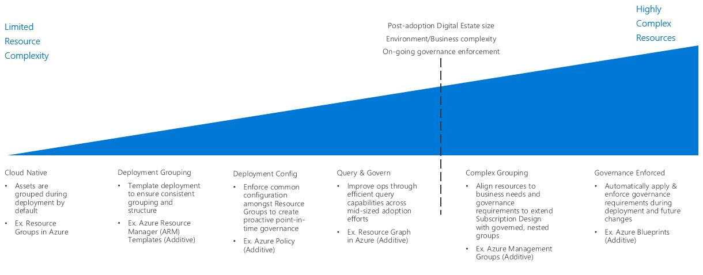

# Enterprise Cloud Adoption: Resource grouping

From the management plane perspective, the deployment and organization of cloud resources is a key component of integrating your existing IT management standards and your organizational policies. The tools available to implement this organization vary by cloud platform but will generally have some form of the following features:

- A logical grouping mechanism below the subscription or account level.
- Ability to deploy resources programatically though an API.
- Templates that can be used to create standardized deployments.
- Ability to deploy policy rules to the subscription, account, or resource grouping levels.

## Resource Grouping Decision Guide

Jump to: 

Resource Grouping options are driven by the anticipated size and complexity of the Digital Estate after a Cloud Transformation is complete. The cost of advanced resource grouping, is typically the increase in change management time to ensure accurate grouping. Limited resource grouping options are provided by most cloud providers, as a default required setting. Some cloud providers offer more options during deployment to improve initial governance. Other options include on-going control for post deployment governance enforcement. In Azure, Management Groups also allow for more complex grouping due to organizational needs (More info on [Management Groups](https://docs.microsoft.com/en-us/azure/governance/management-groups/)).

The inflection point could be driven by one of three factors: Digital Estate Size (Post-Adoption), Business or environment complexity that exceeds defined Subscription Design approaches, or the need to enforce governance over time (Post-Deployment).

More coming...

## Next steps

Learn how [resource naming and tagging](../resource-tagging/overview.md) are used to organize and manage cloud resources.

> [!div class="nextstepaction"]
> [Resource Naming and Tagging](../resource-tagging/overview.md)

