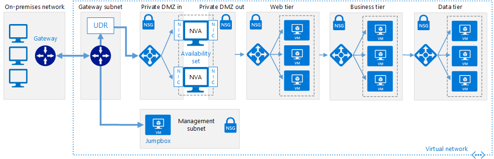
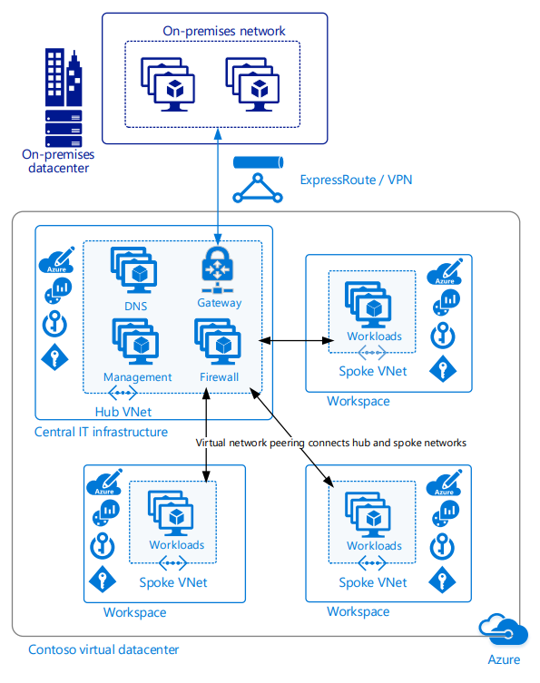

# Enterprise Cloud Adoption: Software Defined Networks

Software Defined Networking (SDN) is a network architecture designed to allow
virtualized networking functionality which can be centrally managed, configured,
and modified through software. It provides an abstraction layer over the
physical networking infrastructure, and enables the virtualized equivalent to
physical routers, firewalls, and other networking hardware you would find in an
on-premises network.

This allows IT staff to configure and deploy network structures and capabilities
that support workload needs using virtualized resources. The flexibility of
software-based deployment management enables rapid modification of networking
resources, and allows the ability to support both agile and traditional
deployment models. Virtualized networks created with SDN technology are critical
to creating secure networks on a public cloud platform.

## Choosing the right virtual networking architectures

There are many ways to use SDN technologies to create cloud-based virtual
networks. How you structure the virtual networks used in your migration, and how
those networks interact with your existing IT infrastructure will depend on a
combination of the workload requirements and your governance requirements.

When planning which virtual networking architecture, or combination of
architectures, to consider when planning your cloud migration, consider the
following questions to help determine what's right for your organization:

| Question                                                                                                                                                   | Cloud Native | Hybrid | VDC |
|------------------------------------------------------------------------------------------------------------------------------------------------------------|--------------|--------|-----|
| Does your workload require integration with on-premises applications?                                                                                      | No           | Yes    | Yes |
| Does your workload require authentication services not supported through cloud identity services, or need direct access to on-premises domain controllers? | No           | Yes    | Yes |
| Will you need to deploy and manage a large number of VMs and workloads?                                                                                    | No           | No     | Yes |
| Will you need to provide central governance while delegating control over resources to individual workload teams?                                          | No           | No     | Yes |

\*Reviewers note: This table is a working list of questions to help readers pick
the right architecture for their migration. Eventually this is intended to be
more of a decision list diagram or something similar. See below for a more
detailed description of each architecture.\*

### Cloud Native

A cloud native virtual network has no dependencies on your organization's
on-premises or other non-cloud resources to support the cloud-hosted workloads.
All required resources are provisioned either in the virtual network itself or
using managed PaaS offerings. A cloud native virtual network is the default
model when creating resources in a cloud platform, and access to it from
external sources like the web need to be explicitly provisioned.

Issues to note when considering a cloud native virtual networking architecture:

-   Cloud native virtual networks are the simplest to deploy and configure, as
    they are the default types of networks created by cloud platforms and have
    no external dependencies. As a result, this architecture is often the best
    choice for experiments or other smaller, self-contained, deployments.

-   Identity management and access control depends solely on the cloud platform
    and resources hosted there. You cannot directly use identity services hosted
    on-premises or other external location.

-   Unless they provide endpoints accessible over the public internet,
    applications and services hosted internally on-premises are not usable by
    resources hosted on a cloud platform.

-   Existing workloads designed to run in an on-premises datacenter may need
    extensive modification to take advantage of cloud-based functionality.

-   Cloud native networks are managed solely through the cloud platform
    management tools, and may lead to management and policy divergence from your
    existing IT standards as time goes on.

**Learn more**

-    [Cloud native networks on Azure.](#cloud-native-azure-networks)

### Hybrid

The hybrid cloud network architecture allows virtual networks to access your
on-premises resources and services and vice versa, using a virtual private
network (VPN) or other connection to directly connect the two networks.

As with a cloud native virtual network, a hybrid virtual network is isolated by
default. Adding connectivity to the on-premises environment grants access to and
from the on-premises network, but any other inbound traffic targeting resources
in the virtual network need to be explicitly allowed. The connection can be
secured using virtual firewall devices and routing rules to limit access or
specify exactly what services can be accessed between the two networks.

Issues to note when considering a hybrid virtual networking architecture:

-   A hybrid virtual network architecture allows cloud hosted workloads to
    access to on-premises identity services, storage, and applications. This can
    make migrating existing applications and services that depend on these
    assets much simpler.

-   Your on-premises environment will need to provision external VPN access for
    the cloud network to connect with.

-   Connecting on-premises networks with cloud networks increases the complexity
    of your security requirements. Both networks need to be secured against
    external vulnerabilities and unauthorized access from both sides of the
    hybrid environment.

-   Scaling the number and size of workloads within a hybrid cloud environment
    can add significant complexity to routing and traffic management.

-   You will need to develop compatible management and access control policies
    to maintain consistent governance throughout your organization.

**Learn more**

-    [Hybrid Networks on Azure](#hybrid-networks-on-azure)

### Virtual Datacenter - Trusted Network Extension

The virtual datacenter architecture is designed to assist enterprises in
deploying a large number of workloads to public cloud platform while still
preserving key aspects of existing access control, policy compliance, and
governance across your entire organization. Building off the connectivity
provided by the hybrid cloud model, a virtual datacenter adds management, access
control, and traffic management capabilities.

An example virtual datacenter model is the trusted network extension. The
network architecture component of a this model is built around a hub and spoke
model composed of multiple virtual networks. The central hub virtual network
contains the main networking, policy, and monitoring resources for virtual
network. As with hybrid clouds, the hub hosts a connection to on-premises or
other external networks and contains the central routing and firewall
capabilities that manage traffic coming from workloads to external networks and
vice versa.

Workload spokes are separate virtual networks that, aside from network peering
with the hub network, are isolated by default. All traffic travelling to the
spoke from outside the VDC and form the spoke to the outside world are forced to
travel through the hub where central security rules and access policies are
applied. Much of the control over the spoke networks and connected workload
resources can be delegated to the workload teams themselves, while critical
security and access controls can be maintained through the central hub.

Issues to note when considering a virtual datacenter networking architecture:

-   A virtual datacenter is more than networking functionality. Implementing
    this model requires integrating requirements from enterprise IT, security,
    governance, and developer teams. This can involve a multiple planning and
    design cycles.

-   A shared identity system is required to keep access control policies
    consistent between on-premises and cloud resources.

-   The virtual datacenter approach assumes a large number of assets that would benefit the management flexibility of a hub and spoke networking model, may be exceeding the number of resources allowed within a single account or subscription, and need a segmented security model allowing central IT control coupled with delegated control of workload resources. For simpler or smaller hybrid deployments a virtual datacenter model is likely more complicated than is necessary.

-   Once central infrastructure is in place, new workload spokes can be spun up
    very quickly, improving agility in support of developers and operations
    teams.

**Learn more**

-   [Azure Virtual Data Center - Enterprise scale trusted network
    extension](#azure-virtual-data-center---enterprise-scale-trusted-network-extension)

## Azure Virtual Networks

On Azure, the core SDN capability is provided by [Azure Virtual
Network](https://docs.microsoft.com/en-us/azure/virtual-network/virtual-networks-overview),
which acts as a cloud analog to physical on-premises networks. Virtual networks
also act as the default isolation boundary between resources on the platform.

A virtual network is inaccessible from all other networks by default. Resources
hosted within a virtual network cannot communicate with other virtual networks,
external data centers, or the internet unless they are explicitly allowed to
through a network policy. Rules and policies defined for the virtual network are
inherited by all resources hosted within the virtual network.

Traffic inside a virtual network can be secured and managed through a
combinations of network security groups
([NSGs](https://docs.microsoft.com/en-us/azure/virtual-network/security-overview)),
user defined routes
([UDR](https://docs.microsoft.com/en-us/azure/virtual-network/virtual-networks-udr-overview)),
and network virtual appliances
([NVA](https://azure.microsoft.com/en-us/solutions/network-appliances/)) or VMs
serving as firewalls or other security devices. This combination of virtual
devices and rules creates isolation boundaries and protects application
deployments within the virtual network's boundaries, much as would be done using
hardware devices within a physical data center.

Virtual networks allow the management of IP addresses for VM's or other
resources, the definition of subnets, implementation of access control policies,
and the creation of entire network infrastructures, with the same structural
ability of traditional physical networks.

Virtual networks can be connected to other Azure virtual networks using the
[virtual network
peering](https://docs.microsoft.com/en-us/azure/virtual-network/virtual-network-peering-overview)
mechanism. They can also be connected to on-premises or other external networks
using [ExpressRoute](https://azure.microsoft.com/en-us/services/expressroute/)
or [VPN connections](https://azure.microsoft.com/en-us/services/vpn-gateway/).

### Cloud Native Azure Networks

*Figure 1. Simple cloud native virtual network with a single VM and Public IP
address.*

A cloud native network is the default configuration for a newly created Azure
virtual networks. By default resources connected to the virtual network have
outbound connectivity (although this can be controlled using NSGs ). Connections
with other virtual networks are possible through peering.

To provide inbound access to any of the VMs or devices connected to the network,
you will need to provision Public IP resources and set the appropriate NSG rules
to allow that traffic. Within the network, subnets, firewalls, load balancers,
and routing rules can all be configured to manage traffic.

By default, identity and authentication services for a cloud native workload are
either provided by Azure Active Directory or devices provisioned within the
virtual network.

Note that any single virtual network and connected resources can only exists
within a single subscription, and is bound by [subscription
limits](https://docs.microsoft.com/en-us/azure/azure-subscription-service-limits)

### Hybrid Networks on Azure

*Figure 2. Example hybrid virtual network containing a DMZ and n-tier
application.*

An Azure hybrid virtual network uses either an ExpressRoute circuit or Azure VPN
to connect your virtual network with your organization's existing non-Azure
hosted IT assets.

As with a basic cloud native virtual network, a hybrid virtual network is
isolated by default. Adding the on-premises connectivity only grants access to
and from the on-premises network. Inbound traffic targeting resources in the
virtual network can be implemented using NSG rules and Public IPs. The
connection can be secured using virtual firewalls and routing rules to limit
access and specify exactly what services can be accessed between the two
networks.

In addition to giving Azure resources access to on-premises applications and
data, a hybrid network allows access to on-premises directory and identity
services. This can provide Azure resources access to authentication technologies
that may not be available through Azure Active Directory or AAD Connect.

For an example of how to implement a secure hybrid virtual network see [this
example at the Azure Architecture
Center](https://docs.microsoft.com/en-us/azure/architecture/reference-architectures/dmz/secure-vnet-hybrid).

### Azure Virtual Data Center - Enterprise scale trusted network extension

*Figure 3. Example hub and spoke structure of a virtual data center, including
connection to on-premises network.*

The [Azure Virtual Data Center
(VDC)](https://docs.microsoft.com/en-us/azure/architecture/vdc/) is an approach
designed to assist enterprises in deploying large number of workloads and
services to the Azure public cloud platform while still preserving key aspects
of your existing security, policy compliance, and general IT governance
practices. The goal of VDC guidance is to show you how to build a trusted
network extension integrating organizational governance, policy, and management
practices across both on-premises and cloud-based components of your IT estate.

As with other hybrid clouds, the VDC hub network hosts a connection to
on-premises or other external networks (via ExpressRoute or VPN) and contains
the UDR, NVA and other routing and security devices to manage traffic coming
from workloads to external on-premises networks and vice versa.

A single hub can connect to many spokes, and each hub and spoke virtual network
exist in separate subscriptions, mitigating some of the subscription level
limits that can affect large cloud migrations.

Note that the VDC networking architecture is just a part of the overall virtual
data center concept, which includes integrating your enterprise's existing
governance, identity and access control, and security policies into your cloud
migration. See the [Azure Virtual Datacenter
E-book](https://azure.microsoft.com/en-us/resources/azure-virtual-datacenter/)
for more information on the broader concepts behind VDC and the trusted network
extension.

## Next steps

Learn how [encryption](encryption.md) is used to secure data in cloud environments.

> [!div class="nextstepaction"]
> [Encryption](encryption.md)