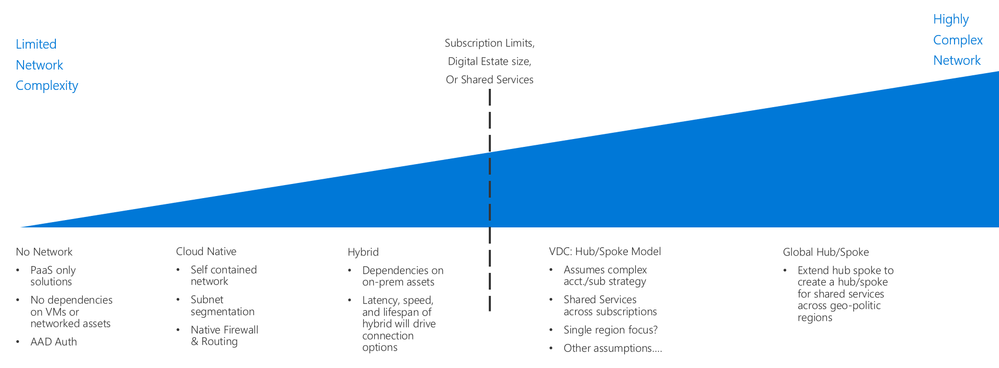

# Enterprise Cloud Adoption: Which Software Defined Network is best for my deployment?

Software Defined Networking (SDN) is a network architecture designed to allow
virtualized networking functionality which can be centrally managed, configured,
and modified through software. It provides an abstraction layer over the
physical networking infrastructure, and enables the virtualized equivalent to
physical routers, firewalls, and other networking hardware you would find in an
on-premises network.

This allows IT staff to configure and deploy network structures and capabilities
that support workload needs using virtualized resources. The flexibility of
software-based deployment management enables rapid modification of networking
resources, and allows the ability to support both agile and traditional
deployment models. Virtualized networks created with SDN technology are critical
to creating secure networks on a public cloud platform.

## Networking Decision Guide

Jump to: [PaaS Only](paas-only.md) | [Cloud native](cloud-native.md) | [Hybrid](hybrid.md) | [VDC: Hub/Spoke model](vdc-networking.md) | [Discovery questions](#choosing-the-right-virtual-networking-architectures)

Software defined networking provides several options with varying degrees of pricing and complexity. The above discovery guide provides a reference to quickly personalize these options to best align with specific business and technology strategies. 

The inflection point in this guide assumes that a few decisions have been made by the Cloud Strategy Team prior to making the networking decision: [Digital Estate definition](../../digital-estate/overview.md), [Subscription Design](../subscriptions/overview.md) (which may require inputs from [cloud accounting](../../business-strategy/cloud-accounting.md) & [global markets](../../business-strategy/global-markets.md) decisions).

Small, single region deployments of less than 1,000 VMs are less likely to be significantly impacted by this inflection point. Conversely, larger adoption efforts with more than 1,000 VMs, multiple business units, or multiple geo-politic markets, could be substantially impacted by the SDN decision and this key inflection point.

The next section on choosing the right virtual networking architectures will ask specific questions to expand on this decision guide.

## Choosing the right virtual networking architectures

There are many ways to use SDN technologies to create cloud-based virtual
networks. How you structure the virtual networks used in your migration, and how
those networks interact with your existing IT infrastructure will depend on a
combination of the workload requirements and your governance requirements.

When planning which virtual networking architecture, or combination of
architectures, to consider when planning your cloud migration, consider the
following questions to help determine what's right for your organization:

| Question                                                                                                                                                   | PaaS Only | Cloud Native | Hybrid | VDC |
|------------------------------------------------------------------------------------------------------------------------------------------------------------|-----------|--------------|--------|-----|
| Only using PaaS services?                                                                                                                                  | Yes       | No           | No     | No  |
| Does your workload require integration with on-premises applications?                                                                                      | No        | No           | Yes    | Yes |
| Does your workload require authentication services not supported through cloud identity services, or need direct access to on-premises domain controllers? | No        | No           | Yes    | Yes |
| Will you need to deploy and manage a large number of VMs and workloads?                                                                                    | No        | No           | No     | Yes |
| Will you need to provide central governance while delegating control over resources to individual workload teams?                                          | No        | No           | No     | Yes |

\*Reviewers note: This table is a working list of questions to help readers pick
the right architecture for their migration. Eventually this is intended to be
more of a decision list diagram or something similar. See below for a more
detailed description of each architecture.\*

## Virtual networking architectures
Learn more about the primary software defined networking architectures:

- [**PaaS Only**](paas-only.md): Platform as a Service (PaaS) products support a limited set of built-in networking features and may not require an explicitly defined software defined network to support workload requirements.
- [**Cloud Native**](cloud-native.md): A cloud native virtual network is the default software defined networking architecture when deploying resources to a cloud platform.
- [**Hybrid**](hybrid.md): The hybrid cloud network architecture allows virtual networks to access your on-premises resources and vice versa.
- [**Virtual Datacenter**](vdc-networking.md): Azure Virtual Datacenter is an approach to making the most of the Azure cloud platform's capabilities while respecting your existing security and networking policies. When deploying enterprise workloads to the cloud, IT organizations and business units must balance governance with developer agility.

## Azure Virtual Networks

On Azure, the core SDN capability is provided by [Azure Virtual
Network](https://docs.microsoft.com/en-us/azure/virtual-network/virtual-networks-overview),
which acts as a cloud analog to physical on-premises networks. Virtual networks
also act as the default isolation boundary between resources on the platform.

A virtual network is inaccessible from all other networks by default. Resources
hosted within a virtual network cannot communicate with other virtual networks,
external data centers, or the internet unless they are explicitly allowed to
through a network policy. Rules and policies defined for the virtual network are
inherited by all resources hosted within the virtual network.

Traffic inside a virtual network can be secured and managed through a
combinations of network security groups
([NSGs](https://docs.microsoft.com/en-us/azure/virtual-network/security-overview)),
user defined routes
([UDR](https://docs.microsoft.com/en-us/azure/virtual-network/virtual-networks-udr-overview)),
and network virtual appliances
([NVA](https://azure.microsoft.com/en-us/solutions/network-appliances/)) or VMs
serving as firewalls or other security devices. This combination of virtual
devices and rules creates isolation boundaries and protects application
deployments within the virtual network's boundaries, much as would be done using
hardware devices within a physical data center.

Virtual networks allow the management of IP addresses for VM's or other
resources, the definition of subnets, implementation of access control policies,
and the creation of entire network infrastructures, with the same structural
ability of traditional physical networks.

Virtual networks can be connected to other Azure virtual networks using the
[virtual network
peering](https://docs.microsoft.com/en-us/azure/virtual-network/virtual-network-peering-overview)
mechanism. They can also be connected to on-premises or other external networks
using [ExpressRoute](https://azure.microsoft.com/en-us/services/expressroute/)
or [VPN connections](https://azure.microsoft.com/en-us/services/vpn-gateway/).

## Next steps

Learn how [encryption](../encryption/overview.md) is used to secure data in cloud environments.

> [!div class="nextstepaction"]
> [Encryption](../encryption/overview.md)