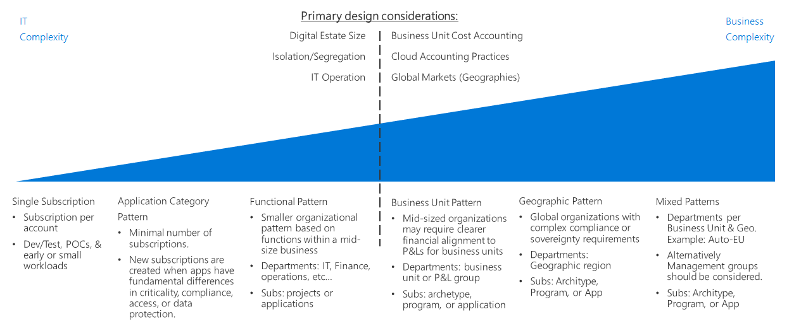

# Fusion: Subscriptions

All cloud platforms have a core ownership model providing the main organization
that billing and resource management is built around. The structure that this
model takes differs between cloud providers, with various types of support for
organizational hierarchy and grouped subscription ownership, but there will
generally be an individual responsible for billing and another assigned as a
top-level owner for managing resources.

## Subscription Decision Guide

Jump to: [Pricing models](#pricing-models)

Subscription Design is one of the first fundamental technical strategies to establish. Departments, Accounts, and Subscriptions (Subscription Design) is the approach taken by Azure to align the business environment with technical strategies for cloud adoption. Subscriptions are where the real work happens. Subscription decisions impact technical architecture, operations, security, scalability and accounting practices.

Subscription Design has unique inflection points, as it involves both business and IT constraints. Before making technical decisions, it is wise for IT architects and decision makers to work with the business stakeholder &/or Cloud Strategy Team to understand the desired Cloud Accounting Approach, Business Unit Cost Accounting practices, and Global Market needs. From there, the technical inflection points are based on Digital Estate Size vs Cloud Provider Subscription limits, Isolation/Segregation policies, and division of IT operations. (Before finalizing a Subscription Design, check out Resource Grouping Discovery Guide)

## Pricing models

Billing terms also differ between providers, but can generally be broken down
into the following pricing models:

### Consumption-based (pay as you go)

In a consumption-based model you are billed only for the resources you use, and
can add, remove, or cancel your subscription at any time. Resources are billed
based on a standard rate per amount of time used.

If you are uncertain of the amount of resources your migration will need, or
plan to widely vary your usage of cloud resources over time, the pay as you go
model may be right for you.

### Upfront minimum commitment 

Most cloud providers will offer significant discounts if you agree to purchase a
predetermined amount of resource usage over a fixed length of time. Usage beyond
this level would be billed at pay as you go rates.

If you can realistically estimate your cloud usage over the next year or more, a
subscription agreement with an upfront commitment can result in significant
savings.

### Enterprise agreement

Integrating your cloud subscriptions within a larger enterprise agreement with a
cloud provider can provide more sophisticated commitment terms and additional
discounts for usage. Enterprise agreements will usually also include additional
support options with the cloud provider.

Enterprise agreements are recommended for any large-scale cloud migration.

**Learn more**

-   See the [Azure Pricing](https://azure.microsoft.com/en-us/pricing/) page for
    information about pricing options on the Azure platform.

## Resource Management

You cloud governance model will depend on the organization of accounts,
subscriptions, and resources. Again, the methods by which this is achieved
differ by cloud platforms, but all allow some logical grouping of resources for
management, access control, and operations purposes.

In addition to grouping assets and resources, [resource naming and
tagging](../resource-tagging/overview.md)
standards are key to organizing resources in support of governance.

**Learn more**

-   For a description of how Azure Subscriptions and Resource Groups are used to
    group and manage resources, see [Resource access management in
    Azure](../../getting-started/azure-resource-access.md).

-   For guidance on structuring your Azure accounts, subscriptions, and
    resources in support of governance requirements, see [Azure enterprise
    scaffold: Prescriptive subscription
    governance](../../appendix/azure-scaffold.md).

## Next steps

Learn how [identity services](../identity/overview.md) are used for access control and management in the cloud.

> [!div class="nextstepaction"]
> [Identity](../identity/overview.md)

