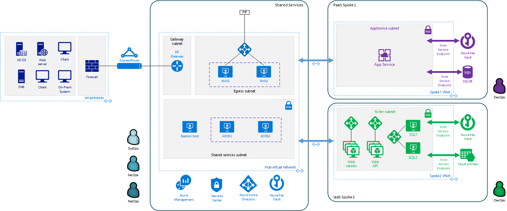

# Fusion: Azure Virtual Datacenter model

This section of the [Fusion framework](../../overview.md) guides you through the process and associated considerations when deploying workloads to Azure using the Azure Virtual Datacenter (VDC) model.

Jump to: [VDC Assumptions](#vdc-assumptions) | [Fusion framework infrastructure and VDC](#fusion-framework-infrastructure-and-vdc) | [Azure Virtual Datacenter structure](#azure-virtual-datacenter-structure) | [Subscription design](#subscription-design) | [Identity](#identity) | [Resource organization](#resource-organization) | [Azure policy](#azure-policy) | [Key vault](#key-vault) | [Networking](#networking) | [Monitoring and compliance](#monitoring-and-compliance) | [Hub components](#hub-components) | [Spoke Components](#spoke-components) | [Azure Virtual Datacenter Automation Toolkit](#azure-virtual-datacenter-automation-toolkit)

Virtual datacenter (VDC) is a term coined by Mark Ozur, Hatay Tuna, Callum Coffin, and Telmo Sampaio from the Azure Customer Advisory Team (AzureCAT), in the eBook "[Azure Virtual Datacenter](https://azure.microsoft.com/en-us/resources/azure-virtual-datacenter/)".

The Azure Virtual Datacenter is a model for deploying your applications and workloads in a cloud-based architecture, while preserving key aspects of your current IT governance and taking advantage of cloud computing’s agility. The goal in implementing a VDC is to provide similar governance capabilities on large Azure deployments in the same manner as you would in a traditional datacenter. At the same time, the Azure Virtual Datacenter model allows teams within your organization to deploy individual workloads with the agility and flexibility common to Azure solutions, while still adhering to central IT policies.

*Abstract view of the Azure Virtual Datacenter model's hub and spoke structure*

A VDC expands upon the existing [hub-spoke networking model](https://docs.microsoft.com/en-us/azure/architecture/reference-architectures/hybrid-networking/hub-spoke) to provide connectivity between isolated workload networks and a centrally managed hub network. The hub environment controls traffic to and from the workloads and the on-premises environment. It also controls all access to workloads from the Internet.

Governing your workloads requires integrating management processes, regulatory requirements, and security processes within a cloud environment. In support of governance requirements, the Azure Virtual Datacenter model provides basic guidance on implementing an organization's separation of roles, responsibilities, and policies in the cloud.  

### Virtual Datacenter model assumptions

Embedded in the Azure Virtual Datacenter model is a core set of assumptions. If your cloud migration requirements align with these assumptions, following the guidance and associated resources can significantly reduce the time required for you to build out a large Azure deployment that is compliant with your organization's governance policy. However, even if these assumptions don't match your specific deployment scenarios, this model will provide you with a logical way of thinking about complex, interconnected cloud-based solutions.

Assumptions about the Virtual Datacenter model include:

- You need to securely access cloud-based resources from your on-premises environment or on-premises resources from the cloud, using [hybrid networking](../software-defined-networks/hybrid.md).
- Your cloud estate will contain large number of assets and may exceed the [single subscription resource limits](https://docs.microsoft.com/en-us/azure/azure-subscription-service-limits), or your subscription design segments workloads into separate subscriptions based on security or accounting requirements. If your deployments can exist within a single subscription a VDC structure, this is likely unnecessary.
- You need to support agile deployment of workloads in support of developer and operations teams, while maintaining common policy and governance compliance and central IT control over core services.
- The data stored on your cloud deployment is sensitive and needs to be secured using [encryption](../encryption/overview.md), in transit and at rest. Public data does not benefit from encryption.
- Your on-premises identity services can be [federated with Azure Active Directory](../identity/overview.md#federation-vdc).
- Your workloads will be compatible with cloud-based authentication methods such as security assertion markup language (SAML) and oAuth 2.0/OpenID connect. Legacy authentication methods like Kerberos or NT Lan Manager (NTLM) are not incorporated in this model by default,  and therefore need to be provisioned separately. 

## Fusion framework infrastructure

The [Infrastructure section](../overview.md) of the [Fusion framework](../../overview.md), describes the components required to migrate core infrastructure services to Azure. A VDC is built on these core services, and each of the following topics discuss how the Azure Virtual Datacenter model uses these services to create a secure cloud network extension compliant with your organization's governance requirements: 

- [VDC Subscriptions](../subscriptions/vdc-subscriptions.md)
- [Identity and roles in VDC](../identity/vdc-identity.md)
- [Resource grouping in VDC](../resource-grouping/vdc-resource-grouping.md)
- [Azure Policy enforcement in VDC](../policy-enforcement/vdc-policy-enforcement.md)
- [VDC naming and tagging recommendations](../resource-tagging/vdc-naming.md)
- [VDC networking architecture](../software-defined-networks/vdc-networking.md)
- [Encryption and key management in VDC](../encryption/vdc-encryption.md)
- [VDC monitoring and reporting](../logs-and-reporting/vdc-monitoring.md)

## Azure Virtual Datacenter structure

The core of the Azure Virtual Datacenter model is the hub environment that is managed by central IT teams. This hub contains the infrastructure through which all network traffic flows, all policies are set, and all core monitoring occurs. It provides central security and networking services, including the hub virtual network that connects to other parts of the datacenter, and manages any external connections used by resources hosted outside your VDC.

Isolated workload environments host the various applications and services that your business teams will use. Each workload environment has its own management resources and spoke virtual networking infrastructure. Central IT manages connectivity with between hub and spoke networks, and applies global policy and access control. However, workload teams can add additional policies to control access and resource usage within the spoke environment, as long as these policies don't conflict with central policies.

*Sample Azure Virtual Datacenter structure, showing major components of on-premises, hub, and spoke environments.*

### Subscription design

The central hub environment and workload spokes are intended to be created in separate Azure subscriptions. This policy decision is intended to increase workload flexibility and avoid subscription-related limits. Separation allows distinct subscription-level policy and access control settings for the hub and each workload, and also supports most [subscription design patterns](../subscriptions/overview.md#subscription-design-patterns). Enforcement of global organizational policies is maintained on all subscriptions.

> See the [subscription design and VDC](../subscriptions/vdc-subscriptions.md) topic for more details.

### Identity

All subscriptions hosting VDC resources need to be associated with a common Azure AD tenant. It's assumed that this tenant is [federated with your on-premises identity provider](../identity/vdc-identity.md), so that you can use a common set of users, groups, and roles across your organization.

The Azure Virtual Datacenter model breaks down the central IT teams into [three primary roles](../identity/vdc-identity.md#roles-and-role-based-access-control-rbac): Security Operations (SecOps), Network Operations(NetOps), and System Operations(SysOps). To support centralized IT control over core security, policy, and networking features, and also to encourage separation of duties among IT staff, role-based access control (RBAC) is used to assign users with these roles access to appropriate pieces of the VDC environment.

These central roles are responsible for managing the core hub infrastructure and other global security and operations tasks. Workload teams can also configure their own version of these roles with responsibilities and access limited to the workload spoke environment.

> See [Identity and roles in VDC](../identity/vdc-identity.md) topics for more details.

### Resource organization

Within subscriptions, the [Azure Virtual Datacenter model organizes resource groups](../resource-grouping/vdc-resource-grouping.md) around functionality, and provides [tagging and naming recommendations](../resource-tagging/vdc-naming.md) to support efficient operational management of VDC-hosted resources.

> See the [Resource grouping in VDC](../resource-grouping/vdc-resource-grouping.md) and [Naming and tagging recommendations](../resource-tagging/vdc-naming.md) topics for more details.

### Azure Policy

[Azure Policy rules are applied](../policy-enforcement/vdc-policy-enforcement.md) at both the subscription and resource group level. These policy rules impose limitations on what resources can be created in specific sections of the VDC, as well as enforcing encryption on all Azure Storage accounts.  

> See the [Azure Policy and VDC](../policy-enforcement/vdc-policy-enforcement.md) topic for more details.

### Key vault

With policy rules enforcing encrypted storage on all Azure-based subscriptions, you will need to securely host and store encryption keys before any storage or virtual machines can be deployed. The Azure Virtual Datacenter model calls for provisioning a Key Vault instance for the hub environment and each of the workload subscriptions. After these key vaults are deployed, cryptographic keys are created and stored in Key Vault, which are then used to perform storage encryption tasks. An encrypted storage account should also be created in the Key Vault resource group for storing audit log information related to the vault itself.

Access to modify secrets and keys within the vault is restricted to the central IT SecOps teams for the hub key vault. Workload key vaults can be accessed by users with the appropriate workload security role. Other roles can use secrets and keys to encrypt and decrypt storage and access encrypted virtual machines, but they cannot modify or otherwise access any keys.

> See the [Encryption in VDC](../encryption/vdc-encryption.md) topic for more details.

### Networking

In the Azure Virtual Datacenter model, the central hub and multiple workload spokes are deployed as separate virtual networks, each residing in their respective subscription. [Virtual network peering](https://docs.microsoft.com/en-us/azure/virtual-network/virtual-network-peering-overview) provides connectivity between the central hub and workload spoke virtual networks. If a workload goes out of compliance, central IT can immediately sever the peering connection, effectively cutting off all resources in the affected spoke from the wider VDC.

The hub network hosts both the on-premises connectivity and the central firewall that manages traffic going to and from the workload spokes. It also hosts secure bastion VMs used to manage IaaS servers and virtual devices hosted in the hub environment. The hub also hosts any common shared services that workloads can take advantage of, such as DNS servers.

Connectivity between your on-premises environment and the hub virtual network is provided through either an [ExpressRoute circuit](https://docs.microsoft.com/en-us/azure/expressroute/expressroute-introduction) or [Azure VPN gateway](https://docs.microsoft.com/en-us/azure/vpn-gateway/vpn-gateway-about-vpngateways). 

The Azure Virtual Datacenter model supports connecting hub and spoke networks across [Azure regions](https://azure.microsoft.com/en-us/global-infrastructure/regions/). However, connecting between regions has the potential to introduce higher latency than would be the case if all networks were in the same region, and this potential latency would need to be accounted for in your network and workload planning.

> See the [VDC networking architecture](../software-defined-networks/vdc-networking.md) topic for more details on the networking resources and configuration within a VDC.

### Monitoring and compliance

The Azure Virtual Datacenter model uses [Azure Monitor]((https://docs.microsoft.com/en-us/azure/azure-monitor/overview)) as its default monitoring and reporting service. Azure Monitor's log analytics feature allows you to capture log data related to virtual machines and your network environment. When deploying a VDC, you should create a log analytics instance for the central IT hub and each of the workload spokes. These instances will capture operational log data from your deployed resources, and allow you to use this data for  reports and alerts.

Core Azure platform features such as  [Azure Active Directory Reports](https://docs.microsoft.com/en-us/azure/active-directory/reports-monitoring/overview-reports), [Azure Network Watcher (NW)](https://docs.microsoft.com/en-us/azure/network-watcher/), and [Azure Security Center (ASC)](https://docs.microsoft.com/en-us/azure/security-center/)are also important monitoring components of the model.

> See the [VDC reporting and monitoring](../logs-and-reporting/vdc-monitoring.md) topic for more details.

### Hub components

The hub subscription contains the core networking, external connectivity, and platform services enabling central management of the VDC. These resources are organized along functional sections, and is reflected in the recommended VDC [resource grouping strategy](../resource-grouping/vdc-resource-grouping.md). The model recommends deploying resources to the hub environment in the following order:  

| Section          | Resources                                                               |
|------------------|-------------------------------------------------------------------------|
| Operations       | <ul><li>Log Analytics instance: Responsible for logging VM and network activity in the hub environment and integration with Azure Monitor</li></ul> |
| Key Vault        | <ul><li>Key Vault instance: Stores keys and secrets used to encrypt resources in the hub or other centrally managed sections of the VDC </li><li>KV diagnostic storage account: Encrypted storage account used to record audit information related to key vault access and activity</li></ul> |
| Networking       | For details on how VDC networking is structured see the [VDC networking architecture](../software-defined-networks/vdc-networking.md) topic <ul><li>Network diagnostic storage account: Encrypted storage account used to store log data related to networking activity.</li><li>Hub virtual network: contains required subnets and base network configuration used by the hub network Spoke networks use virtual network peering to connect with the hub network. </li><li>Central firewall: The collection of virtual appliances, VMs, or other mechanisms used to route traffic in the hub network. </li><li>On-premises gateway: Virtual Network Gateway providing connectivity to the on-premises network's VPN or ExpressRoute connection; Hosted in its own subnet to allow additional security and routing rules between the on-premises connection and the rest of the VDC network</li><li>Gateway NSG: Network Security Group containing network access and security rules applied to the subnet connected to the gateway</li><li>Central NSG: Network security group containing network access and security rules applied to the primary subnet through which traffic will pass between on-premises and spokes</li><li>Central UDR: User-defined route table containing routing rules for traffic passing on-premises and spokes networks</li></ul>  |
| Management       | <ul><li>Management diagnostic storage account: Encrypted storage account used to store log data related to management VMs</li><li>Management VMs: Contains the secure bastion hosts used for management access to IaaS VMs and virtual devices hosted on the hub network </li></ul> |
| Shared services  | <ul><li>Network diagnostic storage account: Encrypted storage account used to store log data related to shared services VMs</li><li>Shared services servers: VMs providing services, such as DNS, used across the hub and spoke networks </li></ul> |

### Spoke Components

As with the hub subscription, each spoke subscription requires a standard set of operations, key vault, and networking resources. These resources should be deployed in the following order:

| Section          | Resources                                                               |
|------------------|-------------------------------------------------------------------------|
| Operations       | <ul><li>Log Analytics instance: Responsible for logging VM and network activity in the spoke environment and integration with Azure Monitor</li></ul> |
| Key Vault        | <ul><li>Key Vault instance: Stores keys and secrets used when encrypting resources in the workload spoke </li><li>KV diagnostic storage account: Encrypted storage account used to record audit information related to key vault access and activity</li></ul> |
| Networking       | <ul><li>Network diagnostic storage account: Encrypted storage account used to store log data related to networking activity on the spoke network</li><li>Spoke virtual network: Contains a default subnet and base network configuration used by the spoke network; Uses virtual network peering to connect with (and only with) the hub network </li><li>Spoke NSG: Network security group containing network access and security rules applied to the default subnet through which traffic will pass between hub and spoke networks</li><li>Spoke UDR: User-defined route table containing routing rules for in the default subnet which routes all traffic leaving the spoke network to the hub network's central firewall</li></ul> |
| Workload         | After the core spoke components are in place and configured, workload teams can deploy resources they need to the spoke environment  |

## Next steps

See more [guidance and examples](../overview.md#azure-examples-and-guidance) on how to use core infrastructure components in the Azure cloud.

> [!div class="nextstepaction"]
> [Azure Examples and Guidance](../overview.md#azure-examples-and-guidance) 

