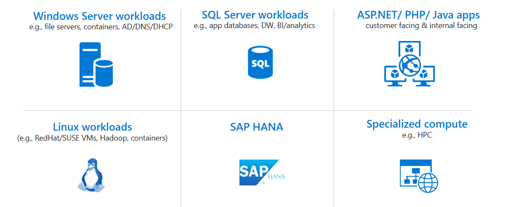

# Application migration patterns and examples

This section of the Cloud Adoption Framework provides examples of several common migration scenarios, demonstrating how you can migrate on-premises infrastructure to the [Microsoft Azure](https://azure.microsoft.com/overview/what-is-azure) cloud.

## Introduction

Azure provides access to a comprehensive set of cloud services. As developers and IT professionals, you can use these services to build, deploy, and manage applications on a range of tools and frameworks, through a global network of datacenters. As your business faces challenges associated with the digital shift, the Azure cloud helps you to figure out how to optimize resources and operations, engage with your customers and employees, and transform your products.

However, Azure recognizes that even with all the advantages that the cloud provides in terms of speed and flexibility, minimized costs, performance, and reliability, many organizations are going to need to run on-premises datacenters for some time to come. In response to cloud adoption barriers, Azure provides a hybrid cloud strategy that builds bridges between your on-premises datacenters, and the Azure public cloud. For example, using Azure cloud resources like Azure Backup to protect on-premises resources, or using Azure analytics to gain insights into on-premises workloads.

As part of the hybrid cloud strategy, Azure provides growing solutions for migrating on-premises apps and workloads to the cloud. With simple steps, you can comprehensively assess your on-premises resources to figure out how they'll run in the Azure cloud. Then, with a deep assessment in hand, you can confidently migrate resources to Azure. When resources are up and running in Azure, you can optimize them to retain and improve access, flexibility, security, and reliability.

## Migration patterns

Strategies for migration to the cloud fall into four broad patterns: rehost, refactor, rearchitect, or rebuild. The strategy you adopt depends on your business drivers and migration goals. You might adopt multiple patterns. For example, you could choose to rehost simple apps, or apps that aren't critical to your business, but rearchitect those that are more complex and business-critical. Let's look at these patterns.

<!-- markdownlint-disable MD033 -->

**Pattern** | **Definition** | **When to use**
--- | --- | ---
**Rehost** | Often referred to as a "lift and shift" migration. This option doesn't require code changes, and allows you to migrate your existing apps to Azure quickly. Each app is migrated as is, to reap the benefits of the cloud, without the risk and cost associated with code changes. | When you need to move apps quickly to the cloud.   When you want to move an app without modifying it.   When your apps are architected so that they can take advantage of [Azure IaaS](https://azure.microsoft.com/overview/what-is-iaas) scalability after migration.   When apps are important to your business, but you don't need immediate changes to app capabilities.
**Refactor** | Often referred to as "repackaging," refactoring requires minimal changes to apps, so that they can connect to [Azure PaaS](https://azure.microsoft.com/overview/what-is-paas), and use cloud offerings.   For example, you could migrate existing apps to Azure App Service or Azure Kubernetes Service (AKS).   Or, you could refactor relational and nonrelational databases into options such as Azure SQL Database Managed Instance, Azure Database for MySQL, Azure Database for PostgreSQL, and Azure Cosmos DB. | If your app can easily be repackaged to work in Azure.   If you want to apply innovative DevOps practices provided by Azure, or you're thinking about DevOps using a container strategy for workloads.   For refactoring, you need to think about the portability of your existing code base, and available development skills.
**Rearchitect** | Rearchitecting for migration focuses on modifying and extending app functionality and the code base to optimize the app architecture for cloud scalability.   For example, you could break down a monolithic application into a group of microservices that work together and scale easily.   Or, you could rearchitect relational and nonrelational databases to a fully managed database solution, such as Azure SQL Database Managed Instance, Azure Database for MySQL, Azure Database for PostgreSQL, and Azure Cosmos DB. | When your apps need major revisions to incorporate new capabilities, or to work effectively on a cloud platform.   When you want to use existing application investments, meet scalability requirements, apply innovative Azure DevOps practices, and minimize use of virtual machines.
**Rebuild** | Rebuild takes things a step further by rebuilding an app from scratch using Azure cloud technologies.   For example, you could build greenfield apps with [cloud-native](https://azure.com/cloudnative) technologies like Azure Functions, Azure AI, Azure SQL Database Managed Instance, and Azure Cosmos DB. | When you want rapid development, and existing apps have limited functionality and lifespan.   When you're ready to expedite business innovation (including DevOps practices provided by Azure), build new applications using cloud-native technologies, and take advantage of advancements in AI, Blockchain, and IoT.

<!-- markdownlint-enable MD033 -->

## Migration example articles

The articles in this section provide examples of several common migration scenarios. Each of these examples include background information and detailed deployment scenarios that illustrate how to set up a migration infrastructure and assess the suitability of on-premises resources for migration. More articles will be added to this section over time.

*Common migration and modernization project categories.*

The articles in the series are summarized below.

- Each migration scenario is driven by slightly different business goals that determine the migration strategy.
- For each deployment scenario, we provide information about business drivers and goals, a proposed architecture, steps to perform the migration, and recommendation for cleanup and next steps after migration is complete.

### Assessment

**Article** | **Details**
--- | ---
[Assess on-premises resources for migration to Azure](contoso-migration-assessment.md) | This article shows how to run an assessment of an on-premises app running on VMware. In the example, an example organization assesses app VMs using the Azure Migrate service, and the app SQL Server database using Data Migration Assistant.

### Infrastructure

**Article** | **Details**
--- | ---
[Deploy Azure infrastructure](contoso-migration-infrastructure.md) | This article shows how an organization can prepare its on-premises infrastructure and its Azure infrastructure for migration. The infrastructure example established in this article is referenced in the other samples provided in this section.

### Windows Server workloads

**Article** | **Details**
--- | ---
[Rehost an app on Azure VMs](contoso-migration-rehost-vm.md) | This article provides an example of migrating on-premises app VMs to Azure VMs using the Site Recovery service.
[Rearchitect an app in Azure containers and Azure SQL Database](contoso-migration-rearchitect-container-sql.md) | This article provides an example of migrating an app while rearchitecting the app web tier as a Windows container running in Azure Service Fabric, and the database with Azure SQL Database.

### Linux workloads

**Article** | **Details**
--- | ---
[Rehost a Linux app on Azure VMs and Azure Database for MySQL](contoso-migration-rehost-linux-vm-mysql.md) | This article provides an example of migrating a Linux-hosted app to Azure VMs by using Site Recovery. It migrates the app database to Azure Database for MySQL by using MySQL Workbench.
[Rehost a Linux app on Azure VMs](contoso-migration-rehost-linux-vm.md) | This example shows how to complete a "lift and shift" migration of a Linux-based app to Azure VMs, using the Site Recovery service.

### SQL Server workloads

**Article** | **Details**
--- | ---
[Rehost an app on an Azure VM and SQL Database Managed Instance](contoso-migration-rehost-vm-sql-managed-instance.md) | This article provides an example of a "lift and shift" migration to Azure for an on-premises app. This involves migrating the app front-end VM using [Azure Site Recovery](/azure/site-recovery/site-recovery-overview), and the app database to an Azure SQL Database Managed Instance using the [Azure Database Migration Service](/azure/dms/dms-overview).
[Rehost an app on Azure VMs and in a SQL Server Always On availability group](contoso-migration-rehost-vm-sql-ag.md) | This example shows how to migrate an app and data using Azure hosted SQL Server VMs. It uses Site Recovery to migrate the app VMs, and the Azure Database Migration Service to migrate the app database to a SQL Server cluster that's protected by an Always On availability group.

### ASP.NET / PHP / Java apps

**Article** | **Details**
--- | ---
[Refactor an app in an Azure web app and Azure SQL Database](contoso-migration-refactor-web-app-sql.md) | This example shows how to migrate an on-premises Windows-based app to an Azure web app and migrates the app database to an Azure SQL Server instance with the Data Migration Assistant.
[Refactor a Linux app to multiple regions using Azure App Service, Azure Traffic Manager, and Azure Database for MySQL](contoso-migration-refactor-linux-app-service-mysql.md) | This example shows how to migrate an on-premises Linux-based app to an Azure web app on multiple Azure regions using Azure Traffic Manager, integrated with GitHub for continuous delivery. The app database is migrated to an Azure Database for MySQL instance.
[Rebuild an app in Azure](contoso-migration-rebuild.md) | This article provides an example of rebuilding an on-premises app using a range of Azure capabilities and managed services, including Azure App Service, Azure Kubernetes Service (AKS), Azure Functions, Azure Cognitive Services, and Azure Cosmos DB.
[Refactor Team Foundation Server on Azure DevOps Services](contoso-migration-tfs-vsts.md) | This article shows an example migration of an on-premises Team Foundation Server deployment to Azure DevOps Services in Azure.

### Migration scaling

**Article** | **Details**
--- | ---
[Scale a migration to Azure](contoso-migration-scale.md) | This article how an example organization prepares to scale to a full migration to Azure.

### Demo apps

The example articles provided in this section use two demo apps: SmartHotel360 and osTicket.

- **SmartHotel360:** This app was developed by Microsoft as a test app that you can use when working with Azure. It's provided as open source and you can download it from [GitHub](https://github.com/Microsoft/SmartHotel360). It's an ASP.NET app connected to a SQL Server database. In the scenarios discussed in these articles, the current version of this app is deployed to two VMware VMs running Windows Server 2008 R2, and SQL Server 2008 R2. These app VMs are hosted on-premises and managed by vCenter Server.
- **osTicket:** An open-source service desk ticketing app that runs on Linux. You can download it from [GitHub](https://github.com/osTicket/osTicket). In the scenarios discussed in these articles, the current version of this app is deployed on-premises to two VMware VMs running Ubuntu 16.04 LTS, using Apache 2, PHP 7.0, and MySQL 5.7
