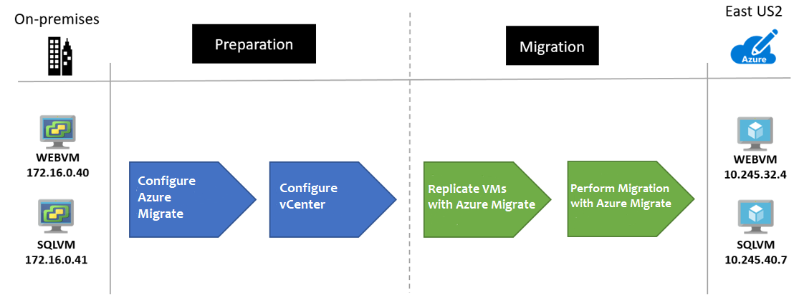
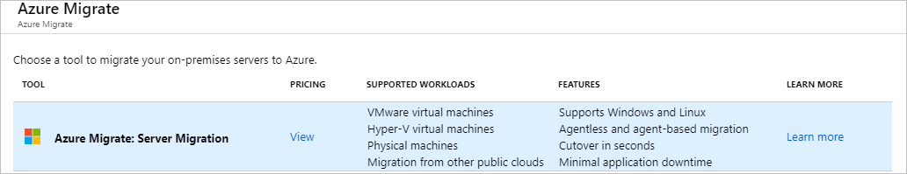
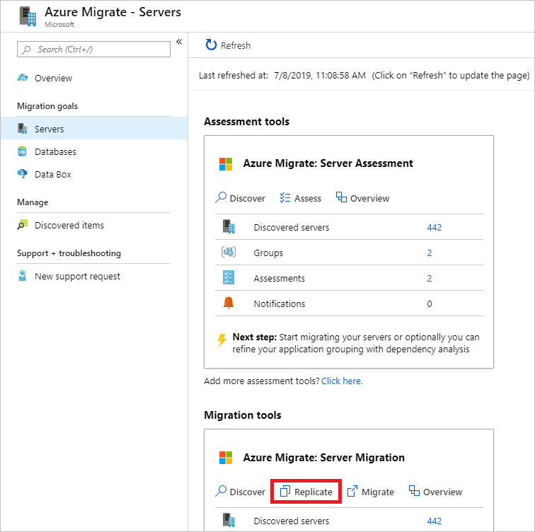
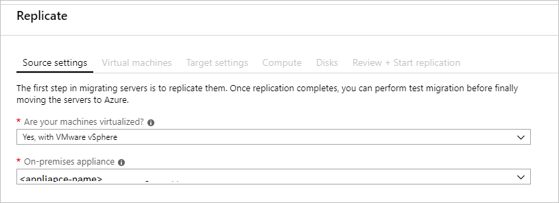
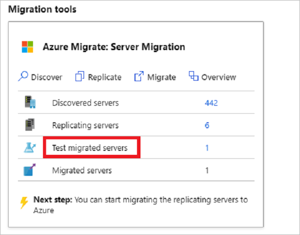

# Rehost an on-premises Linux app to Azure VMs

This article shows how the fictional company Contoso rehosts a two-tier Linux-based Apache MySQL PHP (LAMP) app, using Azure IaaS VMs.

osTicket, the service desk app used in this example is provided as open source. If you'd like to use it for your own testing purposes, you can download it from [GitHub](https://github.com/osTicket/osTicket).

## Business drivers

The IT Leadership team has worked closely with business partners to understand what they want to achieve with this migration:

- **Address business growth.** Contoso is growing, and as a result there's pressure on the on-premises systems and infrastructure.
- **Limit risk.** The service desk app is critical for the Contoso business. Contoso wants to move it to Azure with zero risk.
- **Extend.** Contoso don't want to change the app right now. It simply wants to ensure that the app is stable.

## Migration goals

The Contoso cloud team has pinned down goals for this migration, to determine the best migration method:

- After migration, the app in Azure should have the same performance capabilities as it does today in their on-premises VMware environment. The app will remain as critical in the cloud as it is on-premises.
- Contoso doesn’t want to invest in this app. It is important to the business, but in its current form Contoso simply wants to move it safely to the cloud.
- Contoso doesn't want to change the ops model for this app. It wants to interact with the app in the cloud in the same way that they do now.
- Contoso doesn't want to change app functionality. Only the app location will change.
- Having completed a couple of Windows app migrations, Contoso wants to learn how to use a Linux-based infrastructure in Azure.

## Solution design

After pinning down goals and requirements, Contoso designs and review a deployment solution, and identifies the migration process, including the Azure services that Contoso will use for the migration.

### Current app

- The OSTicket app is tiered across two VMs (**OSTICKETWEB** and **OSTICKETMYSQL**).
- The VMs are located on VMware ESXi host **contosohost1.contoso.com** (version 6.5).
- The VMware environment is managed by vCenter Server 6.5 (**vcenter.contoso.com**), running on a VM.
- Contoso has an on-premises datacenter (**contoso-datacenter**), with an on-premises domain controller (**contosodc1**)

### Proposed architecture

- Since the app is a production workload, the VMs in Azure will reside in the production resource group **ContosoRG**.
- The VMs will be migrated to the primary region (East US 2) and placed in the production network (VNET-PROD-EUS2):
  - The web VM will reside in the front-end subnet (PROD-FE-EUS2).
  - The database VM will reside in the database subnet (PROD-DB-EUS2).
- The on-premises VMs in the Contoso datacenter will be decommissioned after the migration is done.

### Solution review

Contoso evaluates the proposed design by putting together a pros and cons list.

<!-- markdownlint-disable MD033 -->

**Consideration** | **Details**
--- | ---
**Pros** | Both the app VMs will be moved to Azure without changes, making the migration simple.   Since Contoso is using "lift and shift" for both app VMs, no special configuration or migration tools are needed for the app database.   Contoso will retain full control of the app VMs in Azure.    The app VMs are running Ubuntu 16.04-TLS, which is an endorsed Linux distribution. [Learn more](/azure/virtual-machines/linux/endorsed-distros).
**Cons** | The web and data tier of the app will remain a single point of failover.    Contoso will need to continue supporting the app as Azure VMs rather than moving to a managed service such as Azure App Service and Azure Database for MySQL.   Contoso is aware that by keeping things simple with a "lift and shift" VM migration, they're not taking full advantage of the features provided by [Azure Database for MySQL](/azure/mysql/overview) (built-in high availability, predictable performance, simple scaling, automatic backups and built-in security).

<!-- markdownlint-enable MD033 -->

### Migration process

Contoso will migrate as follows:

- As a first step, Contoso prepares and sets up Azure components for Azure Migrate Server Migration, and prepares the on-premises VMware infrastructure.
- They already have the [Azure infrastructure](contoso-migration-infrastructure.md) in place, so Contoso just needs to add configure the replication of the VMs through the Azure Migrate Server Migration tool. 
- With everything prepared, Contoso can start replicating the VMs.
- After replication is enabled and working, Contoso will migrate the VM by failing it over to Azure.

### Azure services

**Service** | **Description** | **Cost**
--- | --- | ---
[Azure Migrate Server Migration](/azure/migrate/contoso-migration-rehost-linux-vm) | The service orchestrates and manages migration of your on-premises apps and workloads, and AWS/GCP VM instances. | During replication to Azure, Azure Storage charges are incurred. Azure VMs are created, and incur charges, when failover occurs. [Learn more](https://azure.microsoft.com/pricing/details/azure-migrate/) about charges and pricing.

## Prerequisites

Here's what Contoso needs for this scenario.

<!-- markdownlint-disable MD033 -->

**Requirements** | **Details**
--- | ---
**Azure subscription** | Contoso created subscriptions in an early article in this series. If you don't have an Azure subscription, create a [free account](https://azure.microsoft.com/pricing/free-trial).   If you create a free account, you're the administrator of your subscription and can perform all actions.   If you use an existing subscription and you're not the administrator, you need to work with the admin to assign you Owner or Contributor permissions.   If you need more granular permissions, review [this article](/azure/site-recovery/site-recovery-role-based-linked-access-control).
**Azure infrastructure** |  [Learn how](contoso-migration-infrastructure.md) Contoso set up an Azure infrastructure.   Learn more about specific [prerequisites](/azure/migrate/contoso-migration-rehost-linux-vm#prerequisites) requirements for Azure Migrate Server Migration.
**On-premises servers** | The on-premises vCenter server should be running version 5.5, 6.0, or 6.5   An ESXi host running version 5.5, 6.0 or 6.5   One or more VMware VMs running on the ESXi host.
**On-premises VMs** | [Review Linux machines](/azure/virtual-machines/linux/endorsed-distros) that are endorsed to run on Azure.

<!-- markdownlint-enable MD033 -->

## Scenario steps

Here's how Contoso will complete the migration:

> [!div class="checklist"]
>
> - **Step 1: Prepare Azure for Azure Migrate Server Migration.** They add the Server Migration tool to their Azure Migrate project. 
> - **Step 2: Prepare on-premises VMware for Azure Migrate Server Migration.** They prepare accounts for VM discovery, and prepare to connect to Azure VMs after failover.
> - **Step 3: Replicate VMs.** They set up replication, and start replicating VMs to Azure storage.
> - **Step 4: Migrate the VMs with Azure Migrate Server Migration.** They run a test failover to make sure everything's working, and then run a full failover to migrate the VMs to Azure.

## Step 1: Prepare Azure for the Azure Migrate Server Migration tool

Here are the Azure components Contoso needs to migrate the VMs to Azure:

- A VNet in which Azure VMs will be located when they're created during failover.
- The Azure Migrate Server Migration tool provisioned. 

They set these up as follows:

1. Set up a network-Contoso already set up a network that can be for Azure Migrate Server Migration when they [deployed the Azure infrastructure](contoso-migration-infrastructure.md)

    - The SmartHotel360 app is a production app, and the VMs will be migrated to the Azure production network (VNET-PROD-EUS2) in the primary East US 2 region.
    - Both VMs will be placed in the ContosoRG resource group, which is used for production resources.
    - The app front-end VM (WEBVM) will migrate to the front-end subnet (PROD-FE-EUS2), in the production network.
    - The app database VM (SQLVM) will migrate to the database subnet (PROD-DB-EUS2), in the production network.

2. Provision the Azure Migrate Server Migration tool-With the network and storage account in place, Contoso now creates a Recovery Services vault (ContosoMigrationVault), and places it in the ContosoFailoverRG resource group in the primary East US 2 region.

    

**Need more help?**

[Learn about](/azure/migrate/) setting up Azure Migrate Server Migration tool. 

### Prepare to connect to Azure VMs after failover

After failover to Azure, Contoso wants to be able to connect to the replicated VMs in Azure. To do this, there's a couple of things that the Contoso admins need to do:

- To access Azure VMs over the internet, they enable SSH on the on-premises Linux VM before migration. For Ubuntu this can be completed using the following command: **Sudo apt-get ssh install -y**.
- After they run the migration (failover), they can check **Boot diagnostics** to view a screenshot of the VM.
- If this doesn't work, they'll need to check that the VM is running, and review these [troubleshooting tips](https://social.technet.microsoft.com/wiki/contents/articles/31666.troubleshooting-remote-desktop-connection-after-failover-using-asr.aspx).

**Need more help?**

- [Learn about](/azure/migrate/contoso-migration-rehost-linux-vm#prepare-vms-for-migration) preparing VMs for migration

## Step 3: Replicate the on-premises VMs

Before Contoso admins can run a migration to Azure, they need to set up and enable replication.

With discovery completed, you can begin replication of VMware VMs to Azure.

1. In the Azure Migrate project > **Servers**, **Azure Migrate: Server Migration**, click **Replicate**.

    

2. In **Replicate**, > **Source settings** > **Are your machines virtualized?**, select **Yes, with VMware vSphere**.
3. In **On-premises appliance**, select the name of the Azure Migrate appliance that you set up > **OK**. 

    

4. In **Virtual machines**, select the machines you want to replicate.
    - If you've run an assessment for the VMs, you can apply VM sizing and disk type (premium/standard) recommendations from the assessment results. To do this, in **Import migration settings from an Azure Migrate assessment?**, select the **Yes** option.
    - If you didn't run an assessment, or you don't want to use the assessment settings, select the **No** options.
    - If you selected to use the assessment, select the VM group, and assessment name.

    

5. In **Virtual machines**, search for VMs as needed, and check each VM you want to migrate. Then click **Next: Target settings**.

6. In **Target settings**, select the subscription, and target region to which you'll migrate, and specify the resource group in which the Azure VMs will reside after migration. In **Virtual Network**, select the Azure VNet/subnet to which the Azure VMs will be joined after migration.
7. In **Azure Hybrid Benefit**:

    - Select **No** if you don't want to apply Azure Hybrid Benefit. Then click **Next**.
    - Select **Yes** if you have Windows Server machines that are covered with active Software Assurance or Windows Server subscriptions, and you want to apply the benefit to the machines you're migrating. Then click **Next**.

8. In **Compute**, review the VM name, size, OS disk type, and availability set. VMs must conform with [Azure requirements](https://docs.microsoft.com/azure/migrate/migrate-support-matrix-vmware#agentless-migration-vmware-vm-requirements).

    - **VM size**: If you're using assessment recommendations, the VM size dropdown will contain the recommended size. Otherwise Azure Migrate picks a size based on the closest match in the Azure subscription. Alternatively, pick a manual size in **Azure VM size**. 
    - **OS disk**: Specify the OS (boot) disk for the VM. The OS disk is the disk that has the operating system bootloader and installer. 
    - **Availability set**: If the VM should be in an Azure availability set after migration, specify the set. The set must be in the target resource group you specify for the migration.

9. In **Disks**, specify whether the VM disks should be replicated to Azure, and select the disk type (standard SSD/HDD or premium-managed disks) in Azure. Then click **Next**.
    - You can exclude disks from replication.
    - If you exclude disks, won't be present on the Azure VM after migration. 

10. In **Review and start replication**, review the settings, and click **Replicate** to start the initial replication for the servers.

> [!NOTE]
> You can update replication settings any time before replication starts, in **Manage** > **Replicating machines**. Settings can't be changed after replication starts.

## Step 4: Migrate the VMs

Contoso admins run a quick test failover, and then a full failover to migrate the VMs.

### Run a test failover

1. In **Migration goals** > **Servers** > **Azure Migrate: Server Migration**, click **Test migrated servers**.

     

2. Right-click the VM to test, and click **Test migrate**.

    

3. In **Test Migration**, select the Azure VNet in which the Azure VM will be located after the migration. We recommend you use a non-production VNet.
4. The **Test migration** job starts. Monitor the job in the portal notifications.
5. After the migration finishes, view the migrated Azure VM in **Virtual Machines** in the Azure portal. The machine name has a suffix **-Test**.
6. After the test is done, right-click the Azure VM in **Replicating machines**, and click **Clean up test migration**.

    

### Migrate the VMs

Now Contoso admins run a full failover to complete the migration.

1. In the Azure Migrate project > **Servers** > **Azure Migrate: Server Migration**, click **Replicating servers**.

    

2. In **Replicating machines**, right-click the VM > **Migrate**.
3. In **Migrate** > **Shut down virtual machines and perform a planned migration with no data loss**, select **Yes** > **OK**.
    - By default Azure Migrate shuts down the on-premises VM, and runs an on-demand replication to synchronize any VM changes that occurred since the last replication occurred. This ensures no data loss.
    - If you don't want to shut down the VM, select **No**
4. A migration job starts for the VM. Track the job in Azure notifications.
5. After the job finishes, you can view and manage the VM from the **Virtual Machines** page.

### Connect the VM to the database

As the final step in the migration process, Contoso adins update the connection string of the application to point to the app database running on the **OSTICKETMYSQL** VM.

1. They make an SSH connection to the **OSTICKETWEB** VM using Putty or another SSH client. The VM is private so they connect using the private IP address.

    

    

2. They need to make sure that the **OSTICKETWEB** VM can communicate with the **OSTICKETMYSQL** VM. Currently the configuration is hardcoded with the on-premises IP address 172.16.0.43.

    **Before the update:**

    

    **After the update:**

    

3. They restart the service with **systemctl restart apache2**.

    

4. Finally, they update the DNS records for **OSTICKETWEB** and **OSTICKETMYSQL**, on one of the Contoso domain controllers.

    

    

**Need more help?**

- [Learn about](/azure/migrate/tutorial-migrate-vmware#run-a-test-migration) running a test failover.
- [Learn about](/azure/migrate/tutorial-migrate-vmware#migrate-vms) migrating VMs to Azure. 

## Clean up after migration

With migration complete, the osTicket app tiers are now running on Azure VMs.

Now, Contoso needs to clean up as follows:

- Remove the on-premises VMs from the vCenter inventory.
- Remove the on-premises VMs from local backup jobs.
- Update their internal documentation to show the new location, and IP addresses for OSTICKETWEB and OSTICKETMYSQL.
- Review any resources that interact with the VMs, and update any relevant settings or documentation to reflect the new configuration.
- Contoso used the Azure Migrate service with dependency mapping to assess the VMs for migration. Admins should remove the Microsoft Monitoring Agent, and the Dependency Agent they installed for this purpose, from the VM.

## Review the deployment

With the app now running, Contoso needs to fully operationalize and secure their new infrastructure.

### Security

The Contoso security team review the OSTICKETWEB and OSTICKETMYSQLVMs to determine any security issues.

- The team reviews the network security groups (NSGs) for the VMs to control access. NSGs are used to ensure that only traffic allowed to the application can pass.
- The team also considers securing the data on the VM disks using Disk encryption and Azure Key Vault.

[Read more](/azure/security/azure-security-best-practices-vms) about security practices for VMs.

### BCDR

For business continuity and disaster recovery, Contoso takes the following actions:

- **Keep data safe.** Contoso backs up the data on the VMs using the Azure Backup service. [Learn more](/azure/backup/backup-introduction-to-azure-backup?toc=%2fazure%2fvirtual-machines%2flinux%2ftoc.json).
- **Keep apps up and running.** Contoso replicates the app VMs in Azure to a secondary region using Site Recovery. [Learn more](/azure/site-recovery/azure-to-azure-quickstart).

### Licensing and cost optimization

- After deploying resources, Contoso assigns Azure tags as defined during the [Azure infrastructure deployment](contoso-migration-infrastructure.md#set-up-tagging).
- Contoso has no licensing issues with the Ubuntu servers.
- Contoso will enable Azure Cost Management licensed by Cloudyn, a Microsoft subsidiary. It's a multicloud cost management solution that helps you to use and manage Azure and other cloud resources. [Learn more](/azure/cost-management/overview) about Azure Cost Management.
