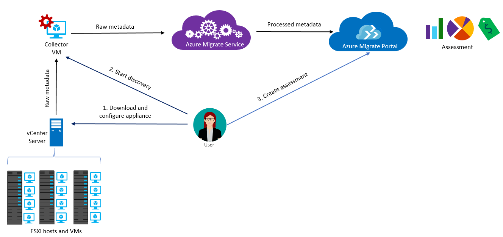

# Assess the digital estate

In an ideal migration, every asset (infrastructure, app, or data) would be compatible with a cloud platform and ready for migration. In reality, not everything should be migrated to the cloud. Furthermore, not every asset is compatible with cloud platforms. Before migrating a workload to the cloud, it is important to assess the workload and each related asset (infrastructure, apps, and data).

The resources in this section will help you assess of your environment to determine its suitability for migration and which methods to consider.

# [Tools](#tab/Tools)

The following tools help you assess your environment to determine the suitability of migration and best approach to use. For helpful information on choosing the right tools to support your migration efforts, see the [Cloud Adoption Framework's migration tools decision guide](../../decision-guides/migrate-decision-guide/index.md).

## Azure Migrate

The Azure Migrate service assesses on-premises infrastructure, applications and data for migration to Azure. The service assesses the migration suitability of on-premises assets, performs performance-based sizing, and provides cost estimates for running on-premises assets in Azure. If you're considering "lift and shift" migrations, or are in the early assessment stages of migration, this service is for you. After completing the assessment, Azure Migrate can be utilized to execute the migration.

### Create a new server migration project

To get started with a server migration assessment using Azure Migrate, follow these steps:

1. Select **Azure Migrate**.
1. In **Overview**, click **Assess and migrate servers**.
1. Select **Add tool(s)**.
1. In **Discover, assess and migrate servers**, click **Add tools**.
1. In **Migrate project**, select your Azure subscription, and create a resource group if you don't have one.
1. In **Project Details**, specify the project name, and geography in which you want to create the project, and click **Next**.
1. In **Select assessment tool**, select **Skip adding an assessment tool for now > Next**.
1. In **Select migration tool**, select **Azure Migrate: Server Migration > Next**.
1. In **Review + add tools**, review the settings, and click **Add tools**
1. After adding the tool, it appears in the **Azure Migrate project > Servers > Migration tools**.

::: zone target="chromeless"

::: form action="Blade[#blade/Microsoft_Azure_Migrate/AmhResourceMenuBlade/overview]" submitText="Assess and migrate servers" :::

::: zone-end

::: zone target="docs"

### Read more

- [Azure Migrate overview](/azure/migrate/migrate-services-overview)
- [Migrate physical or virtualized servers to Azure](/azure/migrate/tutorial-migrate-physical-virtual-machines)
- [Azure Migrate in the Azure portal](https://portal.azure.com/#blade/Microsoft_Azure_Migrate/AmhResourceMenuBlade/overview)

::: zone-end

## Service Map

Service Map automatically discovers application components on Windows and Linux systems and maps the communication between services. With Service Map, you can view your servers in the way that you think of them: as interconnected systems that deliver critical services. Service Map shows connections between servers, processes, inbound and outbound connection latency, and ports across any TCP-connected architecture, with no configuration required other than the installation of an agent.

Azure Migrate uses Service Map to enhance the reporting capabilities and dependencies across the environment. Full details of this integration are outlined in [Dependency visualization](/azure/migrate/concepts-dependency-visualization). If you use the Azure Migration service then there are no additional steps required to configure and obtain the benefits of Service Map. The following instructions are provided for your reference should your wish to use Service Map for other purposes or projects.

### Enable dependency visualization using Service Map

To use dependency visualization, you need to download and install agents on each on-premises machine that you want to analyze.

- [Microsoft Monitoring agent (MMA)](/azure/log-analytics/log-analytics-agent-windows) needs to be installed on each machine.
- The [dependency agent](/azure/azure-monitor/insights/vminsights-enable-hybrid-cloud#install-the-dependency-agent-on-windows) needs to be installed on each machine.
- In addition, if you have machines with no internet connectivity, you need to download and install Log Analytics gateway on them.

<!-- markdownlint-disable MD024 -->

### Read more

- [Using Service Map solution in Azure](/azure/azure-monitor/insights/service-map)
- [Azure Migrate and Service Map: Dependency visualization](/azure/migrate/concepts-dependency-visualization)

# [Scenarios and Stakeholders](#tab/Scenarios)

## Scenarios

This guide focuses on the following scenarios:

- **Legacy hardware:** You are migrating to remove a dependency on legacy hardware nearing end of support or end of life.
- **Capacity growth:** You need to increase the capacity for assets (infrastructure, apps, and data), which your current infrastructure can't provide.
- **Datacenter modernization:** You need to extend your datacenter or modernize your datacenter with cloud technology to ensure your business remains current and competitive.
- **Application or service modernization:** You want to update your applications to take advantage of cloud-native functionality. Even if a rehost migration strategy is your initial objective, the ability to create plans for application or service review and potential modernization is a common process in any migration.

### Organizational alignment and stakeholders

The complete list of stakeholders varies between migration projects. It is best to assume that you will not know all of the stakeholders at the start of planning for a migration, since stakeholders are often only identified during certain phases of the project. However, before starting any migration projects, you can identify key business leaders from finance, IT infrastructure, and application groups that will have an interest in your organization's overall cloud migration efforts.

Establishing a core cloud strategy team, built around these key high-level stakeholders, can help prepare your organization for cloud adoption and guide your overall cloud migration efforts. This team is responsible for understanding cloud technologies and migration processes, identifying the business justification for migrations, and determining the best high-level solutions for migration efforts. They also help identify and work with specific application and business stakeholders to ensure a successful migration.

For more information on how to prepare your organization for cloud migration efforts, see the Cloud Adoption Framework's article on [initial organization alignment](../../ready/initial-org-alignment.md).

# [Timelines](#tab/Timelines)

As a general statement, customers find that the migration scenario covered by this guide can be completed in one to six months.

Some of the factors to consider when evaluating the timeline of your migration are:

- **Assets (infrastructure, apps, and data) to migrate:** The number of and diversity of assets.
- **Staff readiness:** Are your staff ready to manage the new environment or do they need training?
- **Funding:** Do you have the appropriate approval and budget to complete the migration?
- **Change management:** Does your business have specific requirements regarding change implementation and approval?
- **Segment Regulations:** Do you have to comply with segment or industry regulations?

# [Cost Management](#tab/ManageCost)

As you assess your environment, this presents a perfect opportunity to include a cost analysis step. Using the data collected by the assessment activities you should be able to analyze and predict costs. This cost prediction should factor both the consumption service costs in addition to any one-time costs (such as increased data ingress).

During migration, certain factors that affect decisions and execution activities:

- **Digital estate size:** Understanding the size of your digital estate will directly affect decisions and the resources required to perform the migration.
- **Accounting models:** Shifting from a structured capital expense model to a fluid operating expense model.

::: zone target="docs"

The following resources provide related information:

- [Estimate cloud costs](../migration-considerations/assess/estimate.md)

::: zone-end
