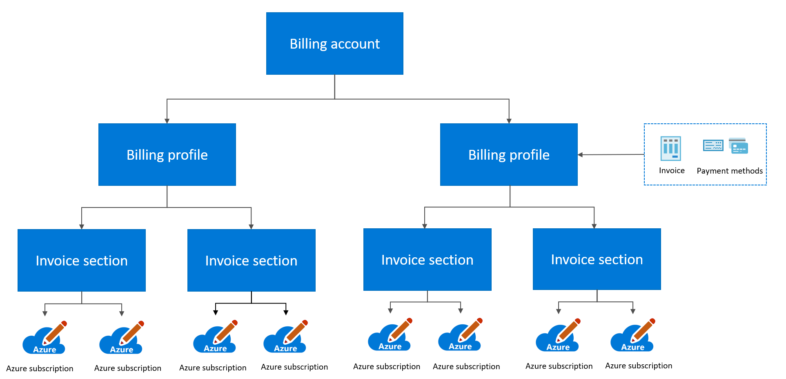

# Manage costs and billing to understand charges and usage from your Azure Resources

Cost control is a critical component to maximize the value of your investment in the cloud. Depending on your subscription type, use the following sections to learn how to manage Azure cost management and understand billing for your subscription. To see your subscription type, go to Subscriptions in the Azure portal.

# [For pay-as-you-go customers](#tab/Forpayasyougocustomers)

Pay-as-you-go customers have access to all Azure portal cost management and billing services. Use the following features to understand and prepare for your future costs:

- **Understand your bill:** Your invoice is the actual monthly cost of your services.
- **Manage payment methods:** You can pay for an Azure subscription with a credit or debit card. Make sure you have the card you want your subscription billed to in the payment methods on your account.
- **Resource tags:** Tags can also be used for billing management. You can combine your resources by tag and group them to one cost center.

::: zone target="docs"

## Understand your bill

1. Go to **Cost Management + Billing**.
2. Select the subscription.
3. Select **Invoices**.
4. Select the invoice.

To see your invoices, go to the [Azure portal](https://ms.portal.azure.com/#blade/Microsoft_Azure_Billing/ModernBillingMenuBlade/Overview)

## Manage payments

To manage payments:

1. Go to [Cost Management + Billing](https://ms.portal.azure.com/#blade/Microsoft_Azure_Billing/ModernBillingMenuBlade/Payment) in **Azure Portal**.
1. Select **Payment methods**.
1. Use the menu to add and delete payment methods.

## Apply a resource tag

To apply a tag to a resource group:

1. Go to **Resource Groups**.
1. Select a resource group.
1. Select **Tags**.
1. Type in a new name and value or select an existing name and value.

## Learn more

For more information, see [understand your bill for Microsoft Azure](/azure/billing/billing-understand-your-invoice).

::: zone-end

::: zone target="chromeless"

## Actions

**Understand your bill:**

 You can download your invoice from the Azure portal or have it sent in email. To download invoices from portal:

1. Go to **Cost Management + Billing**.
2. Select the subscription.
3. Select **Invoices**.
4. Select the invoice.

**Manage payment methods:**

If you would like to pay by invoice, contact support. If you would like to update your credit card:

1. Go to **Cost Management + Billing**.
2. Select **Payment methods**.
3. Use menu to add and delete payment methods.

::: form action="OpenBlade[#blade/Microsoft_Azure_Billing/ModernBillingMenuBlade/Overview]" submitText="Go to Cost Management + Billing" ::: form-end

**Apply a resource tag:**

To apply a tag to a resource group:

1. Go to **Resource Groups**.
1. Select on a resource group.
1. Select **Tags**.
1. Type in a new name and value or select an existing name and value.

::: form action="OpenBlade[#blade/HubsExtension/Resources/resourceType/Microsoft.Resources/subscriptions/resourceGroups]" submitText="Go to Resource Groups" ::: form-end

::: zone-end

# [For Enterprise Agreement Customers](#tab/ForEnterpriseAgreementCustomers)

Microsoft Azure Enterprise Enrollments feature five distinct administrative roles:

- **Enterprise Administrator** has the highest level of access, can manage Account Owners, Enterprise Administrators, Department Administrators, and Notification Contacts, and view usage across all accounts.
- **Department Administrator** can create and manage departments and create new Account Owners.
- **Account Owner** can create and manage subscriptions and manage Service Administrators.
- **Service Administrator** can access and manage subscriptions and development projects on the developer portal.
- **Notification Contact** can receive usage notifications related to the enrollment
- **Resource tags** help you manage billing by combining your resources and associate them to one cost center.

Assign these roles to help manage your organization's usage and spending. Use the Azure EA portal to assign and view these roles.

**Manage Budgets:**

You can manage budgets on a subscription level or resource level:

1. Go to **Cost Management + Billing**.
1. Under **Cost Management**, select budget.
1. Click **Add**.

**Download and understand your usage:**

Microsoft bills annually at the enrollment effective date for any commitment purchases of the Microsoft Azure services and any usage in excess of the commitment amounts. Commitment fees are quoted based on a *monthly rate* and *billed annually* in advance. Overage fees are calculated each month and billed at the end of your billing period. For example, your company may have a monetary commitment with Microsoft and you are running Azure virtual machines. If you choose to upgrade to a more expensive virtual machine, you may potentially incur an overage fee. You can monitor and see these costs by downloading usage from EA portal.

**Manage your costs with Azure Cost Management:**

 Azure provides a number of ways to help you predict and manage costs:

- Using **Budgets**, you can create a budget and configure alerts to warn teams about impending budget overages.
- Using **Recommendations**, Azure Cost Management helps you optimize and improve efficiency by identifying idle and underused resources.
- Using **Cost analysis** allows you to explore and analyze your organizational costs. You can then view aggregated costs by organization and view accumulated costs over time.

::: zone target="chromeless"

## Actions

**Manage Budgets:**

You can manage budgets on a subscription level or resource level

1. Go to **Cost Management + Billing**.
1. Under **Cost Management**, select budget.
1. Click **Add**.

::: form action="OpenBlade[#blade/Microsoft_Azure_CostManagement/Menu/budgets]" submitText="Go to Cost Management + Billing" ::: form-end

**Download usage:**

1. Go to **Cost Management + Billing**.
2. Select organization.
3. Under **Billing**, select **Usage + Charges**.
4. Find the bill you want to download and select **download**.

::: form action="OpenBlade[#blade/Microsoft_Azure_Billing/ModernBillingMenuBlade/Overview]" submitText="Go to Cost Management + Billing" ::: form-end

**Explore Azure Cost Management:**

To explore cost analysis, create a budget, or view advisor recommendations:

::: form action="OpenBlade[#blade/Microsoft_Azure_CostManagement/Menu/costanalysis]" submitText="Go to Azure Cost Management" ::: form-end

**Apply a resource tag:**

To apply a tag to a resource group:

1. Go to **Resource Groups**.
1. Select on a resource group.
1. Select **Tags**.
1. Type in a new name and value or select an existing name and value.

::: form action="OpenBlade[#blade/HubsExtension/Resources/resourceType/Microsoft.Resources/subscriptions/resourceGroups]" submitText="Go to Resource Groups" ::: form-end

::: zone-end

::: zone target="docs"

## Manage EA roles

1. Go to **EA portal**.
1. Go to **Manage**.
1. Use this page to add and manage Administrators.

To manage EA roles, go to [Enterprise portal](https:/ea.azure.com).

## Download usage

1. Go to **Cost Management + Billing**.
1. Select organization.
1. Under **Billing**, select usage + charges.
1. Select download under the month you want to see.

To download your usage go to the [Azure portal](https://ms.portal.azure.com/#blade/Microsoft_Azure_Billing/ModernBillingMenuBlade/Overview)

## Explore cost analysis

To explore cost analysis, go to the [Azure portal](https://ms.portal.azure.com/#blade/Microsoft_Azure_CostManagement/Menu/costanalysis).

## View recommendations

To view recommendations, go to the [Azure portal](https://ms.portal.azure.com/#blade/Microsoft_Azure_CostManagement/Menu/costanalysis).

## Set budgets

To set budgets, go to the [Azure portal](https://ms.portal.azure.com/#blade/Microsoft_Azure_CostManagement/Menu/costanalysis).

## Learn more

- [Understanding your invoice](https://ea.azure.com/helpdocs/understandingYourInvoice).
- [Roles in the Enterprise portal](https://ea.azure.com/helpdocs/rolesInTheEnterprisePortal).

::: zone-end

# [For Microsoft Customer Agreement Customers](#tab/ForMicrosoftCustomerAgreementCustomers)

Use your billing account for Microsoft Customer Agreement to organize billing and track costs for your agreement. A billing account is created for each agreement you sign with Microsoft.

Your billing account for the Microsoft Customer Agreement contains one or more billing profiles. Each billing profile has its own invoice and payment methods to pay the invoice. The billing profile contains one or more invoice sections that let you group charges on its invoice.

The following diagram shows the relationship between a billing account, the billing profiles, and invoice sections.

**Give permissions to manage billing:**

Use Access Control (IAM) on Cost Management + Billing page to give others permission to view and manage billing for your account. Control who can view charges, organize billing, create Azure subscriptions and make purchases like Azure reservations and Marketplace products.

**Manage your costs with Azure Cost Management:**

Azure provides several ways to help you predict and manage costs:

- Using **Budgets**, you can create a budget and configure alerts to warn others about impending budget overages.

- Using **Cost Analysis** allows you to explore and analyze costs for your billing account.

::: zone target="chromeless"

## Actions

**Give permissions to manage billing:**

1. Search on **Cost Management + Billing**.
1. Go to the billing profile. Depending on your access, you may need to select a billing account. From the billing account, select **Billing profiles** and then a billing profile.
1. Select **Access Management (IAM)** from the left-hand pane.
1. From the top of the page, select **Add**.
1. Select a role and enter the email address of the user.
1. Select **Save**.

::: form action="OpenBlade[#blade/Microsoft_Azure_Billing/ModernBillingMenuBlade/Overview]" submitText="Go to Cost Management + Billing"::: form-end

**Give permissions to create Azure subscriptions:**

1. Search on **Cost Management + Billing**.
1. Go to the invoice section. Depending on your access, you may need to select a billing account or a billing profile. From the billing account or profile, select **Invoice sections** and then an invoice section.
1. Select **Access Management (IAM)** from the left-hand pane.
1. From the top of the page, select **Add**.
1. Select **Azure subscription creator** for role and enter the email address of the user.
1. Select **Save**.

::: form action="OpenBlade[#blade/Microsoft_Azure_Billing/ModernBillingMenuBlade/Overview]" submitText="Go to Cost Management + Billing" ::: form-end

**Explore cost management:**

To explore cost analysis or create a budget"
::: form action="OpenBlade[#blade/Microsoft_Azure_Billing/ModernBillingMenuBlade/costAnalysis]" submitText="Go to Azure Cost Management" ::: form-end

::: zone-end

::: zone target="docs"

## Give permissions to manage billing

- To give permissions to manage billing, go to the [Azure portal](https://go.microsoft.com/fwlink/?linkid=2067850&clcid=0x409)

## Give permissions to create Azure subscriptions

- To give permissions to create Azure subscriptions, go to the [Azure portal](https://go.microsoft.com/fwlink/?linkid=2067855&clcid=0x409)

## Explore cost management

- To explore cost analysis or create a budget, go to the [Azure portal](https://go.microsoft.com/fwlink/?linkid=2067857&clcid=0x409).

::: zone-end