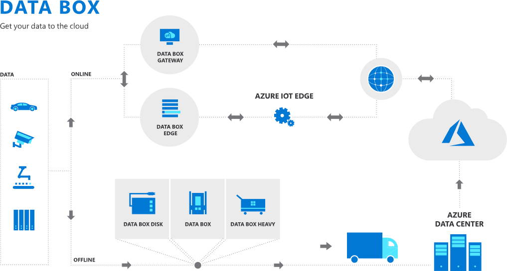

# Storage requirements exceed network capacity during a migration effort

In a cloud migration, assets are replicated and synchronized over the network between the existing datacenter and the cloud. It is not uncommon for the existing data size requirements of various workloads to exceed network capacity. In such a scenario, the process of migration can be radically slowed, or in some cases, stopped entirely. The following guidance will expand the scope of the [Azure migration guide](../azure-migration-guide/index.md) to provide a solution that works around network limitations.

## General scope expansion

Most of this effort required in this scope expansion will occur during the prerequisites, assess, and migrate processes of a migration.

## Suggested prerequisites

**Validate network capacity risks:** [Digital estate rationalization](../../digital-estate/rationalize.md) is a highly recommended prerequisite, especially if there are concerns of overburdening the available network capacity. During digital estate rationalization, an [inventory of digital assets](../../digital-estate/inventory.md) is collected. That inventory should include existing storage requirements across the digital estate. As outlined in [replication risks: Physics of replication](../migration-considerations/migrate/replicate.md#replication-risks---physics-of-replication), that inventory can be used to estimate **total migration data size**, which can be compared to total **available migration bandwidth**. If that comparison doesn't align with the required **time to business change**, then this article can help accelerate migration velocity reducing the time required to migrate the datacenter.

**Offline transfer of independent data stores:** Pictured in the diagram below are examples of both online and offline data transfers with Azure Data Box. These approaches could be used to ship large volumes of data to the cloud prior to workload migration. In an offline data transfer, source data is copied to Azure Data Box, which is then physically shipped to Microsoft for transfer into an Azure storage account as a file or a blob. This process can be used to ship data that isn't directly tied to a specific workload, prior to other migration efforts. Doing so reduces the amount of data that needs to be shipped over the network, in an effort to complete a migration within network constraints.

This approach could be used to transfer data HDFS, backups, archives, File Servers, applications, etc… Existing technical guidance explains how to use this approach to transfer data from [an HDFS store](/azure/storage/blobs/data-lake-storage-migrate-on-premises-hdfs-cluster) or from disks using [SMB](/azure/databox/data-box-deploy-copy-data), [NFS](/azure/databox/data-box-deploy-copy-data-via-nfs), [REST](/azure/databox/data-box-deploy-copy-data-via-rest), or [data copy service](/azure/databox/data-box-deploy-copy-data-via-copy-service) to Data Box.

There are also [third-party partner solutions](https://azuremarketplace.microsoft.com/campaigns/databox/azure-data-box) that use Azure Data Box for a "Seed and Feed" migration, where a large volume of data is moved via an offline transfer but is later synchronized at a lower scale over the network.

## Assess process changes

If the storage requirements of a workload (or workloads) exceed network capacity, then Azure Data Box can still be used in an offline data transfer.

The general Microsoft position is that network transmission is the advised approach, unless the network is unavailable. This suggestion is a result of transfer speeds. Transferring data over the network (even when bandwidth is constrained) is typically faster than physically shipping the same amount of data using an offline transfer mechanism, like Data Box.

If connectivity to Azure is available, an analysis should be conducted before using Data Box, especially if migration of the workload is time sensitive. Data Box is only advisable when the time to transfer the necessary data exceeds the time to populate, ship, and restore data using Data Box.

### Suggested action during the assess process

**Network Capacity Analysis:** When workload-related data transfer requirements are at risk of exceeding network capacity, the cloud adoption team would add an additional analysis task to the assess process, called network capacity analysis. During this analysis, a member of the team with subject matter expertise regarding the local network and network connectivity would estimate the amount of available network capacity and required data transfer time. That available capacity would be compared to the storage requirements of all assets to be migrated during the current release. If the storage requirements exceed the available bandwidth, then assets supporting the workload would be selected for offline transfer.

> [!IMPORTANT]
> At the conclusion of the analysis, the release plan may need to be updated to reflect the time required to ship, restore, and synchronize the assets to be transferred offline.

**Drift analysis:** Each asset to be transferred offline should be analyzed for storage and configuration drift. Storage drift is the amount of change in the underlying storage over time. Configuration drift is change in the configuration of the asset over time. From the time the storage is copied to the time the asset is promoted to production, any drift could be lost. If that drift needs to be reflected in the migrated asset, some form of synchronization would be required, between the local asset and the migrated asset. This should be flagged for consideration during migration execution.

## Migrate process changes

When using offline transfer mechanisms, [replication processes](../migration-considerations/migrate/replicate.md) are not likely required. However, [synchronization processes](../migration-considerations/migrate/replicate.md) may still be a requirement. Understanding the results of the drift analysis completed during the Assess process will inform the tasks required during migration, if an asset is being transferred offline.

### Suggested action during the migrate process

**Copy storage:** This approach could be used to transfer data HDFS, backups, archives, File Servers, applications, etc… Existing technical guidance explains how to use this approach to transfer data from [an HDFS store](/azure/storage/blobs/data-lake-storage-migrate-on-premises-hdfs-cluster) or from disks using [SMB](/azure/databox/data-box-deploy-copy-data), [NFS](/azure/databox/data-box-deploy-copy-data-via-nfs), [REST](/azure/databox/data-box-deploy-copy-data-via-rest), or [data copy service](/azure/databox/data-box-deploy-copy-data-via-copy-service) to Data Box.

There are also [third-party partner solutions](https://azuremarketplace.microsoft.com/campaigns/databox/azure-data-box) that use Azure Data Box for a "seed and sync" migration, where a large volume of data is moved via an offline transfer but is later synchronized at a lower scale over the network.

**Ship the device:** Once the data is copied, the device can be [shipped to Microsoft](/azure/databox/data-box-deploy-picked-up). Once received and imported, the data is available in an Azure storage account.

**Restore the asset:** [Verify the data](/azure/databox/data-box-deploy-picked-up#verify-data-upload-to-azure) is available in the storage account. Once verified, the data can be used as a blob or in Azure Files. If the data is a VHD/VHDX file, the file can be converted managed disks. Those managed disks can then be used to instantiate a virtual machine, which creates a replica of the original on-premises asset.

**Synchronization:** If synchronization of drift is a requirement for a migrated asset, one of the [third-party partner solutions](https://azuremarketplace.microsoft.com/campaigns/databox/azure-data-box) could be used to synchronize the files until the asset is restored.

## Optimize and promote process changes

Optimize activities are not likely affected by this change in scope.

## Secure and manage process changes

Secure and manage activities are not likely affected by this change in scope.

## Next steps

Return to the [expanded scope checklist](./index.md) to ensure your migration method is fully aligned.

> [!div class="nextstepaction"]
> [Expanded scope checklist](./index.md)
