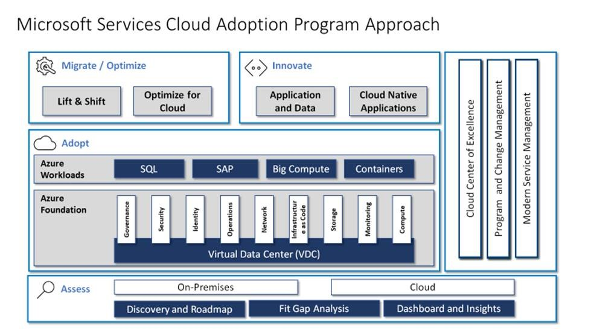

# Understand partnership options

During migration, the cloud adoption team performs the actual migration of workloads to the cloud. Unlike the collaborative and problem-solving tasks when defining the [digital estate](../../../digital-estate/index.md) or building the core cloud infrastructure, migration tends to be a series of repetitive execution tasks. Beyond the repetitive aspects, there are likely testing and tuning efforts that require deep knowledge of the chosen cloud provider. The repetitive nature of this process can sometimes be best addressed by a partner, reducing strain on full-time staff. Additionally, partners may be able to better align deep technical expertise when the repetitive processes encounter execution anomalies.

Partners tend to be closely aligned with a single cloud vendor or a small number of cloud vendors. To better illustrate partnership options, the remainder of this article assumes that Microsoft Azure is the chosen cloud provider.

During plan, build, or migrate, a company generally has four execution partnership options:

- **Guided self-service.** The existing technical team executes the migration, with help from Microsoft.
- **FastTrack for Azure.** Use the Microsoft FastTrack for Azure program to accelerate migration.
- **Solutions Partner.** Get connected with Azure Solutions Partners or Cloud Solutions Partners (CSPs) to accelerate migration.
- **Supported self-service.** Execution is completed by the existing technical staff with support from Microsoft.

## Guided self-service

If an organization is planning an Azure migration on its own, Microsoft is always there to assist throughout the journey. To help fast-track migration to Azure, Microsoft and its partners have developed an extensive set of architectures, guides, tools, and services to reduce risk and to speed migration of virtual machines, applications, and databases. These tools and services support a broad selection of operating systems, programming languages, frameworks, and databases.

- **Assessment and migration tools.** Azure provides a wide range of tools to be used in different phases for your cloud transformation, including assessing your existing infrastructure. For more , refer to the "Assess" section in the "Migration" chapter that follows.
- **[Microsoft Cloud Adoption Framework](../../index.md).** This framework presents a structured approach to cloud adoption and migration. It is based on proven practices across many Microsoft-supported customer engagements and is organized as a series of steps, from architecture and design to implementation. For each step, supporting guidance helps you with the design of your application architecture.
- **[Cloud design patterns](/azure/architecture/patterns).** Azure provides some useful cloud design patterns for building reliable, scalable, secure workloads in the cloud. Each pattern describes the problem that the pattern addresses, considerations for applying the pattern, and an example based on Azure. Most of the patterns include code samples or snippets that show how to implement the pattern on Azure. However, they are relevant to any distributed system, whether hosted on Azure or on other cloud platforms.
- **[Cloud fundamentals](/azure/architecture/guide).** Fundamentals help teach the basic approaches to implementation of core concepts. This guide helps technicians think about solutions that go beyond a single Azure service.
- **[Example scenarios](/azure/architecture/example-scenario).** The guide provides references from real customer implementations, outlining the tools, approaches, and processes that past customers have followed to accomplish specific business goals.
- **[Reference architectures](/azure/architecture/reference-architectures).** Reference architectures are arranged by scenario, with related architectures grouped together. Each architecture includes recommended practices, along with considerations for scalability, availability, manageability, and security. Most also include a deployable solution.

## FastTrack for Azure

[FastTrack for Azure](https://azure.microsoft.com/roadmap/fasttrack-for-azure) provides direct assistance from Azure engineers, working hand in hand with partners, to help customers build Azure solutions quickly and confidently. FastTrack brings best practices and tools from real customer experiences to guide customers from setup, configuration, and development to production of Azure solutions, including:

- Datacenter migration
- Windows Server on Azure
- Linux on Azure
- SAP on Azure
- Business continuity and disaster recovery (BCDR)
- High-performance computing*
- Cloud-native apps
- DevOps
- App modernization
- Cloud-scale analytics**
- Intelligent apps
- Intelligent agents**
- Data modernization to Azure
- Security and management
- Globally distributed data
- IoT***

*Limited preview in United States, Canada, United Kingdom, and Western Europe

**Limited preview in United Kingdom and Western Europe

***Available in H2 2019

During a typical FastTrack for Azure engagement, Microsoft helps to define the business vision to plan and develop Azure solutions successfully. The team assesses architectural needs and provides guidance, design principles, tools, and resources to help build, deploy, and manage Azure solutions. The team matches skilled partners for deployment services on request and periodically checks in to ensure that deployment is on track and to help remove blockers.

The main phases of a typical FastTrack for Azure engagement are:

- **Discovery.** Identify key stakeholders, understand the goal or vision for problems to be solved, and then assess architectural needs.
- **Solution enablement.** Learn design principles for building applications, review architecture of applications and solutions, and receive guidance and tools to drive proof of concept (PoC) work through to production.
- **Continuous partnership.** Azure engineers and program managers check in every so often to ensure that deployment is on track and to help remove blockers.

## Microsoft Services offerings aligned to Cloud Adoption Framework approaches

**Assess:** Microsoft Services uses a [unified, data and tool driven approach](https://download.microsoft.com/download/C/7/C/C7CEA89D-7BDB-4E08-B998-737C13107361/Secure_Cloud_Insights_Datasheet_EN_US.pdf) consisting of architectural workshops, Azure real-time information, security and identity threat models and various tools to provide insights into challenges, risks, recommendations and issues to an existing Azure environment with a key outcome such as [high-level modernization roadmap](https://download.microsoft.com/download/F/7/2/F72FAD7E-8BBD-4E04-8C7B-9AC4FE04A150/Cloud_Adoption_Discovery_and_Roadmap_Datasheet.pdf).

**Adopt:** Through Microsoft Services' [Azure Cloud Foundation](https://download.microsoft.com/download/D/8/7/D872DFD0-1C46-4145-95E4-B5EAB2958B96/Hybrid_Cloud_Foundation_Datasheet_EN_US.pdf), establish your core Azure designs, patterns and governance architecture by mapping your requirements to the most appropriate reference architecture and plan, design and deploy the infrastructure, management, security, and identity required for workloads.

**Migrate/Optimize:** Microsoft Services' [Cloud Modernization Solution](https://download.microsoft.com/download/3/7/3/373F90E3-8568-44F3-B096-CD9C1CD28AB7/Cloud_Modernization_Datasheet_EN_US.pdf) offers a comprehensive approach to move applications and infrastructure to Azure, as well as to optimize and modernize once in the cloud backed by streamlined migration.

**Innovate:** Microsoft Services' [Cloud Center of Excellence (CCoE)](https://download.microsoft.com/download/F/8/B/F8BBE4BD-E5F8-4DFB-82F7-C0A4E17051BB/Cloud_Center_of_Excellence_Datasheet_EN_US.pdf) solution offers a DevOps coaching engagement and uses DevOps principles combined with prescriptive cloud-native service management and security controls to help drive business innovation, increase agility, and reduce time to value within a secure, predictable and flexible services delivery and operations management capability.

## Azure Support

If you have questions or need help, [create a support request](https://portal.azure.com/#blade/Microsoft_Azure_Support/HelpAndSupportBlade/newsupportrequest). If your support request requires deep technical guidance, visit [Azure Support Plans](https://azure.microsoft.com/support/plans) to align the best plan for your needs.

## Azure Solutions Partner

Microsoft Certified Solution Providers specialize in providing up-to-date, Microsoft technology–based customer solutions all over the world. Optimize your business in the cloud with help from an experienced partner.

Get help from partners with ready-made or custom Azure solutions and partners who can help deploy and manage those solutions:

- **[Find a Cloud Solutions Partner](https://www.microsoft.com/solution-providers/home).** A certified CSP can help take full advantage of the cloud by assessing business goals for cloud adoption, identifying the right cloud solution that meets business needs and helps the business become more agile and efficient.
- **[Find a Managed Service Partner](https://www.microsoft.com/solution-providers/search?cacheId=16a3b49b-fef2-449d-bdf0-628008114cca).** An Azure managed service partner (MSP) helps a business transition to Azure by guiding all aspects of the cloud journey. From consulting to migrations and operations management, cloud MSPs show customers all the benefits that come with cloud adoption. They also act as a one-stop shop for common support, provisioning, and the billing experience, all with a flexible pay-as-you-go (PAYG) business model.

## Next steps

After a partner and support strategy is selected, the [release and iteration backlogs](./release-iteration-backlog.md) can be updated to reflect planned efforts and assignments.

> [!div class="nextstepaction"]
> [Manage change using release and iteration backlogs](./release-iteration-backlog.md)
