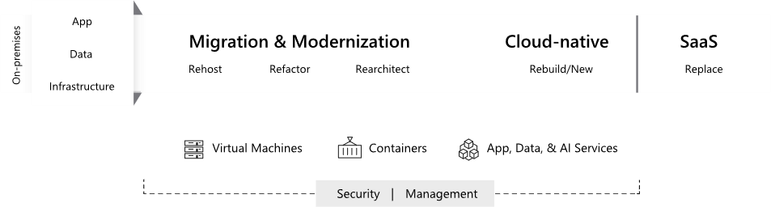

# Cloud Adoption Framework migration model

This section of the Cloud Adoption Framework explains the principles behind its migration model. Wherever possible, this content attempts to maintain a vendor-neutral position while guiding you through the processes and activities that can be applied to any cloud migration, regardless of your chosen cloud vendor.

## Understand migration motivations

Cloud migration is a portfolio management effort, cleverly disguised as a technical implementation. During the migration process, you will decide to move some assets, invest in others, and retire obsolete or unused assets. Some assets will be optimized, refactored, or replaced entirely as part of this process. Each of these decisions should align with the motivations behind your cloud migration. The most successful migrations also go a step further and align these decisions with desired business outcomes.

The Cloud Adoption Framework migration model depends on your organization having completed a process of business readiness for cloud adoption. Make sure you have reviewed [Plan](../../business-strategy/index.md) and [Ready](../../ready/index.md) guidance in the Cloud Adoption Framework to determine the business drivers or other justification for a cloud migration, as well as any required organizational planning or training required before executing a migration process at scale.

> [!NOTE]
> While business planning is important, a growth mindset is equally important. In parallel to broader business planning efforts by the cloud strategy team, it's suggested that the cloud adoption team begin migrating a first workload as a precursor to wider scale migration efforts. This initial migration will allow the team to gain practical experience with the business and technical issues involved in a migration.

## Envision an end state

It’s important to establish a rough vision of your end state before starting your migration efforts. The diagram below shows an on-premises starting point of infrastructure, applications, and data, which defines your *digital estate*. During the migration process, those assets are transitioned using one of the five migration strategies described in [The five Rs of rationalization](../../digital-estate/5-rs-of-rationalization.md).

Migration and modernization of workloads range from simple *rehost* ("lift and shift") migrations using infrastructure as a service (IaaS) capabilities that don't require code and app changes, through *refactoring* with minimal changes, to *rearchitecting* to modify and extend code and app functionality to take advantage of cloud technologies.

Cloud-native strategies and platform as a service (PaaS) strategies *rebuild* on-premises workloads using Azure platform offerings and managed services. Workloads that have equivalent fully managed software as a service (SaaS) cloud-based offerings can often be fully *replaced* by these services as part of the migration process.

> [!NOTE]
> During the public preview of the Cloud Adoption Framework, this section of the framework emphasizes a rehost migration strategy. Although PaaS and SaaS solutions are discussed as alternatives when appropriate, the migration of virtual machine-based workloads using IaaS capabilities is the primary focus.
>
> Other sections and future iterations of this content will expand on other approaches. For a high-level discussion on expanding the scope of your migration to include more complicated migration strategies, see the article balancing the portfolio.

## Incremental migration

The Cloud Adoption Framework migration model is based on an incremental cloud transformation process. It assumes that your organization will start with an initial, limited-scope, cloud migration effort, which we refer to commonly as the first workload. This effort will expand iteratively to include more workloads as your Operations teams refine and improve your migration processes.

Cloud migrations tools like [Azure Site Recovery](/azure/site-recovery/site-recovery-overview) can migrate entire datacenters consisting of tens of thousands of VMs. However, the business and existing IT operations can seldom handle such a high pace of change. As such many organizations break up a migration effort into multiple iterations, moving one workload (or a collection of workloads) per iteration.

The principles behind this incremental model are based on the execution of processes and prerequisites referenced in the following infographic.

The consistent application of these principles represents an end goal for your cloud migration processes and should not be viewed as a required starting point. As your migration efforts mature, refer to the guidance in this section to help define the best process to support your organizational needs.

## Next steps

Begin learning about this model by [investigating the prerequisites to migration](./prerequisites/index.md).

> [!div class="nextstepaction"]
> [Prerequisites to migration](./prerequisites/index.md)
