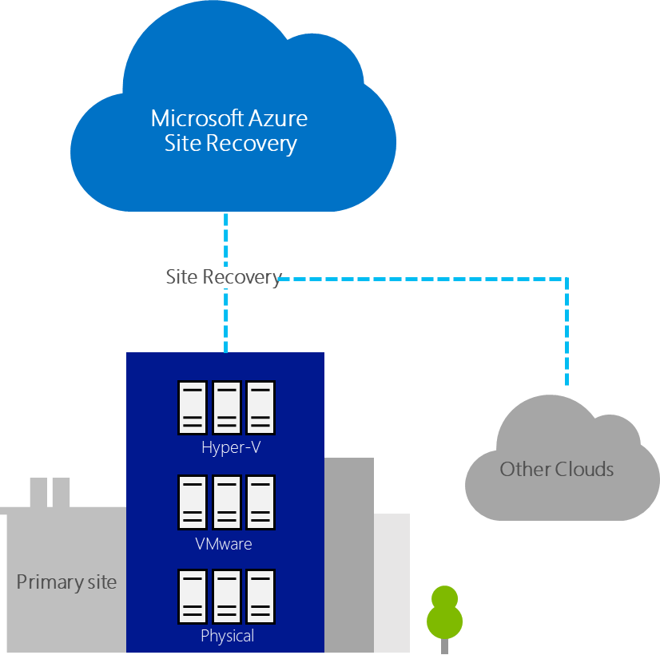

# Replication options

Before any migration, you should ensure that primary systems are safe and will continue to run without issues. Any downtime disrupts users or customers, and it costs time and money. Migration is not as simple as turning off the virtual machines on-premises and copying them across to Azure. Migration tools must take into account asynchronous or synchronous replication to ensure that live systems can be copied to Azure with no downtime. Most of all, systems must be kept in lockstep with on-premises counterparts. You might want to test migrated resources in isolated partitions in Azure, to ensure that workloads work as expected.

The content within the Cloud Adoption Framework assumes that Azure Migrate (or Azure Site Recovery) is the most appropriate tool for replicating assets to the cloud. However, there are other options available. This article discusses those options to help enable decision-making.

## Azure Site Recovery (also known as Azure Migrate)

[Azure Site Recovery](/azure/site-recovery/site-recovery-overview) orchestrates and manages disaster recovery for Azure VMs, on-premises VMs, and physical servers. You can also use Site Recovery to manage migration of machines on-premises and other cloud providers to Azure. Replicate on-premises machines to Azure or Azure VMs to a secondary region. Then, you fail the VM over from the primary site to the secondary and complete the migration process. With Azure Site Recovery, you can achieve various migration scenarios:

- **Migrate from on-premises to Azure.** Migrate on-premises VMware VMs, Hyper-V VMs, and physical servers to Azure. To do this, complete almost the same steps as you would for full disaster recovery. Simply don't fail machines back from Azure to the on-premises site.
- **Migrate between Azure regions.** Migrate Azure VMs from one Azure region to another. After the migration is complete, configure disaster recovery for the Azure VMs now in the secondary region to which you migrated.
- **Migrate from other cloud to Azure.** You can migrate your compute instances provisioned on other cloud providers to Azure VMs. Site Recovery treats those instances as physical servers for migration purposes.

*Azure Site Recovery moving assets to Azure or other clouds*

After you have assessed on-premises and cloud infrastructure for migration, Azure Site Recovery contributes to your migration strategy by replicating on-premises machines. With the following easy steps, you can set up migration of on-premises VMs, physical servers, and cloud VM instances to Azure:

- Verify prerequisites.
- Prepare Azure resources.
- Prepare on-premises VM or cloud instances for migration.
- Deploy a configuration server.
- Enable replication for VMs.
- Test failover to make sure everything's working.
- Run a one-time failover to Azure.

## Azure Database Migration Service

This service helps reduce the complexity of your cloud migration by using a single comprehensive service instead of multiple tools. [Azure Database Migration Service](/azure/dms/dms-overview) is designed as a seamless, end-to-end solution for moving on-premises SQL Server databases to the cloud. It is a fully managed service designed to enable seamless migrations from multiple database sources to Azure data platforms with minimal downtime. It integrates some of the functionality of existing tools and services, providing customers with a comprehensive, highly available solution.

The service uses the Data Migration Assistant to generate assessment reports that provide recommendations to guide you through the changes required prior to performing a migration. It's up to you to perform any required remediation. When you are ready to begin the migration process, the Azure Database Migration Service performs all of the associated steps. You can fire and forget your migration projects with peace of mind, knowing that the process takes advantage of best practices as determined by Microsoft.

## Next steps

After replication is complete, [staging activities](./stage.md) can begin.

> [!div class="nextstepaction"]
> [Staging activities during a migration](./stage.md)
