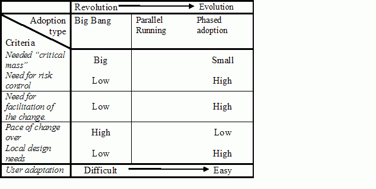

# Business change plan

Traditionally, IT has overseen the release of new workloads. During a major transformation, like a datacenter migration or a cloud migration, a similar pattern of IT lead adoption could be applied. However, the traditional approach might miss opportunities to realize additional business value. For this reason, before a migrated workload is promoted to production, implementing a broader approach to user adoption is suggested. This article outlines the ways in which a business change plan adds to a standard user adoption plan.

## Traditional user adoption approach

User adoption plans focus on how users will adopt a new technology or change to a given technology. This approach is time tested for introducing users to new tools. In a typical user adoption plan, IT focuses on the installation, configuration, maintenance, and training associated with the technical changes being introduced to the business environment.

Although approaches may vary, general themes are present in most user adoption plans. These themes are typically based on a risk control and facilitation approach that aligns to incremental improvement. The Eason Matrix, illustrated in the figure below, represents the drivers behind those themes across a spectrum of adoption types.

*Eason Matrix of user adoption types.*

These themes are often based on the assumption that introduction of new solutions to users should focus largely on risk control and facilitation of change. Additionally, IT has focused mostly on risk from the technology change and facilitation of that change.

## Creating business change plans

A business change plan looks beyond the technical change and assumes that every release in a migration effort drives some level of business process change. It looks upstream and downstream from the technical changes. The following questions help participants think about user adoption from a business change perspective, to maximize business impact:

**Upstream questions.** Upstream questions look at impacts or changes that come before user adoption happens:

- Has an expected [business outcome](../../../business-strategy/business-outcomes/index.md) been quantified?
- Does the business impact map to defined [learning metrics](../../../business-strategy/learning-metrics.md)?
- Which business processes and teams take advantage of this technical solution?
- Who in the business can best align power users for testing and feedback?
- Have the affected business leaders been involved in the prioritization and migration planning?
- Are there any critical events or dates for the business that could be affected by this change?
- Does the business change plan maximize impact but minimize business disruption?
- Is downtime expected? Has a downtime window been communicated to end users?

**Downstream questions.** After the adoption is complete, the business change can begin. Unfortunately, this is where many user adoption plans end. Downstream questions help the cloud strategy team maintain a focus on transformation after technical change is completed:

- Are business users responding well to the changes?
- Has performance anticipation been maintained, now that the technical change has been adopted?
- Are business processes or customer experiences changing in the anticipated ways?
- Are additional changes required to realize learning metrics?
- Did the changes align to the targeted business outcomes? If not, why not?
- Are additional changes required to contribute to business outcomes?
- Have any negative effects been observed as a result of this change?

The business change plan varies from company to company. The goal of these questions is to help better integrate the business into the change associated with each release. By looking at each release not as a technology change to be adopted but instead as a business change plan, business outcomes can become more obtainable.

## Next steps

After business change is documented and planned, [business testing](./business-test.md) can begin.

> [!div class="nextstepaction"]
> [Guidance for business testing (UAT) during migration](./business-test.md)

## References

- Eason, K. (1988) _Information technology and organizational change_, New York: Taylor and Francis.
