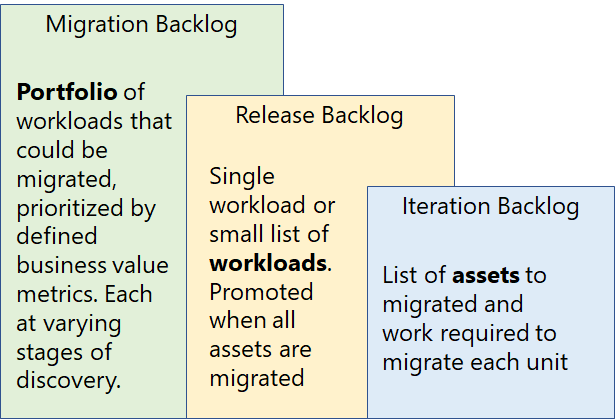

# Prepare for technical complexity: agile change management

When an entire datacenter can be deprovisioned and re-created with a single line of code, traditional processes struggle to keep up. The guidance throughout the Cloud Adoption Framework is built on practices like IT service management (ITSM), The Open Group Architecture Framework (TOGAF), and others. However, to ensure agility and responsiveness to business change, this framework molds those practices to fit agile methodologies and DevOps approaches.

When shifting to an agile model where flexibility and iteration are emphasized, technical complexity and change management are handled differently than they are in a traditional waterfall model focusing on a linear series of migration steps. This article outlines a high-level approach to change management in an agile-based migration effort. At the end of this article, you should have a general understanding of the levels of change management and documentation involved in an incremental migration approach. Additional training and decisions are required to select and implement agile practices based on that understanding. The intention of this article is to prepare cloud architects for a facilitated conversation with project management to explain the general concept of change management in this approach.

## Addressing technical complexity

When changing any technical system, complexity and interdependency inject risk into project plans. Cloud migrations are no exception. When moving thousands&mdash;or tens of thousands&mdash;of assets to the cloud, these risks are amplified. Detecting and mapping all dependencies across a large digital estate could take years. Few businesses can tolerate such a long analysis cycle. To balance the need for architectural analysis and business acceleration, the Cloud Adoption Framework focuses on an INVEST model for product backlog management. The following sections summarize this type of model.

## INVEST in workloads

The term _workload_ appears throughout the Cloud Adoption Framework. A workload is a unit of application functionality that can be migrated to the cloud. It could be a single application, a layer of an application, or a collection of an application. The definition is flexible and may change at various phrases of migration. The Cloud Adoption Framework uses the term _invest_ to define a workload.

INVEST is a common acronym in many agile methodologies for writing user stories or product backlog items, both of which are units of output in agile project management tools. The measurable unit of output in a migration is a migrated workload. The Cloud Adoption Framework modifies the INVEST acronym a bit to create a construct for defining workloads:

- **Independent:** A workload should not have any inaccessible dependencies. For a workload to be considered migrated, all dependencies should be accessible and included in the migration effort.
- **Negotiable:** As additional discovery is performed, the definition of a workload changes. The architects planning the migration could negotiate factors regarding dependencies. Examples of negotiation points could include prerelease of features, making features accessible over a hybrid network, or packaging all dependencies in a single release.
- **Valuable:** Value in a workload is measured by the ability to provide users with access to a production workload.
- **Estimable:** Dependencies, assets, migration time, performance, and cloud costs should all be estimable and should be estimated prior to migration.
- **Small:** The goal is to package workloads in a single sprint. However, this may not always be feasible. Instead, teams are encouraged to plan sprints and releases to minimize the time required to move a workload to production.
- **Testable:** There should always be a defined means of testing or validating completion of the migration of a workload.

This acronym is not intended as a basis for rigid adherence but should help guide the definition of the term _workload_.

## Migration backlog: Aligning business priorities and timing

The migration backlog allows you to track your top-level portfolio of migratable workloads. Prior to migration, the cloud strategy team and the cloud adoption team are encouraged to perform a review of the current [digital estate](../../../digital-estate/index.md), and agree to a prioritized list of workloads to be migrated. This list forms the basis of the initial migration backlog.

Initially, workloads on the migration backlog are unlikely to meet the INVEST criteria outlined in the previous section. Instead, they serve as a logical grouping of assets from an initial inventory as a placeholder for future work. Those placeholders may not be technically accurate, but they serve as the basis for coordination with the business.

*The migration, release, and iteration backlogs track different levels of activity during migration processes.*

In any migration backlog, the change management team should strive to obtain the following information for any workload in the plan. At minimum, this data should be available for any workloads prioritized for migration in the next two or three releases.

### Migration backlog data points

- **Business impact.** Understanding of the impact to the business of missing the expected timeline or reducing functionality during freeze windows.
- **Relative business priority.** A ranked list of workloads based on business priorities.
- **Business owner.** Document the one individual responsible for making business decisions regarding this workload.
- **Technical owner.** Document the one individual responsible for technical decisions related to this workload.
- **Expected timelines.** When the migration is scheduled for completion.
- **Workload freezes.** Time frames in which the workload should be ineligible for change.
- **Workload name.**
- **Initial inventory.** Any assets required to provide the functionality of the workload, including VMs, IT appliances, data, applications, deployment pipelines, and others. This information is likely to be inaccurate.

## Release backlog: Aligning business change and technical coordination

In the context of a migration, a _release_ is an activity that deploys one or more workloads into production. A release generally covers several iterations or technical work. However, it represents a single iteration of business change. After one or more workloads have been prepared for production promotion, a release occurs. The decision to package a release is made when the workloads migrated represent enough business value to justify injecting change into a business environment. Releases are executed in conjunction with a [business change plan](../optimize/business-change-plan.md), after [business testing](../optimize/business-test.md) has been completed. The cloud strategy team is responsible for planning and overseeing the execution of a release to ensure that the desired business change is released.

A *release backlog* is the future state plan that defines a coming release. Release backlog is the pivot point between business change management (*migration backlog*) and technical change management (*sprint backlog*). A release backlog consists of a list of workloads from the migration backlog that align to a specific subset of business outcome realization. Definition and submission of a release backlog to the cloud adoption team serve as a trigger for deeper analysis and migration planning. After the cloud adoption team has verified the technical details associated with a release, it can choose to commit to the release, establishing a release timeline based on current knowledge.

Given the degree of analysis required to validate a release, the cloud strategy team should maintain a running list of the next two to four releases. The team should also attempt to validate as much of the following information as possible, before defining and submitting a release. A disciplined cloud strategy team capable of maintaining the next four releases can significantly increase the consistency and accuracy of release timeline estimates.

### Release backlog data points

A partnership between the cloud strategy team and the cloud adoption team collaborates to add the following data points for any workloads in the release backlog:

- **Refined inventory.** Validation of required assets to be migrated. Often validated through log or monitoring data at the host, network, or OS level to ensure an accurate understanding of network and hardware dependencies of each asset under standard load.
- **Usage patterns.** An understanding of the patterns of usage from end users. These patterns often include an analysis of end-user geographical distribution, network routes, seasonal usage spikes, daily/hourly usage spikes, and end-user composition (interval versus external).
- **Performance expectations.** Analysis of available log data capturing throughput, pageviews, network routes, and other performance data required to replicate the end-user experience.
- **Dependencies.** Analysis of network traffic and application usage patterns to identify any additional workload dependencies, which should be factored into sequencing and environmental readiness. Don't include a workload in a release until one of the following criteria can be met:
  - All dependent workloads have been migrated.
  - Network and security configurations have been implemented to allow the workload to access all dependencies in alignment with existing performance expectations.
- **Desired migration approach.** At the migration backlog level, the assumed migration effort is the only consideration used in analysis. For instance, if the business outcome is an exit from an existing datacenter, all migrations are assumed to be a rehost scenario in the migration backlog. In the release backlog, the cloud strategy team and the cloud adoption team should evaluate the long-term value of additional features, modernization, and continued development investments to evaluate whether a more modern approach should be involved.
- **Business testing criteria.** After a workload is added to the migration backlog, testing criteria should be mutually agreed on. In some cases, testing criteria can be limited to a performance test with a defined power user group. However, for statistical validation, an automated performance test is desired and should be included. The existing instance of the application often has no automated testing capabilities. Should this prove accurate, it is not uncommon for the cloud architects to work with power users to create a baseline load test against the existing solution to establish a benchmark to be used during migration.

### Release backlog cadence

In mature migrations, releases come in a regular cadence. The velocity of the cloud adoption team often normalizes, producing a release every two to four iterations (approximately every one or two months). However, this should be an organic outcome. Creating artificial release cadences can negatively affect the cloud adoption team’s ability to achieve consistent throughput.

To stabilize business impact, the cloud strategy team should establish a monthly release process with the business to maintain regular dialogue but should also establish the expectation that it will be several months before a regular release cadence can be predicted.

## Sprint or iteration backlog: Aligning technical change and effort

A *sprint*, or *iteration*, is a consistent, time-bound unit of work. In the migration process, this is often measured in two-week increments. However, it’s not unheard of to have one-week or four-week iterations. Creating time-bound iterations forces consistent intervals of effort completion and allows for more frequent adjustment to plans, based on new learnings. During any given sprint, there are usually tasks for the assessment, migration, and optimization of workloads defined in the migration backlog. Those units of work should be tracked and managed in the same project-management tool as the migration and release backlog, to drive consistency across each level of change management.

A *sprint backlog*, or *iteration backlog*, consists of the technical work to be completed in a single sprint or iteration, dealing with migrating individual assets. That work should be derived from the list of workloads being migrated. When using tools like Azure DevOps (previously Visual Studio Online) for project management, the work items in a sprint would be children of the product backlog Items in a release backlog and the epics in a migration backlog. Such a parent-child relationship allows for clarity at all levels of change management.

Within a single sprint or iteration, the cloud adoption team would work to deliver the committed amount of technical work, driving toward the migration of a defined workload. This is the end result of the change management strategy. When complete, these efforts can be tested by validating production readiness of a workload staged in the cloud.

### Large or complex sprint structures

For a small migration with a self-contained migration team, a single sprint could include all four phases of a migration for a single workload (*assess*, *migrate*, *optimize*, and *secure and manage*). More commonly, each of these processes shared by multiple teams in distinct work items across numerous sprints. Depending on the effort type, effort scale, and roles, these sprints can take a few different shapes.

- **Migration factory.** Large-scale migrations sometimes require an approach that resembles a factory in the execution model. In this model, various teams are allocated to the execution of a specific migration process (or subset of the process). After completion, the output of one team's sprint populates the backlog for the next team. This is an efficient approach for large-scale rehost migrations of many potential workloads involving thousands of virtual machines moving through phases of assessment, architecture, remediation, and migration. However, for this approach to work, a new homogenous environment with streamlined change management and approval processes is a must.
- **Migration waves.** Another approach that works well for large migrations is a wave model. In this model, division of labor isn't nearly as clear. Teams dedicate themselves to the migration process execution of individual workloads. However, the nature of each sprint changes. In one sprint, the team may complete assessment and architecture work. In another sprint, it may complete the migration work. In yet another sprint, the focus would be on optimization and production release. This approach allows a core team to stay aligned to workloads, seeing them through the process in its entirety. When using this approach, the diversity of skills and context switching could reduce the potential velocity of the team, slowing the migration effort. Additionally, roadblocks during approval cycles can cause significant delays. It is important to maintain options in the release backlog to keep the team moving during blocked periods, with this model. It is also important to cross-train team members and to ensure that skillsets align with the theme of each sprint.

### Sprint backlog data points

The outcome of a sprint captures and documents the changes made to a workload, thus closing the change-management loop. When completed, at minimum, the following should be documented. Throughout the execution of a sprint, this documentation should be completed in tandem with the technical work items.

- **Assets deployed.** Any assets deployed to the cloud to host the workload.
- **Remediation.** Any changes to the assets to prepare for cloud migration.
- **Configuration.** Chosen configuration of any assets deployed, including any references to configuration scripts.
- **Deployment model.** Approach used to deploy the asset to the cloud, including references to any deployment scripts or tools.
- **Architecture.** Documentation of the architecture deployed to the cloud.
- **Performance metrics.** Output of automated testing or business testing performed to validate performance at the time of deployment.
- **Unique requirements or configuration.** Any unique aspects of the deployment, configuration, or technical requirements necessary to operate the workload.
- **Operational approval.** Sign-off of validating operational readiness from the application owner and the IT operations staff responsible for managing the workload post deployment.
- **Architecture approval.** Sign-off from the workload owner and the cloud adoption team to validate any architecture changes required to host each asset.

## Next steps

After change management approaches have been established, its time to address the final prerequisite, [Migration backlog review](./migration-backlog-review.md)

> [!div class="nextstepaction"]
> [Migration backlog review](./migration-backlog-review.md)
