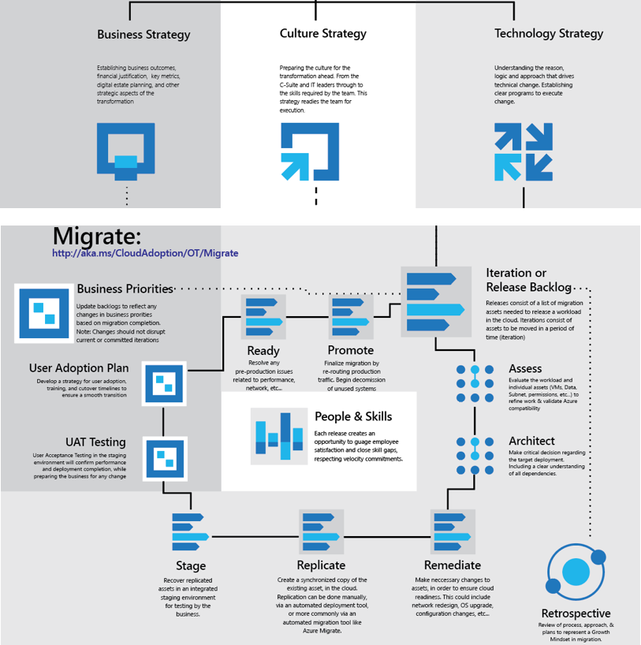

# Fusion: Migration Assessment Activities

The [Migration section](../overview.md) of the [Fusion framework](../../overview.md), outlines the processes typically required to migrate a DataCenter to the cloud. This article, expands on the [Migration Execution Process](overview.md)by reviewing activities associated with Assessing a workload within a given iteration.
  

*Figure 1. Migration Execution Process and related activities.*

As discussed in the  [Migration Execution Overview](overview.md), Assess is an activity that generally happens within an iteration (or sprint) as described in the article on [Incremental Change Management](../plan/incremental-change-management.md).

## Assess Objectives

Validate that all assets and associated dependencies are compatible with the chosen [deployment model](../../getting-started/cloud-deployment-models.md). Document any efforts required to [remediate](remediate.md) compatibility issues. Update the [plan](../plan/incremental-change-management.md) accordingly, which may change commitments in the current iteration.

> [!NOTE]
> In some environments, remediation can require substantial efforts. This is common when VMs, Source Code, or Data structures haven't been frequently maintained & updated. Ex. A large contingent of Windows servers with versions older than 2008 R2. In such cases, Assess and Remediate may need to be run in parallel iterations, often referred to as waves. In such an approach, an Assess and Remediate wave would generally run several iterations (or even a full release) ahead of the Migration wave. In such a scenario, the following guidance would still apply, with minor vocabulary tweaks.

## Assess Assumptions

To define activities, the framework assumes an intention to migration to Azure. In the [Migration Execution Process](overview.md), the following list also assumes an intention to leverage Azure Migrate (also known as Azure Site Recovery) for [replication activities](replicate.md). For alternative tools, see [Replication Options](replicate-options.md).

This article is not intended to capture all possible assessment activities. It is assumed that each environment and business outcome will dictate specific assessment requirements. To help accelerate the creation of those requirements, the remainder of this article shares a few common assessment activities related to [Infrastructure](#common-infrastructure-assessment-activities), [Database](#common-database-assessment-activities), and [Network](#common-network-assessment-activities) assessments.

## Common infrastructure assessment activities

* VMWare Requirements: [Review the Azure Site Recovery requirements for VMWare](/azure/site-recovery/vmware-physical-azure-support-matrix)
* Hyper-V Requirements: [Review the Azure Site Recovery requirements for Hyper-V](/azure/site-recovery/hyper-v-azure-support-matrix)

Be sure to document any discrepancies in host configuration, replicated VM configuration, storage requirements or network configuration.

## Common database assessment activities

* Document Recovery Point Objectives and Recovery Time Objectives of the current database deployment. This will be used in [Architecture activities](architect.md) to aid in decision making
* Document any requirements for high availability configuration. For assistance understanding SQL Server requirements see the [SQL Server High Availability Solutions Guide](/sql/sql-server/failover-clusters/high-availability-solutions-sql-server)
* Evaluate PaaS compatibility: [Azure Data Migration Guide](https://datamigration.microsoft.com/) maps a number of on-premise data bases to compatible Azure PaaS solutions like [Cosmos DB](/azure/cosmos-db) or [Azure DB](/azure/sql-database/) for [MySQL](/azure/mysql/), [Postgres](/azure/postgresql/), or [MariaDB](/azure/mariadb/)
* When PaaS compatibility is an option without need for any remediation, consult the team responsible for [Architecture Activities](architect.md). PaaS migrations can produce significant time savings and reductions in the Total Cost of Ownership (TCO) of most cloud solutions.
* When PaaS compatibility is an option, but remediation is required, consult the teams responsible for [Architecture Activities](architect.md) and [Remediation Activities](remediate.md). In many scenarios, the advantages of PaaS migrations for database solutions can outweigh the increase in remediation time.
* Document size and rate of change for each database to be migrated.
* When possible, document any applications or other assets that make calls to each database

> [!TIP]
> Synchronization of any asset consumes bandwidth during the replication processes. A very common pitfall, is overlooking the bandwidth consumption required to keep assets synchronized between the point of replication and release. Databases are common consumers of bandwidth during release cycles, databases with large storage footprints or a high rate of change are especially concerning. Consider an approach of replicating the data structure, with controlled updates before UAT & release. In such scenarios, alternatives to Azure Site Recovery may be more appropriate. See guidance from [Azure Data Migration Guide](https://datamigration.microsoft.com/) for more detail.

## Common network assessment activities

* Calculate the total storage for of all VMs to be replicated during the iterations leading up to a release.
* Calculate the drift or change rate of storage for all VMs to be replicated during the iterations leading up to a release.
* Calculate the bandwidth requirements needed for each iteration by summing total storage and drift
* Calculate unused bandwidth available on the current network to validate per iteration alignment
* Document bandwidth needed to reach anticipated migration velocity. If any remediation is required to provide necessary bandwidth, notify the team responsible for  [Remediation Activities](remediate.md) and update the [Plan](../plan/incremental-change-management.md) accordingly.

> [!NOTE]
> Total storage will directly impact bandwidth requirements during initial replication. However, storage drift will continue from the point of replication until release. This means that drift has an accumulative affect on available bandwidth.

## Next steps

This article is not intended to capture all possible assessment activities. It is assumed that each environment and business outcome will dictate additional assessment requirements.

Once those requirements are assessed, the iteration is ready to proceed to [Architect activities](architect.md).

> [!div class="nextstepaction"]
> [Begin Architecture Activities](architect.md)