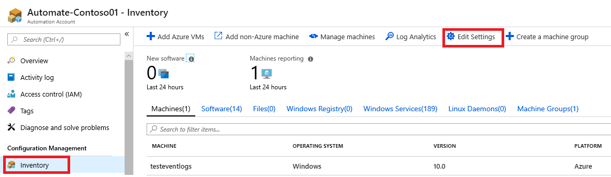
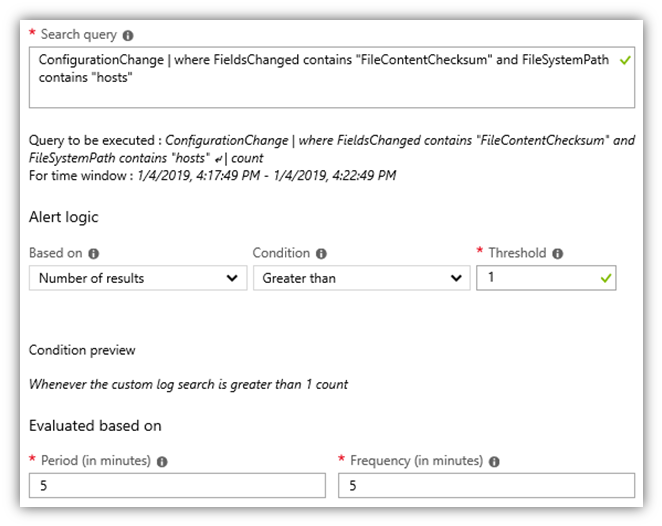
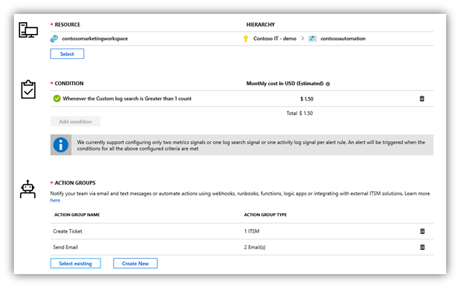

# Enable tracking and alerting on critical changes

A key feature of Azure Change Tracking and Inventory is the ability to alert on the configuration state of and any changes to your hybrid environment. These capabilities include monitoring critical file, service, software, and registry changes that may affect your deployed servers.

By default, the Azure Automation inventory service does not include any files or registry settings. However, the solution does provide a list of recommended registry keys to monitor by navigating to your Automation account in the Azure portal and selecting **Inventory** > **Edit settings**.



For more information about each registry key, see [Registry key change tracking](/azure/automation/automation-change-tracking#registry-key-change-tracking). You can evaluate and then enable each key by selecting it. The setting is applied to all VMs enabled in the same workspace.

Additionally, you can track critical file changes. For example, the file `C:\windows\system32\drivers\etc\hosts` is important to track because it is used by the OS to map hostnames to IP addresses&mdash;any modifications to this file could cause connectivity issues or redirect traffic to dangerous websites.

To enable file content tracking for the hosts file, follow the steps in [Enable file content tracking](/azure/automation/change-tracking-file-contents#enable-file-content-tracking).

You can also add an alert for changes that occur to files you're tracking. Continuing the hosts file example, you can navigate into **Log Analytics** from the Log Analytics button in the command bar or by opening Log Search for the linked Log Analytics workspace. Once in Log Analytics, search for content changes to the hosts file via the following query:

```kusto
ConfigurationChange | where FieldsChanged contains "FileContentChecksum" and FileSystemPath contains "hosts"
```


This query searches for changes that occurred in file contents for files having a path that contains the word “hosts”. You can also search for a specific file by changing the path portion (for example, `FileSystemPath ==  "c:\\windows\\system32\\drivers\\etc\\hosts"`).
  
After the query returns the desired results, select **New alert rule** to open the alert rule editor. You can also navigate to this experience via Azure Monitor in the Azure portal.

In the alert rule editor, review the query and modify the alert logic. In this case, we want the alert to be raised if any changes are detected for any machine in the environment.



After the condition logic is set, you can assign action groups to perform actions in response to the alert. In this example, when the alert is raised, emails are sent and an ITSM ticket is created. Many other useful actions can be taken, such as triggering an Azure function, Azure Automation runbook, webhook, or logic app.



After all the parameters and logic are set, apply the alert to the environment.

## Additional tracking and alerting examples

In addition to the above example for enabling an alert on changes to the Hosts file, many other use cases should be considered. The following scenarios are common:

### Driver file changes

Detect if driver files have been modified, added, or removed. Useful for tracking changes to critical system files.

  ```kusto
  ConfigurationChange | where ConfigChangeType == "Files" and FileSystemPath contains " c:\\windows\\system32\\drivers\\"
  ```

### Specific service stopped

Useful for tracking changes to system critical services.

  ```kusto
  ConfigurationChange | where SvcState == "Stopped" and SvcName contains "w3svc"
  ```

### New software installed

Useful for environments that need to lock down software configurations.

  ```kusto
  ConfigurationChange | where ConfigChangeType == "Software" and ChangeCategory == "Added"
  ```

### Specific software version is or isn't installed on a machine

Note that this query references “ConfigurationData”, which contains the logs for Inventory and reports the last reported configuration state, not changes. This useful for assessing security impact.

  ```kusto
  ConfigurationData | where SoftwareName contains "Monitoring Agent" and CurrentVersion != "8.0.11081.0"
  ```

### Known DLL changes through registry

Useful for detecting changes to well-known registry keys.

  ```kusto
  ConfigurationChange | where RegistryKey == "HKEY_LOCAL_MACHINE\\System\\CurrentControlSet\\Control\\Session Manager\\KnownDlls"
  ```

## Next steps

Learn how to manage updates to your servers by [creating update schedules](./update-schedules.md) using Azure Automation.

> [!div class="nextstepaction"]
> [Create update schedules](./update-schedules.md)
